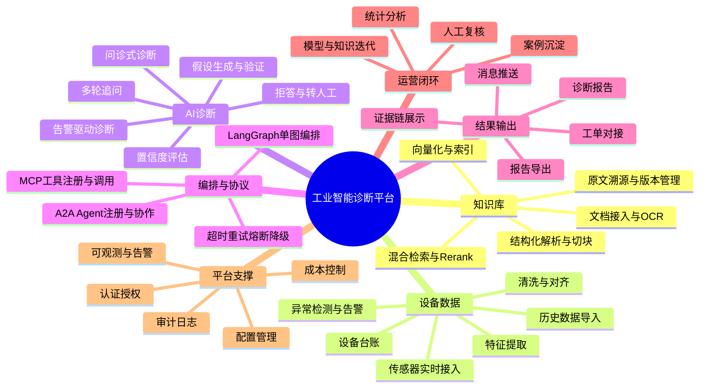

# 02 业务功能介绍（Business Functions）

> 文档编号：IIP-BF-001  
> 版本：V1.0  
> 状态：评审稿  
> 读者：业务方、产品经理、研发、测试、实施交付

---

## 1. 功能定位

工业智能诊断平台（IIP）面向设备运维场景，提供“知识检索—数据查询—异常检测—智能诊断—报告输出—人工复核—知识回流”的业务闭环。平台不以替代工程师为目标，而是作为工程师的智能诊断助手，帮助其更快、更准、更一致地完成故障定位和处置决策。

### 1.1 核心业务价值

- **更快**：将故障诊断从小时级缩短到分钟级辅助定位。
- **更准**：知识和数据双证据驱动，降低主观判断偏差。
- **更一致**：将专家 SOP 固化为可重复的诊断流程。
- **更可信**：所有结论可追溯、可复核、可审计。
- **更可扩展**：新增设备、文档、工具和 Agent 不改核心编排。

---

## 2. 用户角色与权限边界

| 角色 | 主要操作 | 数据权限 | 典型终端 |
| --- | --- | --- | --- |
| 值班工程师 | 发起诊断、查看报告、反馈复核 | 所属设备与文档范围 | Web |
| 设备工程师 | 问诊式诊断、历史查询、导出报告 | 所属设备/区域 | Web |
| 诊断专家 | 复核结论、修正案例、维护故障库 | 全部或授权范围 | Web |
| 知识管理员 | 上传/更新文档、维护版本与权限 | 知识库管理范围 | Web 管理台 |
| 运维主管 | 查看统计、任务跟踪、质量管理 | 管理范围汇总数据 | Web/报表 |
| 系统管理员 | 用户、角色、设备、集成配置 | 平台配置 | 管理台 |
| 第三方系统 | 触发诊断、查询结果、订阅推送 | API 授权范围 | REST/Webhook |
| 审计/安全人员 | 查询审计日志、导出合规报告 | 审计数据只读 | 管理台 |

> 权限模型建议采用 RBAC + 数据范围（设备分组/文档密级）双重控制；所有敏感操作写入审计日志。

---

## 3. 业务功能地图

---

## 4. 功能模块清单

### 4.1 工业文档知识库

**目标**：让 27 份工业文档变成可检索、可溯源、可维护的知识资产。

| 功能编号 | 功能名称 | 功能描述 | 优先级 |
| --- | --- | --- | --- |
| BF-KB-01 | 文档接入 | 支持 PDF、Word、Excel、图片、文本等格式批量上传；支持来源、设备型号、文档类型等元数据 | M |
| BF-KB-02 | OCR 与清洗 | 扫描件/图片 OCR，识别结果可人工校正；去除页眉页脚、乱码和重复内容 | M |
| BF-KB-03 | 结构化解析 | 识别章节、标题、表格、图注、参数阈值、检修步骤等语义单元 | M |
| BF-KB-04 | 智能切块 | 按语义和结构切块，控制块大小与重叠，生成约 5091 个基线向量块 | M |
| BF-KB-05 | 向量化与索引 | 生成文本向量，建立向量索引与全文关键词索引 | M |
| BF-KB-06 | 混合检索 | 向量 + 关键词召回，Rerank 精排，返回 Top-K 证据 | M |
| BF-KB-07 | 原文溯源 | 每条结果携带文档名、页码、章节、原文片段，支持跳转 | M |
| BF-KB-08 | 版本管理 | 文档新增/修订后增量更新，保留历史版本和引用关系 | S |
| BF-KB-09 | 知识管理台 | 分类、检索预览、失效标记、权限设置、健康度统计 | S |

**业务规则**：

- 任何检索结果不得脱离原文片段直接生成结论。
- 被标记为失效或过期版本的文档不得作为当前诊断的主要证据。
- 新增文档后，向量索引更新应支持灰度/增量，不中断在线检索。

### 4.2 设备与传感器数据服务

**目标**：让 4 台设备、24 个传感器的数据可查、可信、可用。

| 功能编号 | 功能名称 | 功能描述 | 优先级 |
| --- | --- | --- | --- |
| BF-DATA-01 | 设备台账 | 管理设备编号、型号、产线、关键部件、文档关联关系 | M |
| BF-DATA-02 | 传感器元数据 | 管理传感器类型、量纲、采样率、安装位置、报警阈值 | M |
| BF-DATA-03 | 实时接入 | 支持 OPC UA、Modbus、MQTT 等工业协议接入（按现场实际） | M |
| BF-DATA-04 | 历史数据导入 | 支持 CSV/Parquet/数据库批量导入历史数据 | M |
| BF-DATA-05 | 数据清洗 | 缺失值处理、异常值识别、去噪、单位统一 | M |
| BF-DATA-06 | 时间对齐与重采样 | 多传感器时间对齐，按查询需求重采样 | M |
| BF-DATA-07 | 特征提取 | 时域、频域、统计特征：均值、方差、峰峰值、RMS、频谱、包络等 | M |
| BF-DATA-08 | 异常检测 | 阈值规则 + 统计/轻量模型识别异常，生成告警事件 | M |
| BF-DATA-09 | 数据链路健康 | 采集延迟、丢点率、断线、数据完整率监测 | S |
| BF-DATA-10 | 统一数据 API | 对内供 Agent 调用，对外按权限提供查询 | M |

**业务规则**：

- 诊断必须明确时间窗和采样数据范围，避免无边界取数。
- 数据缺失或质量不达标时，应降低结论置信度并提示补充数据。
- 报警阈值以设备文档或现场配置为准，平台不得擅自修改设备控制参数。

### 4.3 AI 智能诊断

**目标**：以 AI 辅助工程师完成故障定位、根因分析和处置建议生成。

| 功能编号 | 功能名称 | 功能描述 | 优先级 |
| --- | --- | --- | --- |
| BF-DIAG-01 | 问诊式诊断 | 用户以自然语言描述现象，平台识别设备、时间窗、工况并启动诊断 | M |
| BF-DIAG-02 | 告警驱动诊断 | 传感器异常告警自动触发诊断任务，生成初步报告 | M |
| BF-DIAG-03 | 信息澄清 | 关键信息缺失时主动向用户追问，不臆测 | M |
| BF-DIAG-04 | 多步推理 | 基于“假设—验证”提出候选故障，逐项获取证据验证 | M |
| BF-DIAG-05 | 工具调用 | 调用知识检索、数据查询、特征计算、故障库匹配、报告生成等工具 | M |
| BF-DIAG-06 | 置信度评估 | 根据证据数量、证据一致性、数据质量给出置信度 | M |
| BF-DIAG-07 | 处置建议 | 按风险和可执行性给出排查步骤、维护建议和风险提示 | M |
| BF-DIAG-08 | 拒答/转人工 | 证据不足或超出能力边界时明确说明并建议人工介入 | M |
| BF-DIAG-09 | 多轮对话 | 支持工程师追问、补充信息和复核 | S |
| BF-DIAG-10 | 反馈回流 | 工程师确认或修正后沉淀案例，用于优化 | S |

### 4.4 结果输出与协同

| 功能编号 | 功能名称 | 功能描述 | 优先级 |
| --- | --- | --- | --- |
| BF-OUT-01 | 结构化报告 | 输出故障定位、根因、置信度、证据链、处置建议、风险提示 | M |
| BF-OUT-02 | 证据链展示 | 文档引用可点击查看原文，数据证据可查看曲线与特征 | M |
| BF-OUT-03 | 多形态输出 | Web 页面、API、邮件/企业 IM/短信、工单系统 | M |
| BF-OUT-04 | 报告导出 | 支持 PDF、Word、Markdown 导出 | S |
| BF-OUT-05 | 人工复核 | 确认、驳回、修正、填写意见，操作留痕 | M |
| BF-OUT-06 | 免责声明 | 明确标注“AI 辅助建议，最终以人工确认为准” | M |
| BF-OUT-07 | 统计分析 | 故障类型分布、MTTR 变化、诊断准确率、使用率 | S |
| BF-OUT-08 | 工单联动 | 将诊断结论生成工单或回填工单（按集成能力） | C |

### 4.5 平台运营与支撑

| 功能编号 | 功能名称 | 功能描述 | 优先级 |
| --- | --- | --- | --- |
| BF-OPS-01 | 认证与授权 | 统一登录、RBAC、数据范围控制 | M |
| BF-OPS-02 | 审计日志 | 用户操作、诊断任务、工具调用、模型调用全量留痕 | M |
| BF-OPS-03 | 配置管理 | 设备、传感器、提示词、模型、协议、阈值均可配置化 | M |
| BF-OPS-04 | 可观测 | Trace、Metric、Log 三位一体，支持链路追踪 | M |
| BF-OPS-05 | 告警与通知 | 服务异常、任务失败、数据链路异常告警 | S |
| BF-OPS-06 | 成本控制 | Token、模型调用次数、并发和预算上限监控 | S |
| BF-OPS-07 | 备份与恢复 | 知识库、时序库、向量库、配置定期备份 | M |
| BF-OPS-08 | 灰度与回滚 | 模型、提示词、工具版本灰度发布和回滚 | S |

---

## 5. 典型业务场景

### 5.1 场景一：实时异常诊断

**触发**：某设备振动传感器超过报警阈值，平台生成异常告警。  
**参与角色**：值班工程师、诊断 Agent、数据分析 Agent、报告 Agent。  
**主流程**：

1. 告警事件进入平台，任务编排器创建诊断任务。
2. 系统自动获取设备台账、传感器元数据和告警时间窗。
3. 数据分析 Agent 调取时序数据，计算特征并确认异常模式。
4. 知识检索 Agent 检索相关故障模式、报警说明和处置规程。
5. 诊断 Agent 生成候选故障假设并逐项验证。
6. 报告 Agent 生成含证据链和置信度的诊断报告。
7. 报告推送值班工程师，工程师复核确认或修正。
8. 复核结果回流案例库。

**成功标准**：从告警到报告推送 P95 ≤ 60 秒；报告中的每条结论可追溯到数据和文档证据。

### 5.2 场景二：人工问诊式诊断

**触发**：工程师在 Web 控制台输入“3 号设备振动升高并伴随温度异常”。  
**主流程**：

1. 意图识别节点解析设备、现象、时间范围、工况。
2. 若关键信息缺失，澄清节点向工程师追问。
3. 数据分析 Agent 查询相关传感器数据并提取特征。
4. 知识检索 Agent 检索故障模式与检修规程。
5. 诊断 Agent 输出候选故障排序、置信度和排查建议。
6. 工程师可追问、要求补充证据或发起复核。

### 5.3 场景三：知识查询与规程问答

**触发**：工程师询问“某设备轴承温度报警阈值是多少？”  
**主流程**：

1. 问题路由到知识检索 Agent。
2. 混合检索命中相关文档段落，Rerank 后返回 Top-K。
3. 生成带原文页码引用的答案。
4. 若证据不足，明确说明并建议查阅原始文档或联系专家。

### 5.4 场景四：诊断结果复核与知识回流

**触发**：工程师查看 AI 诊断报告。  
**主流程**：

1. 工程师确认、驳回或修正 AI 结论。
2. 平台记录复核意见和实际处置结果。
3. 高质量案例进入案例库；错误结论进入错题集用于优化。
4. 知识管理员定期评审并更新故障库、提示词和诊断策略。

### 5.5 场景五：趋势预警与预测性维护（试点/二期）

**触发**：平台基于历史趋势识别设备劣化趋势。  
**主流程**：

1. 对关键传感器做趋势分析和剩余寿命估计。
2. 提前生成预警，建议维护窗口。
3. 结合知识库给出检查项和备件建议。
4. 人工确认后生成计划性维护任务。

---

## 6. 业务功能优先级与版本规划

### 6.1 MoSCoW 优先级

| 优先级 | 含义 | 典型功能 |
| --- | --- | --- |
| Must（M） | 本期必须交付 | 文档入库、传感器接入、AI 诊断、MCP/A2A 调度、报告输出、权限审计 |
| Should（S） | 本期应交付 | 版本管理、多轮对话、统计分析、告警通知、成本控制 |
| Could（C） | 本期可交付或延后 | 知识图谱、趋势预测、工单深度联动 |
| Won't（W） | 本期明确不做 | 设备自动控制、传感器施工、公众移动 App |

### 6.2 版本建议

| 版本 | 主题 | 核心业务功能 |
| --- | --- | --- |
| V0.1（MVP） | 打通主链路 | 文档入库、小规模数据接入、单设备诊断、基础报告 |
| V0.5（试点） | 生产可用雏形 | 24 传感器接入、多 Agent 协作、MCP 工具化、HITL 复核 |
| V1.0（生产） | 正式上线 | 四类核心场景、可观测、安全、验收指标达标 |
| V1.5（增强） | 知识运营 | 案例回流、统计分析、模型/提示词灰度 |
| V2.0（扩展） | 预测性维护 | 趋势预测、RUL、工单和备件联动 |

---

## 7. 功能验收口径

| 编号 | 验收项 | 验收口径 |
| --- | --- | --- |
| AC-BF-01 | 知识库 | 27 份文档全部成功解析入库；随机抽样可定位正确原文页码 |
| AC-BF-02 | 数据接入 | 4 台设备、24 个传感器稳定上报；数据完整率 ≥ 99% |
| AC-BF-03 | 诊断功能 | 约定测试集准确率 ≥ 85%；报告包含根因、置信度、证据链、处置建议 |
| AC-BF-04 | 协议调度 | 新增 MCP 工具零改动接入；A2A 任务可下发与回传 |
| AC-BF-05 | 输出协同 | 报告可导出、可推送、可复核，操作留痕 |
| AC-BF-06 | 端到端场景 | 实时异常、人工问诊、知识问答、复核回流四类场景演示通过 |

---

## 8. 业务功能与需求追溯

| 业务功能 | 对应需求编号 | 对应模块 |
| --- | --- | --- |
| 文档知识库 | FR-01-* | M01 |
| 传感器数据处理 | FR-02-* | M02 |
| AI 智能诊断 | FR-03-* | M03 |
| 双协议编排调度 | FR-04-* | M04 |
| 结果输出 | FR-05-* | M05 |
| 平台支撑 | NFR-*、AR-* | M06 |
| 数据存储与集成 | 数据资源需求 | M07 |

> 详细需求描述与验收标准见 [07_requirements_analysis.md](./07_requirements_analysis.md)。
