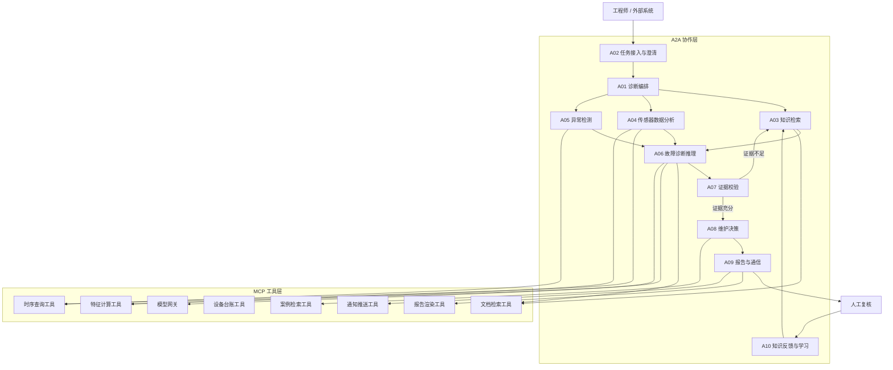

# 03 智能体数量与职责（Agent Catalog and Responsibilities）

> 文档编号：IIP-AGT-001  
> 版本：V1.0  
> 状态：评审稿  
> 读者：架构师、算法工程师、后端研发、测试、运维

---

## 1. 智能体设计原则

### 1.1 设计原则

1. **单图统一编排**：所有诊断步骤在 LangGraph 单一编排图中完成，State 是唯一上下文载体；Agent 是图中的节点或受控子图，不允许绕过编排器各自为战。
2. **职责单一**：每个 Agent 只负责一类能力，避免“全能 Agent”导致提示词膨胀、测试困难和责任边界模糊。
3. **A2A 协作**：需要跨 Agent 协作时，通过 A2A 协议进行任务发现、协商、下发和结果回传。
4. **MCP 工具化**：Agent 不直接耦合数据源和底层工具，统一通过 MCP Server/Client 调用。
5. **证据优先**：任何诊断结论必须来自检索证据、数据证据和规则约束的组合，不允许无依据生成。
6. **可观测与可回滚**：每次 Agent 调用记录输入、输出、工具链、耗时、Token、置信度和版本号。
7. **人机协同**：关键结论由人工复核，Agent 提供建议而非最终执行控制。

### 1.2 数量结论

**本期生产级基线包含 10 个核心智能体（Core Agents）。**

| 编号 | 智能体 | 英文名 | 所属层面 | 是否独立部署 |
| --- | --- | --- | --- | --- |
| A01 | 诊断编排智能体 | Diagnostic Orchestrator Agent | 编排控制面 | 是 |
| A02 | 任务接入与澄清智能体 | Intake & Triage Agent | 交互入口层 | 是 |
| A03 | 知识检索智能体 | Knowledge Retrieval Agent | 知识与数据面 | 是 |
| A04 | 传感器数据分析智能体 | Sensor Data Agent | 知识与数据面 | 是 |
| A05 | 异常检测智能体 | Anomaly Detection Agent | 知识与数据面 | 是 |
| A06 | 故障诊断推理智能体 | Fault Diagnosis Agent | 诊断推理面 | 是 |
| A07 | 证据校验智能体 | Evidence Verification Agent | 诊断推理面 | 是 |
| A08 | 维护决策智能体 | Maintenance Decision Agent | 诊断推理面 | 是 |
| A09 | 报告与通信智能体 | Report & Communication Agent | 输出协同面 | 是 |
| A10 | 知识反馈与学习智能体 | Knowledge Feedback & Learning Agent | 运营闭环面 | 是 |

> 另有 3 类**平台治理服务**不单独计为业务 Agent：安全护栏服务（Safety Guardrail）、身份与审计服务（IAM & Audit）、可观测与成本服务（Observability & Cost）。它们以拦截器、中间件或策略引擎形式嵌入所有 Agent 调用链。
>
> 可选扩展（不计入本期 10 个）：预测性维护 Agent（Prognostics Agent）、数字孪生 Agent（Digital Twin Agent），建议纳入二期。

---

## 2. 智能体总体协作架构



### 2.1 编排与协作边界

| 通信类型 | 协议 | 使用场景 | 示例 |
| --- | --- | --- | --- |
| 编排内部状态传递 | LangGraph State | 同一图内节点间上下文和证据流转 | `diagnosis_state` 传递设备、时间窗、候选故障、证据 |
| Agent 间任务协作 | A2A | 跨 Agent 异步/同步任务、能力发现、进度回传 | 编排器向知识检索 Agent 下发检索任务 |
| Agent 调工具/数据源 | MCP | 标准化工具注册、Schema 校验、鉴权、调用 | 调用时序库查询、文档检索、报告渲染 |
| 人工交互 | Web / HITL API | 澄清、确认、修正、驳回 | 报告复核 |
| 外部集成 | REST / Webhook | 告警接入、工单回填、消息推送 | 企业 IM 通知 |

---

## 3. 各智能体职责详解

### A01 诊断编排智能体（Diagnostic Orchestrator Agent）

| 项目 | 说明 |
| --- | --- |
| 定位 | 诊断任务的“总调度”和 LangGraph 单图的 Supervisor |
| 核心职责 | 解析任务优先级；初始化 State；规划诊断步骤；按条件路由到各 Agent/工具；管理循环、重试、超时、检查点；触发人工确认；汇总最终结果 |
| 输入 | 原始任务、用户上下文、告警事件、设备 ID、时间窗、权限信息 |
| 输出 | 诊断任务状态、路由决策、最终诊断结果、全链路 Trace |
| 关键工具 | LangGraph Checkpointer、任务队列、A2A Client、MCP Client、配置中心 |
| 关键约束 | 不直接生成诊断结论；所有分支可审计；关键节点必须幂等；失败可恢复 |
| 核心指标 | 任务成功率 ≥ 99%、编排额外开销 P95 ≤ 200ms、检查点恢复成功率 100% |
| 典型故障模式 | 路由死循环、状态丢失、重试风暴；通过最大步数、幂等键、熔断和限流控制 |

**主要 A2A 交互**：

- 向 A02 请求意图澄清结果；
- 向 A03 下发知识检索子任务；
- 向 A04 下发数据查询与特征计算子任务；
- 向 A06 下发诊断推理子任务；
- 向 A09 下发报告生成子任务。

---

### A02 任务接入与澄清智能体（Intake & Triage Agent）

| 项目 | 说明 |
| --- | --- |
| 定位 | 用户/外部系统与平台之间的智能入口 |
| 核心职责 | 意图识别、槽位抽取、任务分类、紧急度评估、信息澄清、权限预检、会话上下文维护 |
| 输入 | 自然语言问诊、告警消息、API 请求 |
| 输出 | 结构化任务：设备、现象、时间窗、工况、优先级、所需能力清单 |
| 关键工具 | LLM 结构化输出、设备台账查询、会话存储、权限服务 |
| 关键约束 | 信息不足时必须提问；不猜测设备或时间窗；不越权访问 |
| 核心指标 | 意图识别准确率 ≥ 95%、槽位完整率 ≥ 90%、澄清后任务可执行率 100% |
| 典型故障模式 | 指代消解错误（“3 号设备”指哪台）；通过设备别名表和二次确认解决 |

**输出结构示例**：

```json
{
  "task_id": "TASK-20250101-0001",
  "source": "web",
  "device_id": "EQ-003",
  "symptom": ["振动升高", "温度异常"],
  "time_window": {"start": "2025-01-01T08:00:00+08:00", "end": "2025-01-01T10:00:00+08:00"},
  "priority": "high",
  "missing_slots": [],
  "requested_capabilities": ["sensor_analysis", "knowledge_retrieval", "diagnosis"]
}
```

---

### A03 知识检索智能体（Knowledge Retrieval Agent）

| 项目 | 说明 |
| --- | --- |
| 定位 | 工业文档知识的专业检索与证据组装者 |
| 核心职责 | 查询改写、混合检索、元数据过滤、Rerank、去重、证据分块、引用溯源、知识缺口识别 |
| 输入 | 诊断问题、设备型号、故障现象、检索范围、权限上下文 |
| 输出 | 带引用的证据片段列表：文档名、页码、章节、原文、相关性分数 |
| 关键工具 | MCP 文档检索工具、向量库、关键词索引、Rerank 模型、Embedding 模型 |
| 关键约束 | 返回结果必须可溯源；不得虚构文档或页码；无结果时明确返回知识缺口 |
| 核心指标 | 检索 P95 ≤ 1.5s、引用准确率 ≥ 99%、Top-5 命中率 ≥ 90%（测试集） |
| 典型故障模式 | OCR 噪声导致召回错误；通过元数据过滤、Rerank、原文校验缓解 |

**检索策略**：

1. 查询改写：将口语化现象转为工业术语 + 设备型号 + 部件名。
2. 并行召回：向量检索 + BM25 关键词检索。
3. 元数据过滤：设备型号、文档类型、版本有效性、权限范围。
4. Rerank 精排：得到 Top-K 证据。
5. 证据打包：保留原文片段、页码和置信度，供下游校验。

---

### A04 传感器数据分析智能体（Sensor Data Agent）

| 项目 | 说明 |
| --- | --- |
| 定位 | 设备时序数据的统一查询、清洗、对齐和特征计算者 |
| 核心职责 | 根据设备和时间窗查询传感器数据；执行缺失值处理、去噪、重采样、时间对齐；提取时域/频域/统计特征；返回数据质量报告 |
| 输入 | 设备 ID、传感器列表、时间窗、采样要求、特征清单 |
| 输出 | 清洗后的时序数据、特征向量、数据质量报告、数据证据包 |
| 关键工具 | MCP 时序查询工具、特征计算工具、设备台账工具、数据质量检查器 |
| 关键约束 | 不修改原始数据；所有处理步骤可追溯；数据质量差必须显式标注 |
| 核心指标 | 查询 P95 ≤ 2s（近 7 天窗口）、特征计算正确率 100%、数据完整率 ≥ 99% |
| 典型故障模式 | 时间戳漂移、量纲不统一；通过时区归一、单位换算和元数据校验解决 |

**典型特征**：

| 类别 | 特征 |
| --- | --- |
| 统计特征 | 均值、方差、标准差、最大值、最小值、峰峰值、偏度、峭度 |
| 时域特征 | RMS、波形因子、峰值因子、脉冲因子、裕度因子 |
| 频域特征 | 频谱峰值、主频、谐波能量、边带能量、包络谱 |
| 趋势特征 | 滑动均值、变化率、趋势斜率、突变点 |
| 质量特征 | 缺失率、重复率、异常点比例、时间抖动 |

---

### A05 异常检测智能体（Anomaly Detection Agent）

| 项目 | 说明 |
| --- | --- |
| 定位 | 从数据中识别异常事件并判断异常模式 |
| 核心职责 | 加载设备/传感器阈值规则；执行统计检测、无监督检测、轻量模型检测；关联多传感器异常；生成异常事件和严重度分级 |
| 输入 | 时序数据、特征、报警阈值、工况标签 |
| 输出 | 异常事件列表、异常时间窗、异常类型、严重度、可疑部件 |
| 关键工具 | MCP 时序查询工具、特征计算工具、规则引擎、异常检测模型 |
| 关键约束 | 阈值以文档和现场配置为准；误报必须可解释；不能将工况变化简单判为故障 |
| 核心指标 | 典型异常召回率 ≥ 90%、误报率 ≤ 10%、检测延迟 ≤ 5s |
| 典型故障模式 | 工况切换造成误报；通过工况标签和基线自适应缓解 |

---

### A06 故障诊断推理智能体（Fault Diagnosis Agent）

| 项目 | 说明 |
| --- | --- |
| 定位 | 平台的核心诊断大脑，负责“假设—验证”推理 |
| 核心职责 | 基于现象、数据和知识生成候选故障假设；规划验证步骤；调用工具获取证据；对假设进行支持/反驳/不确定判断；输出候选故障排序和根因 |
| 输入 | 结构化任务、知识证据、数据特征、异常事件、历史案例 |
| 输出 | 候选故障列表、根因假设、置信度、验证过程、反证信息 |
| 关键工具 | MCP 知识检索、数据查询、特征计算、案例检索；A2A 请求证据校验 |
| 关键约束 | 每个假设必须有验证计划；不能跳过证据直接给结论；不确定时明确拒答/转人工 |
| 核心指标 | 典型故障准确率 ≥ 85%、Top-3 命中率 ≥ 92%、无依据结论率 = 0 |
| 典型故障模式 | 过早收敛到单一假设；通过多假设并行、反证校验和证据覆盖度评估避免 |

**推理循环**：

```text
观察现象 → 生成候选假设 H1..Hn
  → 为每个假设规划证据需求 E1..Em
  → 调用 MCP 工具获取证据
  → 判断证据支持/反驳/不确定
  → 更新假设置信度
  → 是否达到结论阈值或最大轮次？
     是 → 输出候选排序与根因
     否 → 继续验证 / 回到知识检索 / 澄清信息
```

---

### A07 证据校验智能体（Evidence Verification Agent）

| 项目 | 说明 |
| --- | --- |
| 定位 | 诊断结论的“质检员”和反幻觉护栏 |
| 核心职责 | 校验证据真实性、来源可靠性、时间一致性、设备一致性、知识冲突；校验结论是否被证据支持；进行置信度校准；识别矛盾证据；决定是否需要补证或转人工 |
| 输入 | 候选故障、结论、证据链、数据质量报告、文档版本信息 |
| 输出 | 校验结果、置信度修正、风险标记、人工介入建议 |
| 关键工具 | MCP 文档溯源校验、元数据查询、规则引擎、LLM 校验器 |
| 关键约束 | 仅凭 LLM 自评不足以通过校验；必须有规则 + 外部证据；冲突证据必须显式展示 |
| 核心指标 | 引用伪造率 = 0、证据链完整率 ≥ 95%、高风险结论拦截率 100% |
| 典型故障模式 | 证据与结论弱相关；通过证据覆盖度评分和矛盾检测降低风险 |

**校验维度**：

| 维度 | 校验内容 | 不通过处理 |
| --- | --- | --- |
| 来源真实性 | 文档是否存在、页码是否存在、片段是否一致 | 剔除该证据并告警 |
| 时间一致性 | 文档版本有效期、数据时间窗是否匹配 | 降低置信度或要求补充 |
| 设备一致性 | 文档适用型号、传感器所属设备是否匹配 | 剔除或标记为参考 |
| 证据充分性 | 支持证据数量、覆盖故障特征维度 | 要求补证或转人工 |
| 证据矛盾性 | 支持证据与反驳证据是否同时存在 | 展示矛盾，降低置信度 |
| 安全合规 | 是否包含控制指令、越权数据、敏感信息 | 拦截并转安全审计 |

---

### A08 维护决策智能体（Maintenance Decision Agent）

| 项目 | 说明 |
| --- | --- |
| 定位 | 将诊断结论转化为可执行的运维建议 |
| 核心职责 | 检索 SOP 和检修规程；生成排查步骤、维护措施、备件建议、风险提示；区分立即处理/计划处理/观察项；给出验证方法和升级路径 |
| 输入 | 根因、置信度、证据链、设备状态、风险等级 |
| 输出 | 处置建议、操作步骤、风险提示、备件/工具清单、升级路径 |
| 关键工具 | MCP 案例检索、文档检索、设备台账、备件接口（预留） |
| 关键约束 | 不生成设备自动控制指令；涉及安全的操作必须提示人工确认和挂牌上锁 |
| 核心指标 | 建议可执行率 ≥ 95%、规程引用准确率 100%、安全提示覆盖率 100% |
| 典型故障模式 | 建议过于笼统；通过 SOP 模板和专家规则约束提升可执行性 |

---

### A09 报告与通信智能体（Report & Communication Agent）

| 项目 | 说明 |
| --- | --- |
| 定位 | 诊断结果的呈现者与分发者 |
| 核心职责 | 按模板生成结构化报告；渲染证据链、图表和风险提示；导出 PDF/Word/Markdown；通过 Web/API/企业 IM/邮件/短信推送；管理报告版本和分发记录 |
| 输入 | 诊断结论、证据链、处置建议、报告模板、通知策略 |
| 输出 | 诊断报告、通知消息、报告元数据 |
| 关键工具 | MCP 报告渲染工具、通知推送工具、对象存储、模板引擎 |
| 关键约束 | 报告中不得省略免责声明；证据链接必须可达；敏感信息按权限脱敏 |
| 核心指标 | 报告生成 P95 ≤ 5s、推送成功率 ≥ 99%、报告完整率 100% |
| 典型故障模式 | 渠道不可用导致推送失败；通过异步重试、降级到站内信和告警处理 |

---

### A10 知识反馈与学习智能体（Knowledge Feedback & Learning Agent）

| 项目 | 说明 |
| --- | --- |
| 定位 | 组织知识闭环的维护者，让平台越用越准 |
| 核心职责 | 收集人工复核、修正、实际处置结果；将高质量案例沉淀为案例库；将错误结论形成错题集；识别知识缺口并生成补充建议；统计诊断质量；触发知识库/提示词/规则优化 |
| 输入 | 人工反馈、诊断记录、实际工单结果、检索日志、拒答记录 |
| 输出 | 案例条目、错题集、知识缺口报告、优化建议、质量看板 |
| 关键工具 | MCP 案例写入、知识库管理、统计分析、工单接口（预留） |
| 关键约束 | 未经人工确认的结论不得自动作为标准答案；知识更新需版本化和可回滚 |
| 核心指标 | 案例回流率 100%、知识缺口闭环率 ≥ 90%、诊断准确率月度提升可观测 |
| 典型故障模式 | 低质量反馈污染知识库；通过专家评审、置信度门槛和版本管理避免 |

---

## 4. 智能体 RACI 矩阵

| 活动 | A01 编排 | A02 接入 | A03 检索 | A04 数据 | A05 异常 | A06 诊断 | A07 校验 | A08 决策 | A09 报告 | A10 学习 |
| --- | --- | --- | --- | --- | --- | --- | --- | --- | --- | --- |
| 任务接入与澄清 | A | R | C | I | I | I | I | I | I | I |
| 知识检索 | A | I | R | C | I | C | C | C | I | C |
| 数据查询与特征 | A | I | C | R | C | C | C | C | I | I |
| 异常检测 | A | I | I | C | R | C | C | I | I | I |
| 故障推理 | A | I | C | C | C | R | C | C | I | C |
| 证据校验 | A | I | C | C | C | C | R | I | I | I |
| 维护决策 | A | I | C | I | I | C | C | R | I | I |
| 报告生成与推送 | A | I | I | I | I | C | C | C | R | I |
| 人工复核 | A | C | I | I | I | C | C | C | R | C |
| 知识回流 | A | I | C | I | I | C | C | I | C | R |
| 安全与合规 | A | C | C | C | C | C | C | C | C | C |

> R = Responsible（执行者）、A = Accountable（负责人）、C = Consulted（被咨询）、I = Informed（被告知）。安全护栏、身份审计、可观测服务作为平台级横向能力，对全部活动具有拦截和记录职责。

---

## 5. 智能体部署与扩缩容

| 智能体 | 推荐部署形态 | 副本策略 | 资源特征 | 扩缩容触发 |
| --- | --- | --- | --- | --- |
| A01 编排 | 无状态服务 + Checkpointer | 2+ 副本 | CPU 中等、状态外部化 | 任务队列长度、并发 |
| A02 接入 | 无状态服务 | 2+ 副本 | CPU/GPU 视模型而定 | QPS、会话数 |
| A03 检索 | 无状态 + 外部索引 | 2+ 副本 | CPU/GPU（Embedding/Rerank） | 检索 QPS、延迟 |
| A04 数据 | 无状态服务 | 2+ 副本 | CPU 较高、内存较大 | 查询 QPS、数据窗口大小 |
| A05 异常 | 无状态服务 + 模型 | 2+ 副本 | CPU/GPU | 流数据吞吐、检测任务数 |
| A06 诊断 | 无状态服务 | 2+ 副本 | 依赖 LLM 网关 | 并发诊断任务数 |
| A07 校验 | 无状态服务 | 2+ 副本 | LLM/规则引擎 | 诊断任务数 |
| A08 决策 | 无状态服务 | 2+ 副本 | CPU 中等 | 并发任务数 |
| A09 报告 | 无状态服务 | 2+ 副本 | CPU 中等、IO 较高 | 报告生成和推送 QPS |
| A10 学习 | 定时任务 + 服务 | 1～2 副本 | CPU/GPU（离线任务） | 批处理队列、数据量 |

**部署原则**：

- 所有 Agent 通过 A2A 服务注册中心发现彼此，不硬编码实例地址。
- 所有工具和数据源通过 MCP Server 暴露，Agent 只持有工具名称和 Schema。
- 无状态服务多副本部署；状态存储在数据库、向量库、时序库、对象存储或 Checkpointer 中。
- 模型调用统一走模型网关，支持限流、重试、缓存、成本统计和灰度切换。

---

## 6. 智能体接口契约（摘要）

### 6.1 统一 A2A 任务请求

```json
{
  "protocol": "a2a/1.0",
  "task_id": "A2A-TASK-20250101-0001",
  "parent_task_id": "TASK-20250101-0001",
  "source_agent": "A01",
  "target_agent": "A03",
  "capability": "knowledge.retrieve",
  "priority": "high",
  "deadline_ms": 5000,
  "payload": {
    "query": "EQ-003 振动升高 可能故障",
    "filters": {"device_model": "MODEL-X", "doc_status": "active"},
    "top_k": 8
  },
  "context_ref": "state://TASK-20250101-0001",
  "trace_id": "trace-xxx"
}
```

### 6.2 统一 A2A 任务响应

```json
{
  "protocol": "a2a/1.0",
  "task_id": "A2A-TASK-20250101-0001",
  "status": "succeeded",
  "source_agent": "A03",
  "target_agent": "A01",
  "result": {
    "evidence": [
      {
        "evidence_id": "EV-001",
        "source_type": "document",
        "doc_id": "DOC-012",
        "doc_name": "XX设备检修规程.pdf",
        "page": 37,
        "section": "5.2 轴承故障判断",
        "text": "...",
        "score": 0.91
      }
    ],
    "knowledge_gaps": []
  },
  "error": null,
  "metrics": {"latency_ms": 820, "token_usage": 0}
}
```

### 6.3 统一 MCP 工具调用

```json
{
  "protocol": "mcp/1.0",
  "tool_name": "timeseries.query",
  "request_id": "MCP-REQ-20250101-0001",
  "arguments": {
    "device_id": "EQ-003",
    "sensor_ids": ["S-001", "S-002"],
    "time_window": {"start": "2025-01-01T08:00:00+08:00", "end": "2025-01-01T10:00:00+08:00"},
    "sampling": "raw"
  },
  "auth_context": {"user_id": "U-1001", "scopes": ["sensor:read:EQ-003"]},
  "timeout_ms": 3000
}
```

---

## 7. 智能体质量指标汇总

| 编号 | 智能体 | 核心指标 | 建议阈值 |
| --- | --- | --- | --- |
| A01 | 编排 | 任务成功率、恢复成功率 | ≥ 99%、100% |
| A02 | 接入澄清 | 意图准确率、槽位完整率 | ≥ 95%、≥ 90% |
| A03 | 知识检索 | 引用准确率、Top-5 命中率 | ≥ 99%、≥ 90% |
| A04 | 数据分析 | 数据完整率、特征正确率 | ≥ 99%、100% |
| A05 | 异常检测 | 召回率、误报率 | ≥ 90%、≤ 10% |
| A06 | 故障诊断 | 准确率、Top-3 命中率 | ≥ 85%、≥ 92% |
| A07 | 证据校验 | 引用伪造率、完整率 | 0、≥ 95% |
| A08 | 维护决策 | 可执行率、规程引用准确率 | ≥ 95%、100% |
| A09 | 报告通信 | 推送成功率、完整率 | ≥ 99%、100% |
| A10 | 知识学习 | 回流率、缺口闭环率 | 100%、≥ 90% |

---

## 8. 智能体失败模式与降级策略

| 编号 | 失败模式 | 影响 | 检测方式 | 降级策略 |
| --- | --- | --- | --- | --- |
| F-01 | LLM 超时/不可用 | 诊断中断 | 模型网关错误率、超时率 | 切换备用模型；降级为规则/模板输出；转人工 |
| F-02 | 知识检索无结果 | 无法提供文档证据 | 结果数为 0 | 返回知识缺口；建议补充文档；转人工 |
| F-03 | 时序数据缺失 | 数据证据不足 | 数据质量报告 | 降低置信度；使用可用窗口；要求补充数据 |
| F-04 | A2A 子任务超时 | 流程阻塞 | 任务超时监控 | 重试、熔断、部分结果降级 |
| F-05 | MCP 工具异常 | 能力不可用 | 工具健康检查 | 切换备用工具或缓存结果；记录事件 |
| F-06 | 证据冲突 | 结论不可靠 | 证据校验 | 展示冲突；降低置信度；转人工 |
| F-07 | 编排死循环 | 资源耗尽 | 最大步数/超时 | 强制中断；进入人工处理；记录审计 |
| F-08 | 输出敏感/越权 | 安全合规风险 | 安全护栏 | 拦截输出；审计告警；通知管理员 |

---

## 9. 智能体扩展路线

| 阶段 | 新增智能体 | 触发条件 | 说明 |
| --- | --- | --- | --- |
| 本期 V1.0 | 10 个核心 Agent | 生产基线 | 覆盖诊断主链路 |
| 二期 V2.0 | Prognostics Agent | 预测性维护需求明确 | 趋势预测、剩余寿命估计 |
| 二期 V2.0 | Digital Twin Agent | 设备模型和仿真数据可用 | 工况仿真、反事实分析 |
| 二期 V2.0 | Multimodal Agent | 图纸/红外/声音数据接入 | 多模态故障诊断 |
| 持续演进 | 领域专家 Agent | 特定设备类型积累足够 | 按设备/工艺领域专员化 |

> 新增 Agent 必须通过 A2A 注册能力，并在 LangGraph 编排图中以节点/子图方式接入；不得绕过统一编排独立对用户提供服务。
