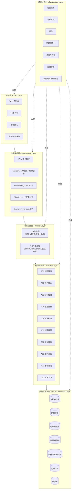
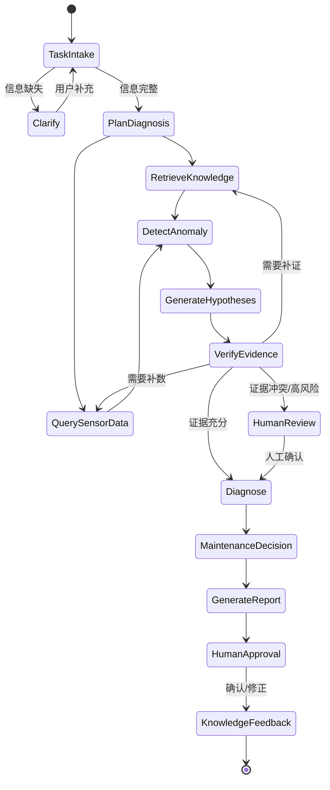
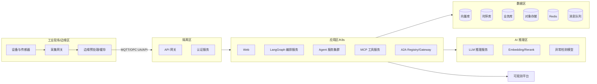
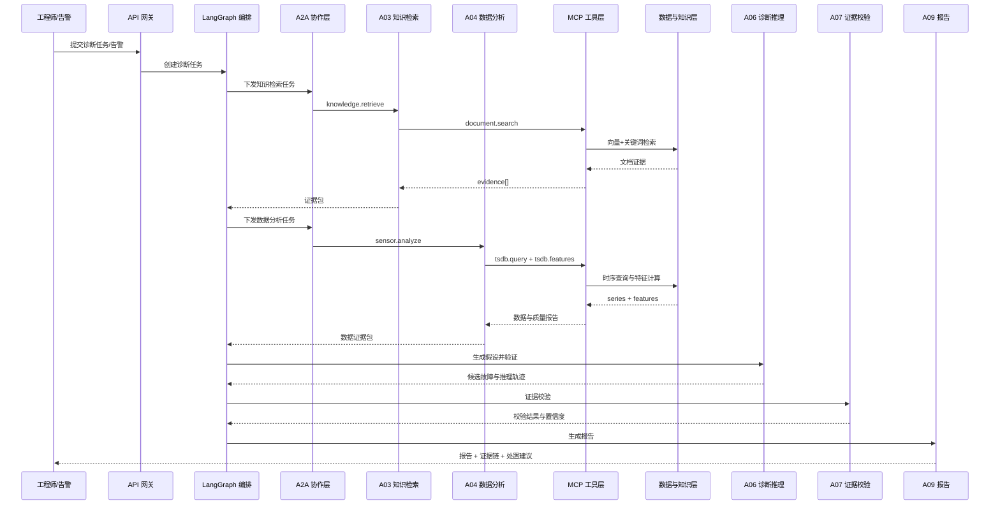

# 04 项目整体架构设计（System Architecture Design）

> 文档编号：IIP-ARCH-001  
> 版本：V1.0  
> 状态：评审稿  
> 读者：架构师、后端/算法/前端研发、测试、运维、安全

---

## 1. 架构目标与原则

### 1.1 架构目标

1. 支撑工业文档知识库与 4 台设备、24 个传感器数据的统一诊断。
2. 以 **LangGraph 单图统一编排** 作为唯一流程入口，保证诊断过程可控、可恢复、可审计。
3. 以 **A2A + MCP 双协议分层架构** 实现 Agent 协作与工具接入的解耦。
4. 达到生产可用：高可用、可观测、可降级、可扩展、可回滚、安全合规。
5. 支持私有化部署和网络隔离，满足工业现场安全要求。
6. 新增设备、文档、工具、Agent 以插件化方式接入，不修改核心编排。

### 1.2 架构原则

| 原则 | 说明 | 落地方式 |
| --- | --- | --- |
| 单一编排入口 | 所有诊断任务从 LangGraph 统一图进入 | API 网关只暴露任务入口；禁止绕过编排直接调用 Agent |
| 状态与实现分离 | 图状态是唯一上下文载体 | `DiagnosisState` 统一 Schema，节点只读写状态 |
| 协议屏蔽差异 | A2A 管协作，MCP 管工具 | Agent 不直连数据库或外部系统 |
| 能力插件化 | 工具、Agent、模型可注册/替换 | 注册中心 + 工厂 + 配置驱动 |
| 证据驱动 | 结论必须映射到证据 | Evidence 数据结构 + 校验节点 |
| 默认安全 | 最小权限、零信任、审计 | 统一 IAM、工具 scope、输入输出护栏 |
| 可观测优先 | 每个调用可追踪 | OpenTelemetry + Trace/Metric/Log |
| 优雅降级 | 依赖失败不导致整体不可用 | 超时、重试、熔断、缓存、转人工 |
| 可回滚 | 模型/提示词/工具/知识可版本化 | 版本化配置 + 灰度发布 + 回滚脚本 |

---

## 2. 总体分层架构



### 2.1 层次职责

| 层次 | 职责 | 关键组件 | 关键要求 |
| --- | --- | --- | --- |
| 接入层 | 用户与系统交互 | Web、API 网关、告警接入、消息/工单 | 认证、限流、审计、协议转换 |
| 应用编排层 | 流程与状态编排 | LangGraph、State、Checkpointer、HITL | 单图入口、可恢复、可中断 |
| 协议适配层 | 标准化协作与工具接入 | A2A Registry、MCP Server/Client | 注册发现、Schema、鉴权、可观测 |
| 能力服务层 | 具体诊断能力 | 10 个核心 Agent | 无状态、可扩展、可替换 |
| 数据与知识层 | 知识、数据、证据存储 | 向量库、时序库、对象存储、案例库、台账 | 一致性、可溯源、可备份 |
| 基础设施层 | 运行支撑 | K8s、MQ、缓存、IAM、KMS、模型网关 | 高可用、安全、可观测 |

---

## 3. LangGraph 单图统一编排设计

### 3.1 为什么采用单图

- **唯一事实来源**：整个诊断流程共享一份 `DiagnosisState`，避免多图之间状态漂移。
- **全程可控**：条件路由、循环、重试、超时、检查点统一由一张图管理。
- **可中断恢复**：长流程诊断通过 Checkpointer 持久化，服务重启后可续跑。
- **人工介入简单**：HITL 作为图中的中断节点，审批后继续执行。
- **便于审计**：每个节点执行都有 `node_name`、输入摘要、输出摘要和 Trace ID。

### 3.2 图逻辑结构



> 实际图由 LangGraph 节点、条件边、循环和子图组成；图中节点可通过 A2A 调用 Agent，通过 MCP 调用工具。

### 3.3 状态 Schema（摘要）

```python
class DiagnosisState(TypedDict, total=False):
    task_id: str
    trace_id: str
    source: str
    user_context: dict
    device: dict
    symptom: list[str]
    time_window: dict
    priority: str
    requested_capabilities: list[str]

    evidence: list[dict]
    sensor_features: dict
    anomalies: list[dict]
    hypotheses: list[dict]
    diagnosis_result: dict
    confidence: float
    risk_level: str
    maintenance_advice: list[dict]

    clarification_needed: bool
    human_review_required: bool
    human_feedback: dict
    error: dict | None
    metrics: dict
    audit: list[dict]
```

### 3.4 关键节点说明

| 节点 | 对应 Agent | 输入 | 输出 | 异常处理 |
| --- | --- | --- | --- | --- |
| `task_intake` | A02 | 原始请求 | 结构化任务 | 信息不足则进入澄清 |
| `plan_diagnosis` | A01 | 结构化任务 | 诊断计划 | 计划失败转人工 |
| `retrieve_knowledge` | A03 | 查询与过滤条件 | 文档证据 | 无结果则记录知识缺口 |
| `query_sensor_data` | A04 | 设备/时间窗/特征 | 数据与特征 | 数据不足则降低置信度 |
| `detect_anomaly` | A05 | 时序/特征 | 异常事件 | 检测失败降级为规则 |
| `generate_hypotheses` | A06 | 现象+证据 | 候选假设 | 假设为空则转人工 |
| `verify_evidence` | A07 | 假设+证据 | 校验结果 | 冲突则补证/转人工 |
| `diagnose` | A06 | 校验后的假设 | 根因与置信度 | 无依据则拒答 |
| `maintenance_decision` | A08 | 根因+风险 | 处置建议 | 规程缺失则给通用建议并提示 |
| `generate_report` | A09 | 诊断结果 | 报告 | 渲染失败则返回 Markdown 降级 |
| `human_approval` | HITL | 报告 | 确认/修正 | 超时则保持待处理 |
| `knowledge_feedback` | A10 | 反馈 | 案例/错题 | 低质量反馈不自动入库 |

---

## 4. A2A + MCP 双协议分层架构

### 4.1 协议定位

| 协议 | 解决的问题 | 不解决的问题 | 在本平台中的位置 |
| --- | --- | --- | --- |
| A2A | Agent 之间的注册、发现、能力协商、任务下发、进度与结果回传 | 工具/数据源的标准化接入 | 协议适配层的协作面 |
| MCP | Agent 与工具/数据源之间的标准化调用、Schema 校验、权限控制 | Agent 之间复杂任务生命周期 | 协议适配层的工具面 |
| LangGraph | 流程编排、状态管理、条件路由、检查点、HITL | 跨进程协议通信 | 应用编排层 |

### 4.2 A2A 层设计

**核心组件**：

- A2A Registry：Agent 注册与能力目录。
- A2A Gateway：任务路由、负载均衡、鉴权、限流。
- A2A Task Manager：任务生命周期（提交、执行、进度、完成、失败、取消）。
- A2A Client SDK：供 Agent 发起和接收任务。

**能力声明示例**：

```json
{
  "agent_id": "A03",
  "name": "Knowledge Retrieval Agent",
  "version": "1.0.0",
  "capabilities": [
    {
      "name": "knowledge.retrieve",
      "description": "工业文档混合检索与证据溯源",
      "input_schema": "schemas/knowledge_retrieve_request.json",
      "output_schema": "schemas/knowledge_retrieve_response.json",
      "timeout_ms": 5000,
      "max_concurrency": 20
    }
  ],
  "endpoints": {"rpc": "http://a03:8080/a2a"},
  "health": "/healthz",
  "labels": {"plane": "knowledge", "region": "edge"}
}
```

**可靠性设计**：

- 任务幂等键：`task_id + capability + payload_hash`。
- 超时、重试、熔断、舱壁隔离。
- 任务状态持久化，支持断点查询。
- 结果回传采用至少一次投递 + 幂等消费。

### 4.3 MCP 层设计

**核心组件**：

- MCP Server：封装文档检索、时序查询、特征计算、设备台账、案例检索、报告渲染、通知推送等工具。
- MCP Client：Agent 侧统一调用入口。
- MCP Registry：工具注册、版本、Schema、权限、SLA。
- MCP Proxy：鉴权、审计、限流、超时、重试、缓存。

**MCP 工具清单（基线）**：

| 工具名 | 能力 | 输入 | 输出 | 调用方 |
| --- | --- | --- | --- | --- |
| `document.search` | 混合检索 + Rerank + 溯源 | query、filters、top_k | evidence[] | A03/A06/A08 |
| `document.get_chunk` | 按 doc_id/page/chunk_id 取原文 | doc_id、page、chunk_id | text、metadata | A07/A09 |
| `tsdb.query` | 查询时序数据 | device_id、sensor_ids、time_window | series[] | A04/A05 |
| `tsdb.features` | 计算时域/频域特征 | series、feature_list | features | A04/A05/A06 |
| `device.get` | 查询设备/传感器台账 | device_id/sensor_id | metadata | A01/A02/A04 |
| `case.search` | 检索历史案例 | query、device_model | cases[] | A06/A08 |
| `case.write` | 写入复核后的案例 | case_payload | case_id | A10 |
| `report.render` | 渲染报告 | template_id、data | report | A09 |
| `notify.send` | 推送消息 | channel、recipient、content | message_id | A09 |
| `model.invoke` | 统一模型调用 | model_alias、messages、tools | completion | 全部 Agent |
| `audit.write` | 写审计日志 | actor、action、payload | ok | 全部 Agent |

**MCP 调用安全**：

- 每个工具声明所需 scope，如 `sensor:read:EQ-003`。
- 调用前做权限校验、参数 Schema 校验、敏感字段脱敏。
- 调用后记录输入输出摘要、耗时、结果状态和 Trace ID。
- 工具级别限流、超时、熔断和降级。
- 禁止工具执行设备控制指令；仅允许只读数据和非控制类操作。

---

## 5. 部署架构

### 5.1 逻辑部署拓扑



### 5.2 网络分区建议

| 区域 | 组件 | 网络策略 |
| --- | --- | --- |
| 工业控制区 | PLC、传感器、采集网关 | 严格控制入站，只允许采集出站/单向数据流 |
| 隔离区 | API 网关、认证、反向代理 | 按需开放端口，禁止直接访问数据库 |
| 应用区 | Agent、编排、MCP、Web | 东西向按服务名访问，启用 mTLS |
| 数据区 | 向量库、时序库、对象存储 | 仅应用区白名单访问 |
| AI 推理区 | LLM、Embedding、模型服务 | 仅模型网关访问，记录调用审计 |
| 运维区 | 监控、日志、堡垒机 | 只读/审计访问，最小权限 |

### 5.3 高可用设计

| 组件 | 高可用策略 | RTO/RPO 目标 |
| --- | --- | --- |
| API 网关 | 多实例 + 负载均衡 | RTO ≤ 5min |
| LangGraph 编排 | 无状态多副本 + 外部 Checkpointer | 任务可恢复 |
| Agent 服务 | 多副本 + 健康检查 | 单节点故障不影响服务 |
| 向量库 | 主从/集群 + 定期快照 | RPO ≤ 5min |
| 时序库 | 副本 + 冷热分层 | RPO ≤ 5min |
| 业务库 | 主备/集群 + WAL | RPO ≤ 5min |
| 对象存储 | 多副本/纠删码 | RPO 近 0 |
| 消息队列 | 集群 + 持久化 | 消息不丢 |
| 模型服务 | 多副本 + 备用模型 | 降级可用 |

---

## 6. 数据架构

### 6.1 数据域划分

| 数据域 | 内容 | 存储建议 | 保留策略 |
| --- | --- | --- | --- |
| 文档原文 | PDF/Word/图片等 | 对象存储 | 永久，版本化 |
| 文档解析结果 | 结构化文本、表格、切块 | 文档数据库/对象存储 | 与原文版本一致 |
| 向量索引 | 文本向量与元数据 | 向量数据库 | 随知识库版本更新 |
| 时序数据 | 原始传感器数据 | 时序数据库 | 热数据 90 天，冷数据按需归档 |
| 特征数据 | 统计/频域/趋势特征 | 时序库/特征库 | 可重算，建议保留 1 年 |
| 诊断记录 | 任务、状态、结论、证据 | 关系库/文档库 | 永久或按合规要求 |
| 案例库 | 复核后的案例和错题 | 关系库 + 向量索引 | 永久 |
| 设备台账 | 设备、传感器、文档关联 | 关系库 | 永久，版本化 |
| 审计日志 | 操作、调用、权限、输出 | 日志/审计库 | ≥ 1 年，不可篡改 |
| 指标与 Trace | 性能、成本、链路 | 可观测平台 | 30～180 天 |

### 6.2 数据流



---

## 7. 安全架构

### 7.1 安全控制点

| 控制点 | 措施 |
| --- | --- |
| 身份认证 | OIDC/OAuth2/LDAP/SSO 对接；服务间 mTLS |
| 访问控制 | RBAC + 数据范围 + 工具 scope + 字段级脱敏 |
| 数据安全 | 传输 TLS/国密；存储加密；敏感数据最小化 |
| 模型安全 | 提示注入防护、输出过滤、工具调用白名单、系统提示隔离 |
| 工具安全 | MCP 工具权限声明、参数校验、只读优先、禁止控制指令 |
| 审计 | 全链路审计、不可篡改日志、异常行为告警 |
| 网络 | 分区隔离、最小开放、白名单、堡垒机 |
| 密钥 | KMS/Vault 管理，定期轮换 |
| 合规 | 等保/行业规范适配、数据留存与删除策略 |

### 7.2 安全调用链

```text
用户请求
  → 网关认证
  → 权限与数据范围校验
  → 输入安全过滤（提示注入/敏感信息）
  → LangGraph 编排
  → Agent 调用（A2A，服务身份鉴权）
  → MCP 工具调用（工具 scope 校验 + 参数校验）
  → 数据访问（行/列级权限）
  → 输出安全过滤（脱敏/控制指令拦截）
  → 审计落库
```

---

## 8. 可观测与运维架构

### 8.1 三大支柱

| 类型 | 采集内容 | 工具建议 | 关键用途 |
| --- | --- | --- | --- |
| Trace | 请求链路、Agent 调用、MCP 调用、模型调用 | OpenTelemetry + Jaeger/Tempo | 定位慢节点、失败节点 |
| Metric | QPS、延迟、错误率、Token、成本、队列长度 | Prometheus + Grafana | 容量与 SLA 监控 |
| Log | 结构化业务日志、审计日志、错误堆栈 | Loki/ELK | 排障与审计 |

### 8.2 关键监控指标

| 类别 | 指标 |
| --- | --- |
| 任务 | 任务量、成功率、失败率、P50/P95/P99 延迟 |
| Agent | 调用次数、平均轮次、超时率、降级率 |
| 模型 | Token 消耗、调用成本、缓存命中率、限流次数 |
| 检索 | 召回数、Rerank 耗时、无结果率、引用准确率 |
| 数据 | 采集延迟、丢点率、数据完整率、查询延迟 |
| 工具 | 调用量、错误率、P95 延迟、熔断次数 |
| 系统 | CPU、内存、GPU、磁盘、网络、Pod 重启次数 |
| 业务 | 诊断准确率、复核率、人工修正率、案例回流率 |

### 8.3 告警分级

| 级别 | 示例 | 响应 |
| --- | --- | --- |
| P0 | 平台不可用、数据泄露、越权控制风险 | 立即响应，启动应急预案 |
| P1 | 诊断主链路失败、核心数据库不可用 | 15 分钟内响应 |
| P2 | 单 Agent/工具异常、延迟升高 | 1 小时内响应 |
| P3 | 指标波动、容量预警 | 当班处理/计划处理 |

---

## 9. 关键架构决策记录（ADR）

| ADR | 决策 | 理由 | 备选方案 | 影响 |
| --- | --- | --- | --- | --- |
| ADR-01 | 采用 LangGraph 单图统一编排 | 状态统一、可恢复、可中断、易审计 | 多图编排、状态机、工作流引擎 | 需控制图复杂度，避免单图膨胀 |
| ADR-02 | A2A 负责 Agent 协作 | 解耦 Agent 生命周期与部署 | 直接 RPC、消息总线 | 增加协议层复杂度，换取扩展性 |
| ADR-03 | MCP 负责工具接入 | 工具标准化、Schema 化、可替换 | 自定义 SDK、硬编码工具 | 需统一工具治理规范 |
| ADR-04 | 混合检索 + Rerank | 兼顾语义与关键词，提升工业术语命中 | 纯向量、纯关键词 | 增加检索组件和延迟 |
| ADR-05 | 结论必须引用证据 | 抑制幻觉，提高可解释性 | 直接生成答案 | 需要证据管理和校验成本 |
| ADR-06 | AI 只辅助、不控制 | 工业安全边界 | 自动控制 | 需人工闭环，但更安全 |
| ADR-07 | 私有化部署优先 | 工业数据安全与网络隔离 | 公有云 SaaS | 运维成本较高 |
| ADR-08 | 无状态服务 + 外部状态 | 易扩展、易恢复 | 有状态 Actor | 需要外部存储和 Checkpointer |

---

## 10. 架构风险与缓解

| 风险 | 影响 | 缓解措施 |
| --- | --- | --- |
| 单图复杂度过高 | 可读性差、回归风险高 | 子图封装、节点单一职责、图版本管理、自动化图测试 |
| A2A/MCP 增加调用链 | 延迟与排障复杂 | 明确协议边界、超时预算、全链路 Trace |
| Agent 输出不稳定 | 诊断质量波动 | 结构化输出、Schema 校验、证据校验、评测集回归 |
| 知识库规模增长 | 检索性能下降 | 索引分区、元数据过滤、缓存、异步重建 |
| 模型成本失控 | 成本超预算 | 模型分级、缓存、Token 上限、成本告警 |
| 现场网络不稳定 | 数据延迟/丢失 | 边缘缓存、断点续传、降级与补数 |
| 安全攻击面扩大 | 数据泄露/越权 | 零信任、最小权限、安全测试、审计告警 |

---

## 11. 架构验收清单

- [ ] LangGraph 单图可完成端到端诊断，支持条件分支、循环、Checkpoint 和 HITL。
- [ ] A2A 注册中心可发现全部 10 个 Agent，任务可下发、可查询、可取消。
- [ ] MCP 工具可注册、可鉴权、可审计，新增工具无需修改编排代码。
- [ ] 诊断全链路 Trace 可查询，关键节点耗时和状态可观测。
- [ ] 文档检索结果 100% 可溯源，数据证据可回溯到传感器和时间窗。
- [ ] 关键依赖故障时系统可降级并提示人工介入。
- [ ] 权限、数据范围、审计、脱敏、提示注入防护通过安全测试。
- [ ] 支持容器化部署、多副本、滚动升级和回滚。
