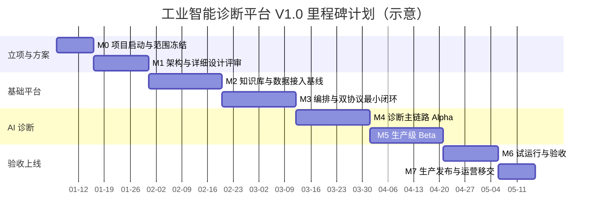
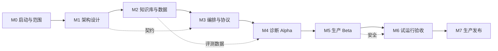

# 06 开发里程碑计划（Development Milestone Plan）

> 文档编号：IIP-PM-001  
> 版本：V1.0  
> 状态：评审稿  
> 读者：项目经理、产品经理、技术负责人、全体研发/测试/运维成员

---

## 1. 计划说明

本计划以“里程碑 + 迭代”方式组织，适用于工业智能诊断平台 V1.0 生产版本建设。所有具体日期、人力投入和预算均使用占位符表示，由项目经理在项目启动会上根据实际资源填充。

**计划基准**：

- 项目周期：`[PROJECT_START_DATE]` 至 `[PROJECT_GO_LIVE_DATE]`
- 迭代周期：2 周/迭代（可根据团队规模调整）
- 里程碑数量：8 个主里程碑（M0～M7）
- 交付目标：完成 27 份文档、4 台设备 24 个传感器、LangGraph 单图编排、A2A + MCP 双协议分层，并通过生产可用验收

---

## 2. 总体里程碑

> 上图日期为示意，实际以 `[MILESTONE_DATE_*]` 占位符替换。

---

## 3. 里程碑定义与交付物

### M0：项目启动与范围冻结

| 项目 | 内容 |
| --- | --- |
| 目标 | 明确项目目标、范围、组织、计划和验收口径 |
| 关键活动 | 项目启动会、干系人访谈、范围确认、风险登记、工具环境准备 |
| 交付物 | 项目章程、范围说明书、干系人清单、RACI、风险登记册、初始 backlog |
| 准入条件 | 业务方、项目经理、技术负责人到位；项目预算和资源原则通过 |
| 准出条件 | 本期范围冻结；验收指标确认；需求评审计划确认 |
| 负责人 | `[PROJECT_MANAGER]` |
| 依赖 | 业务方输入 27 份文档清单、4 台设备/24 传感器清单 |

### M1：架构与详细设计评审

| 项目 | 内容 |
| --- | --- |
| 目标 | 冻结总体架构、接口契约、数据模型和详细设计基线 |
| 关键活动 | 需求分析、架构设计、协议设计、数据设计、安全设计、测试策略 |
| 交付物 | SRS、架构设计、详细设计、A2A/MCP 契约、数据库设计、测试计划 |
| 准入条件 | M0 范围冻结；关键假设确认 |
| 准出条件 | 架构评审通过；接口契约评审通过；风险应对方案确认 |
| 负责人 | `[ARCHITECT]` |
| 依赖 | 现场协议/数据调研完成；模型选型原则确认 |

### M2：知识库与数据接入基线

| 项目 | 内容 |
| --- | --- |
| 目标 | 完成 27 份文档入库和 4 台设备/24 传感器数据接入基线 |
| 关键活动 | 文档解析/OCR/切块/向量化；设备台账；采集协议适配；数据清洗；检索 API |
| 交付物 | 知识库 V0.1（≥ 5091 向量块）、设备台账、传感器数据服务、检索评测报告 |
| 准入条件 | 文档和样例数据到位；解析环境可用 |
| 准出条件 | 文档入库成功率 ≥ 98%；24 传感器数据可查询；检索可溯源 |
| 负责人 | `[DATA_LEAD]`、`[KNOWLEDGE_ENGINEER]` |
| 依赖 | 现场采集协议确认；算力与存储就绪 |

### M3：编排与双协议最小闭环

| 项目 | 内容 |
| --- | --- |
| 目标 | 打通 LangGraph 单图 + A2A 协作 + MCP 工具的端到端最小闭环 |
| 关键活动 | 图骨架、状态设计、A2A Registry/Gateway、MCP 工具封装、Checkpointer |
| 交付物 | 可运行的诊断最小流程、A2A/MCP SDK、工具注册表、链路追踪 |
| 准入条件 | M2 数据与检索接口可用；模型网关可用 |
| 准出条件 | 一个模拟任务可完成“检索—取数—推理—报告”最小闭环；组件故障可降级 |
| 负责人 | `[PLATFORM_LEAD]` |
| 依赖 | 模型和向量模型可用；开发/测试环境就绪 |

### M4：诊断主链路 Alpha

| 项目 | 内容 |
| --- | --- |
| 目标 | 10 个 Agent 核心职责实现，主链路可跑通真实样例 |
| 关键活动 | 假设—验证推理、证据校验、维护决策、报告生成、人工复核、案例回流 |
| 交付物 | Alpha 版本、Agent 单元/契约测试、诊断评测集 V0.1、端到端 Demo |
| 准入条件 | M3 最小闭环稳定；评测数据和标注规则确认 |
| 准出条件 | 典型故障 Top-3 命中率 ≥ 80%；结论均带证据链；无依据拒答生效 |
| 负责人 | `[AI_LEAD]` |
| 依赖 | 专家提供故障场景和标注；报告模板确认 |

### M5：生产级 Beta

| 项目 | 内容 |
| --- | --- |
| 目标 | 完成生产级非功能能力，达到上线前质量门槛 |
| 关键活动 | 性能优化、安全加固、可观测完善、权限审计、降级限流、成本控制、部署自动化 |
| 交付物 | Beta 版本、性能报告、安全测试报告、部署手册、运维手册、回滚方案 |
| 准入条件 | M4 功能完整；测试环境和准生产环境就绪 |
| 准出条件 | 功能/性能/安全/可靠性测试通过；诊断准确率 ≥ 85%；P95 ≤ 60s |
| 负责人 | `[QA_LEAD]`、`[DEVOPS_LEAD]` |
| 依赖 | 安全合规评审；基础设施资源到位 |

### M6：试运行与验收

| 项目 | 内容 |
| --- | --- |
| 目标 | 在真实/准真实场景试点运行，完成用户验收测试 |
| 关键活动 | 试点部署、用户培训、场景演练、问题修复、指标采集、验收评审 |
| 交付物 | 试运行报告、UAT 报告、验收报告、培训材料、问题闭环清单 |
| 准入条件 | M5 Beta 通过；试点范围和用户确定 |
| 准出条件 | 四类核心场景通过；用户确认；遗留问题满足上线标准 |
| 负责人 | `[PROJECT_MANAGER]`、`[BUSINESS_OWNER]` |
| 依赖 | 现场配合、专家复核、数据准备 |

### M7：生产发布与运营移交

| 项目 | 内容 |
| --- | --- |
| 目标 | 完成生产发布、运营体系建立和知识闭环移交 |
| 关键活动 | 灰度发布、生产观察、应急演练、运营手册移交、知识库运营机制建立 |
| 交付物 | 生产发布记录、运维交接单、运营 SOP、知识治理计划、版本说明 |
| 准入条件 | M6 验收通过；发布审批完成 |
| 准出条件 | 生产稳定运行观察期通过；运营团队可独立运维；知识闭环运转 |
| 负责人 | `[RELEASE_MANAGER]`、`[OPS_LEAD]` |
| 依赖 | 生产环境、监控告警、值班体系就绪 |

---

## 4. 迭代计划（示意）

| 迭代 | 主题 | 主要任务 | 主要交付 |
| --- | --- | --- | --- |
| Sprint 0 | 项目准备 | 环境、CI、契约、脚手架 | Monorepo、CI/CD、开发规范 |
| Sprint 1-2 | 文档知识库 | 解析、OCR、切块、向量化、检索 | 知识库 V0.1、检索 API |
| Sprint 3-4 | 传感器数据 | 协议接入、清洗、特征、异常检测 | 数据服务、异常事件 |
| Sprint 5-6 | 编排与协议 | LangGraph、A2A、MCP、Checkpointer | 最小闭环、SDK |
| Sprint 7-8 | 诊断核心 | 假设验证、证据校验、置信度 | Alpha 诊断链路 |
| Sprint 9-10 | 输出闭环 | 报告、复核、案例回流 | Beta 功能闭环 |
| Sprint 11 | 生产加固 | 性能、安全、可观测、降级 | 生产候选版本 |
| Sprint 12 | 试运行验收 | 试点、培训、UAT、修复 | 验收版本 |

> 每个迭代包含需求澄清、设计、开发、自测、联调、演示、回顾；迭代内不引入未评审的重大范围变更。

---

## 5. WBS 工作分解摘要

| WBS | 工作包 | 负责人（占位符） | 主要产出 |
| --- | --- | --- | --- |
| 1 | 项目管理 | `[PROJECT_MANAGER]` | 计划、报告、风险、变更 |
| 2 | 需求与产品 | `[PRODUCT_OWNER]` | 需求、原型、验收口径 |
| 3 | 知识工程 | `[KNOWLEDGE_ENGINEER]` | 文档解析、知识库、评测 |
| 4 | 数据工程 | `[DATA_ENGINEER]` | 采集、清洗、时序服务 |
| 5 | 平台架构 | `[ARCHITECT]` | 架构、契约、技术决策 |
| 6 | 编排与协议 | `[PLATFORM_ENGINEER]` | LangGraph、A2A、MCP |
| 7 | AI 算法 | `[AI_ENGINEER]` | Agent、提示词、评测、优化 |
| 8 | 应用开发 | `[BACKEND_ENGINEER]`、`[FRONTEND_ENGINEER]` | API、Web、报告 |
| 9 | 测试与质量 | `[QA_ENGINEER]` | 测试计划、用例、报告 |
| 10 | 安全与合规 | `[SECURITY_ENGINEER]` | 安全设计、测试、审计 |
| 11 | DevOps | `[DEVOPS_ENGINEER]` | CI/CD、部署、监控、备份 |
| 12 | 运营与知识治理 | `[OPS_LEAD]`、`[KNOWLEDGE_MANAGER]` | 运营 SOP、案例评审、培训 |

---

## 6. 里程碑依赖关系

**关键路径**：M0 → M1 → M2 → M3 → M4 → M5 → M6 → M7。  
**关键依赖**：

- 文档和数据到位时间；
- 现场协议与网络开通；
- 专家标注和复核资源；
- 模型/算力资源；
- 安全合规评审。

---

## 7. 质量门禁

| 门禁 | 检查内容 | 通过标准 |
| --- | --- | --- |
| G0 范围门禁 | 需求基线冻结 | 范围、指标、假设确认 |
| G1 设计门禁 | 架构与接口评审 | 无未决高风险设计 |
| G2 数据门禁 | 知识库与数据可用 | 入库成功率、完整率达标 |
| G3 开发门禁 | 单元/契约/集成测试 | 核心覆盖率、契约 100% |
| G4 评测门禁 | 诊断效果 | 准确率、Top-3、引用准确率达标 |
| G5 安全门禁 | 安全测试 | 无高危漏洞，权限审计通过 |
| G6 性能门禁 | 性能压测 | P95、并发、资源达标 |
| G7 发布门禁 | 上线审批 | 回滚方案、监控告警、值班就绪 |

---

## 8. 资源与成本假设

| 类别 | 占位符/假设 | 说明 |
| --- | --- | --- |
| 项目周期 | `[PROJECT_DURATION_WEEKS]` | 建议 20～28 周（视范围） |
| 团队规模 | `[TEAM_SIZE]` | 建议 12～20 人，详见团队分工文档 |
| 预算 | `[PROJECT_BUDGET]` | 含人力、算力、软件、硬件、运维 |
| GPU 资源 | `[GPU_RESOURCE_PLAN]` | 训练/推理/评测分离 |
| 存储资源 | `[STORAGE_PLAN]` | ≥ 1TB 可扩展，含备份 |
| 第三方软件 | `[THIRD_PARTY_LICENSES]` | 模型、数据库、可观测工具 |

---

## 9. 风险与应对

| 编号 | 风险 | 影响 | 概率 | 应对 | 责任人 |
| --- | --- | --- | --- | --- | --- |
| PM-R01 | 需求范围蔓延 | 延期/超预算 | 中 | 冻结范围，变更评审 | `[PROJECT_MANAGER]` |
| PM-R02 | 文档/数据延迟 | 关键路径阻塞 | 中高 | 提前对账，分批交付，准备样例数据 | `[DATA_LEAD]` |
| PM-R03 | 专家资源不足 | 评测和知识结构化延误 | 中 | 提前锁定专家时间，建立评审机制 | `[PRODUCT_OWNER]` |
| PM-R04 | 模型/算力不到位 | 开发与评测受阻 | 中 | 提前采购，准备替代模型/云资源 | `[AI_LEAD]` |
| PM-R05 | 双协议集成复杂 | 联调延期 | 中 | 接口先行、Mock 驱动、小步联调 | `[PLATFORM_LEAD]` |
| PM-R06 | 安全合规评审周期长 | 上线延期 | 中 | 安全设计左移，提前预审 | `[SECURITY_ENGINEER]` |
| PM-R07 | 现场网络隔离 | 部署/接入困难 | 中 | 提前勘查，准备边缘部署方案 | `[DEVOPS_ENGINEER]` |
| PM-R08 | 用户采纳不足 | 价值无法兑现 | 中 | 试点共创、培训、可解释结果、持续运营 | `[OPS_LEAD]` |

---

## 10. 项目治理

| 机制 | 频率 | 参与人 | 输出 |
| --- | --- | --- | --- |
| 每日站会 | 每工作日 | 研发团队 | 阻塞项、当天计划 |
| 迭代评审 | 每迭代 | 项目组 + 业务代表 | 演示、反馈、验收 |
| 迭代回顾 | 每迭代 | 项目组 | 改进项 |
| 架构评审 | 按需/里程碑 | 架构师、技术负责人 | ADR、设计决议 |
| 风险例会 | 每两周 | 项目经理、负责人 | 风险更新与应对 |
| 质量门禁评审 | 每里程碑 | QA、安全、运维 | 门禁结论 |
| 项目指导委员会 | 每月 | 发起人、业务方、项目经理 | 决策、资源、范围 |

---

## 11. 交付物清单

| 类别 | 交付物 | 里程碑 |
| --- | --- | --- |
| 管理 | 项目章程、计划、风险登记册、变更记录 | M0～M7 |
| 需求 | SRS、用户故事、验收标准 | M1 |
| 设计 | 架构设计、详细设计、接口契约、数据模型 | M1～M3 |
| 数据 | 知识库、设备台账、评测集、案例库 | M2～M4 |
| 软件 | 编排服务、Agent、MCP Server、Web、API | M3～M5 |
| 测试 | 测试计划、用例、报告、性能/安全报告 | M4～M6 |
| 部署 | 镜像、Helm/K8s 清单、部署/运维手册 | M5～M7 |
| 运营 | 培训材料、运营 SOP、知识治理计划 | M6～M7 |
| 验收 | UAT 报告、验收报告、发布记录 | M6～M7 |

---

## 12. 里程碑达成标准

| 里程碑 | 达成标准摘要 |
| --- | --- |
| M0 | 范围、计划、组织、风险基线确认 |
| M1 | 需求、架构、接口、测试策略评审通过 |
| M2 | 27 份文档入库、24 传感器可查、检索可溯源 |
| M3 | 单图 + A2A + MCP 最小闭环跑通，故障可降级 |
| M4 | 10 个 Agent 主链路可用，Top-3 ≥ 80% |
| M5 | 功能、性能、安全、可靠性达标，准确率 ≥ 85% |
| M6 | 四类场景 UAT 通过，遗留问题可控 |
| M7 | 生产稳定运行，运营和知识闭环移交完成 |

> 所有日期、人员、预算、资源数量均以 `[占位符]` 表示，由项目经理在项目启动会上替换并形成正式基线。
