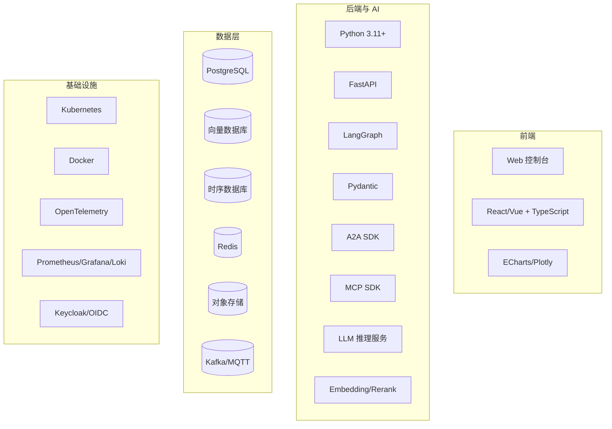

# 08 技术选型说明（Technology Selection）

> 文档编号：IIP-TECH-001  
> 版本：V1.0  
> 状态：评审稿  
> 读者：架构师、研发、算法、运维、采购、安全

---

## 1. 选型原则

| 原则 | 说明 |
| --- | --- |
| 生产可用优先 | 优先选择有工业落地案例、社区活跃、可观测、可运维的技术 |
| 自主可控 | 支持私有化部署、国产化适配，避免供应商锁定 |
| 接口标准化 | 优先 MCP/A2A/OpenAPI/OpenTelemetry 等开放标准 |
| 可替换 | 模型、数据库、消息队列等关键组件通过接口抽象，避免硬耦合 |
| 与 AI 生态兼容 | 优先 Python、Pydantic、LangGraph、向量检索生态 |
| 成本可控 | 兼顾授权成本、算力成本、运维成本和人力成本 |
| 安全合规 | 支持加密、审计、权限、网络隔离和合规要求 |

---

## 2. 总体技术栈

---

## 3. 核心技术选型

### 3.1 编排框架：LangGraph

| 项目 | 内容 |
| --- | --- |
| 选型 | LangGraph（Python） |
| 版本策略 | 锁定小版本，升级前做回归和兼容测试 |
| 选型理由 | 支持有状态多步骤 Agent、条件边、循环、子图、Checkpoint、Human-in-the-loop；与本项目“单图统一编排”要求高度匹配 |
| 备选方案 | 自研状态机、Temporal、Airflow、Prefect、CrewAI、AutoGen |
| 备选对比 | Temporal 适合长事务但 Agent 生态弱；Airflow 偏批处理；CrewAI/AutoGen 多 Agent 编排与“单图统一状态”不完全契合 |
| 关键风险 | 图复杂度、版本升级不兼容、状态膨胀 |
| 缓解措施 | 子图封装、状态分层、版本锁定、图快照回归测试、最大步数限制 |

**结论**：LangGraph 作为唯一编排框架。所有 Agent 以节点/子图形式接入，禁止旁路编排。

### 3.2 Agent 协作协议：A2A

| 项目 | 内容 |
| --- | --- |
| 选型 | A2A（Agent-to-Agent）协议 + 自研注册中心/网关 |
| 选型理由 | 标准化 Agent 注册、发现、能力声明、任务下发和结果回传；支持 Agent 独立部署、独立扩缩容；适合多团队协作 |
| 备选方案 | gRPC 直连、REST 直连、消息总线、自研 Agent 协议 |
| 备选对比 | 直连耦合强、扩展难；消息总线异步友好但同步诊断链路复杂；自研协议维护成本高 |
| 关键风险 | 协议成熟度、跨版本兼容、网络开销 |
| 缓解措施 | 协议 Schema 化、版本协商、超时预算、Trace 贯穿、兼容性测试 |

**结论**：A2A 用于 Agent 间协作；DiagnosisState 仍由 LangGraph 单图维护，A2A 只负责跨 Agent 任务协作。

### 3.3 工具接入协议：MCP

| 项目 | 内容 |
| --- | --- |
| 选型 | MCP（Model Context Protocol） | 
| 选型理由 | 统一工具/数据源接入方式；工具能力、入参出参 Schema、权限可声明；新增工具可零改动编排接入 |
| 备选方案 | 自定义 Tool SDK、OpenAPI Function Calling、插件框架 |
| 备选对比 | 自定义 SDK 无统一规范；OpenAPI 适合 REST 但不覆盖模型工具上下文；插件框架缺少模型侧标准 |
| 关键风险 | MCP 生态演进、工具安全、调用链复杂 |
| 缓解措施 | Schema 校验、工具 scope、审计、限流、熔断、Mock Server、契约测试 |

**结论**：所有工具/数据源通过 MCP Server 暴露；Agent 只持有工具名和 Schema，不直连底层系统。

### 3.4 后端语言与框架

| 项目 | 内容 |
| --- | --- |
| 选型 | Python 3.11+ + FastAPI + Pydantic v2 + Uvicorn/Gunicorn |
| 选型理由 | AI/LLM 生态最完善；FastAPI 异步性能好、OpenAPI 原生支持；Pydantic 适合 Schema 和结构化输出校验 |
| 备选方案 | Java Spring Boot、Go、Node.js/NestJS |
| 备选对比 | Java 适合企业级治理但 AI 生态弱；Go 性能好但 AI SDK 不足；Node.js 前后端统一但数据处理生态弱 |
| 关键风险 | Python GIL、性能、依赖冲突 |
| 缓解措施 | 异步 I/O、计算密集任务下沉到独立服务、虚拟环境/容器隔离、依赖锁定 |

**结论**：核心 AI/编排/数据服务采用 Python；若企业已有 Java 平台，网关、IAM、工单集成可用 Java/Go，通过标准 API 互通。

### 3.5 前端技术

| 项目 | 内容 |
| --- | --- |
| 选型 | React 18 + TypeScript + Vite + Ant Design（或同等企业级 UI） + ECharts |
| 选型理由 | 生态成熟、组件丰富、适合工业控制台；ECharts 适合时序曲线、频谱和统计图表 |
| 备选方案 | Vue 3 + Element Plus、Angular |
| 备选对比 | Vue 上手快，Angular 企业规范强但重；React 生态与图表、微前端更成熟 |
| 关键风险 | 工业场景大表格/大图表性能 |
| 缓解措施 | 虚拟滚动、按需加载、Web Worker、数据降采样、图表按需渲染 |

### 3.6 关系数据库

| 项目 | 内容 |
| --- | --- |
| 选型 | PostgreSQL 15+ |
| 用途 | 设备台账、诊断任务、案例、配置、权限元数据、审计索引 |
| 选型理由 | 开源成熟、事务可靠、JSONB 灵活、生态好、支持逻辑复制和备份 |
| 备选方案 | MySQL、Oracle、SQL Server、达梦/人大金仓 |
| 备选对比 | MySQL 生态广但 JSON/扩展弱；Oracle 成本高；国产数据库按合规要求可替换 |
| 关键风险 | 高并发写入、单点故障 |
| 缓解措施 | 主备/集群、连接池、读写分离、分区、归档 |

### 3.7 向量数据库

| 项目 | 内容 |
| --- | --- |
| 选型 | Milvus/Qdrant/pgvector 三选一，建议试点后冻结 |
| 推荐 | 中等规模（5091 向量块起）优先 pgvector 简化运维；规模增长或性能要求高时选 Milvus/Qdrant |
| 选型理由 | 支持向量检索、元数据过滤、标量字段、批量导入；与 RAG 生态兼容 |
| 备选方案 | Elasticsearch/OpenSearch 向量检索、FAISS、Weaviate、Chroma |
| 备选对比 | FAISS 轻量但不适合服务化；Chroma 轻量但生产治理弱；ES 可统一关键词+向量但资源重 |
| 关键风险 | 索引重建、过滤性能、版本升级、数据一致性 |
| 缓解措施 | 版本化索引、双写/别名切换、增量重建、备份、索引健康检查 |

### 3.8 时序数据库

| 项目 | 内容 |
| --- | --- |
| 选型 | TimescaleDB / InfluxDB / Apache IoTDB 三选一，结合现场和国产化要求 |
| 推荐 | 已有 PostgreSQL 能力优先 TimescaleDB；海量工业时序和国产化要求高可选 IoTDB |
| 用途 | 24 传感器原始时序、特征、异常事件、数据质量指标 |
| 选型理由 | 高写入、时间窗口查询、压缩、保留策略、降采样 |
| 备选方案 | Prometheus（不适合业务时序）、ClickHouse（分析强但实时写入需评估）、OpenTSDB |
| 关键风险 | 写入吞吐、乱序数据、长周期存储成本 |
| 缓解措施 | 批量写入、分区/分片、冷热分层、压缩、保留策略、乱序处理策略 |

### 3.9 缓存与消息队列

| 项目 | 内容 |
| --- | --- |
| 缓存 | Redis 7.x：会话、热点检索、限流、分布式锁、任务状态缓存 |
| 消息队列 | Kafka 或 RabbitMQ：告警接入、异步任务、事件、审计；现场 MQTT 通过网关接入 |
| 选型理由 | Redis 低延迟、生态成熟；Kafka 高吞吐、可回放，适合事件驱动 |
| 备选方案 | NATS、Pulsar、RocketMQ、内存队列 |
| 关键风险 | 消息积压、重复消费、顺序性 |
| 缓解措施 | 分区、消费幂等、死信队列、积压告警、消息保留策略 |

### 3.10 对象存储

| 项目 | 内容 |
| --- | --- |
| 选型 | MinIO（私有化）或云对象存储；S3 兼容 API |
| 用途 | 原始文档、解析结果、报告、导出文件、模型包、备份 |
| 选型理由 | 私有化部署友好、S3 兼容、可扩展、低成本 |
| 备选方案 | NFS、Ceph、云 OSS/S3 |
| 关键风险 | 容量、一致性、备份 |
| 缓解措施 | 多副本/纠删码、生命周期、版本控制、跨区备份 |

### 3.11 模型与推理

| 项目 | 内容 |
| --- | --- |
| LLM | 支持工具调用和长上下文的工业/通用大模型；优先私有化部署 |
| 推理框架 | vLLM / TGI / TensorRT-LLM / Ollama（开发） |
| Embedding | 中文/工业领域文本向量模型，支持批量编码 |
| Rerank | 低延迟 Cross-Encoder 重排模型 |
| OCR | PaddleOCR / 商用 OCR（按扫描件质量选择） |
| 时序模型 | 统计方法 + Isolation Forest/One-Class SVM/LSTM/AutoEncoder（按数据量） |
| 模型网关 | 统一模型别名、路由、限流、缓存、成本、灰度、审计 |
| 选型理由 | 平衡效果、中文支持、私有化、成本与工程成熟度 |
| 关键风险 | 模型幻觉、显存不足、版本漂移、授权 |
| 缓解措施 | 证据校验、评测集、模型卡片、灰度、备用模型、成本上限 |

> 具体 LLM/Embedding/Rerank 型号由算法评测决定，不在本文件锁定；选型必须提交模型卡片和评测报告。

### 3.12 身份、安全与审计

| 项目 | 内容 |
| --- | --- |
| 身份认证 | Keycloak/OIDC/LDAP/企业 SSO |
| 权限 | RBAC + ABAC/数据范围，建议 Casbin/OPA 策略引擎 |
| 密钥 | Vault/KMS/Secrets Manager |
| 审计 | 独立审计库/日志服务，WORM 或哈希链防篡改 |
| 安全扫描 | Semgrep、Trivy、Bandit、Dependabot/Snyk |
| 选型理由 | 开源成熟、支持私有化、策略可配置 |
| 关键风险 | 集成复杂、策略漂移 |
| 缓解措施 | 策略即代码、权限回归测试、定期审计 |

### 3.13 可观测与运维

| 项目 | 内容 |
| --- | --- |
| Trace | OpenTelemetry + Jaeger/Tempo |
| Metric | Prometheus + Grafana |
| Log | Loki/ELK + 结构化日志 |
| 告警 | Alertmanager + 企业 IM/邮件 |
| 部署 | Kubernetes + Helm/Kustomize；开发环境 Docker Compose |
| CI/CD | GitHub Actions/GitLab CI/Jenkins + Argo CD |
| 选型理由 | 云原生标准、生态成熟、支持私有化 |
| 关键风险 | 指标基数、日志成本、Trace 采样 |
| 缓解措施 | 指标规范、日志分级、尾部采样、保留策略 |

---

## 4. 关键选型决策表

| 领域 | 首选 | 备选 | 决策依据 | 替换成本 |
| --- | --- | --- | --- | --- |
| 编排 | LangGraph | Temporal/自研 | 单图、状态、HITL | 高 |
| 协作协议 | A2A | gRPC/REST | 解耦、标准 | 中 |
| 工具协议 | MCP | 自定义 SDK | 标准、Schema、插件 | 中 |
| 后端 | Python/FastAPI | Java/Go | AI 生态 | 中 |
| 前端 | React/TS | Vue | 企业组件与图表 | 低 |
| 关系库 | PostgreSQL | MySQL/国产库 | 事务、JSON、扩展 | 中 |
| 向量库 | pgvector/Milvus/Qdrant | FAISS/ES | 规模与运维权衡 | 中 |
| 时序库 | TimescaleDB/IoTDB | InfluxDB | 写入与国产化 | 中 |
| 缓存 | Redis | 本地缓存 | 成熟、低延迟 | 低 |
| 消息 | Kafka/RabbitMQ | NATS/Pulsar | 吞吐与生态 | 中 |
| 对象存储 | MinIO/S3 | Ceph/NFS | 私有化、S3 | 低 |
| LLM 推理 | vLLM/TGI | Ollama/云 API | 私有化与性能 | 中 |
| 身份 | Keycloak | 企业 SSO | 标准、私有化 | 低 |
| 可观测 | OTel + Prom/Grafana/Loki | 商业 APM | 标准、成本 | 中 |

---

## 5. 依赖与版本管理

| 类别 | 管理策略 |
| --- | --- |
| Python 依赖 | 使用 lock 文件（uv/poetry/pip-tools），CI 固定哈希安装 |
| 前端依赖 | pnpm lock + 依赖审计 |
| 容器基础镜像 | 固定 digest，禁止 `latest` |
| 数据库 schema | Flyway/Alembic 迁移，版本化 |
| 模型 | 模型注册表 + 版本 + 模型卡片 + 哈希 |
| 提示词 | Git 版本化 + 评测门禁 + 灰度 |
| MCP/A2A 协议 | 语义化版本 + 兼容性测试 |
| 第三方服务 | 合同/授权审查，准备平替方案 |

---

## 6. 合规与授权注意事项

| 组件 | 常见许可证 | 注意事项 |
| --- | --- | --- |
| LangGraph | MIT/Apache 类 | 确认具体版本许可证 |
| PostgreSQL | PostgreSQL License | 宽松，商用友好 |
| Redis | BSD/RSAL 版本差异 | 确认 Redis 版本与许可证，必要时用 Valkey/KeyDB |
| Milvus/Qdrant | Apache 2.0/混合 | 确认版本条款 |
| MinIO | AGPL/商业授权 | AGPL 对分发有要求，商业部署需评估 |
| Keycloak | Apache 2.0 | 商用友好 |
| Grafana/Loki/Prometheus | AGPL/Apache | 确认分发/托管方式 |
| 大模型 | 社区/商业许可 | 重点审查商用、私有化、输出归属和数据使用条款 |
| OCR/Embedding/Rerank | 各模型不同 | 逐项审查许可证与合规 |

> 建议法务/采购在选型确认前完成开源合规审查，形成 SBOM 和许可证清单。

---

## 7. 选型风险与缓解

| 风险 | 影响 | 概率 | 缓解措施 |
| --- | --- | --- | --- |
| LangGraph/A2A/MCP 版本升级不兼容 | 系统不稳定 | 中 | 版本锁定、升级评审、回归测试、接口抽象 |
| 模型效果不达预期 | 诊断准确率低 | 中高 | 预研评测、备用模型、RAG/规则补充、持续优化 |
| 向量库/时序库性能不足 | 延迟/吞吐不达标 | 中 | 压测选型、分片、缓存、冷热分层 |
| 开源许可证风险 | 合规问题 | 中 | 法务审查、SBOM、替换方案 |
| 国产化/信创要求 | 需替换组件 | 中 | 优先支持国产数据库/操作系统/芯片，预留适配层 |
| 算力成本过高 | 预算超支 | 中 | 模型分级、缓存、量化、预算上限、按需扩缩容 |
| 运维复杂度高 | 故障率上升 | 中 | 标准化部署、IaC、可观测、自动化运维、演练 |

---

## 8. 技术选型结论

1. **编排框架**采用 LangGraph，单图统一编排，作为唯一流程入口。
2. **协作与工具**采用 A2A + MCP 双协议分层，实现 Agent 解耦和工具标准化。
3. **后端**以 Python/FastAPI/Pydantic 为主，企业集成可采用 Java/Go。
4. **存储**采用 PostgreSQL + 向量库 + 时序库 + Redis + 对象存储，按规模和国产化要求选型。
5. **模型**采用私有化优先、模型网关统一治理，具体型号经评测后冻结。
6. **部署**采用 Kubernetes 容器化，支持灰度、回滚和多环境。
7. **可观测与安全**采用 OpenTelemetry、Prometheus/Grafana/Loki、Keycloak、OPA 等标准组件。
8. 所有选型须通过 **PoC/压测/安全/合规/成本** 五类验证后方可进入生产基线；未验证组件以 `[待验证]` 标记。
