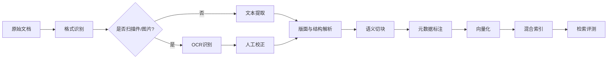

# 09 数据集与硬件资源说明（Dataset and Hardware Resources）

> 文档编号：IIP-RES-001  
> 版本：V1.0  
> 状态：评审稿  
> 读者：算法工程师、数据工程师、运维、采购、安全合规

---

## 1. 资源总览

| 资源类别 | 本期规模 | 说明 |
| --- | --- | --- |
| 工业文档 | 27 份，约 1109 页 | 设备手册、检修规程、故障案例、工艺标准、图纸等 |
| 向量块 | 约 5091 个 | 文档切块基线，后续可增量扩展 |
| 设备 | 4 台 | 按设备类型、型号、产线编号管理 |
| 传感器 | 24 个 | 振动、温度、压力、电流、转速等 |
| 时序数据 | 实时 + 历史 | 多采样率、多量纲，需时间戳和台账元数据 |
| 模型 | LLM + Embedding + Rerank + OCR + 时序模型 | 私有化优先，模型网关统一治理 |
| 算力 | GPU 推理/训练 + CPU 服务 | 具体配置按容量估算和预算确定 |
| 存储 | ≥ 1TB 可扩展（建议预留 2～5TB） | 文档、向量、时序、报告、备份 |

> 所有具体数量、型号、型号、采样率、留存周期均需现场调研确认；本文未明确处均使用 `[待确认]` 或“（假设）”标注。

---

## 2. 工业文档数据集

### 2.1 数据集组成

| 编号 | 文档类型 | 数量（建议） | 典型内容 | 格式 | 处理重点 |
| --- | --- | --- | --- | --- | --- |
| DOC-01 | 设备操作手册 | `[DOC_COUNT_01]` | 设备结构、操作步骤、参数说明 | PDF/Word | 章节结构、参数表 |
| DOC-02 | 维护检修规程 | `[DOC_COUNT_02]` | 检修周期、标准、步骤、验收 | PDF/Word | SOP、阈值、步骤 |
| DOC-03 | 故障诊断案例 | `[DOC_COUNT_03]` | 现象、原因、处理、结论 | PDF/Word/Excel | 案例结构化 |
| DOC-04 | 工艺参数标准 | `[DOC_COUNT_04]` | 工艺窗口、报警阈值、工况 | Excel/PDF | 表格、阈值 |
| DOC-05 | 图纸/图片 | `[DOC_COUNT_05]` | 结构图、接线图、部件图 | 图片/PDF | OCR、图注、标注 |
| DOC-06 | 传感器/部件说明 | `[DOC_COUNT_06]` | 传感器规格、量纲、安装 | PDF/Word | 元数据提取 |
| DOC-07 | 安全规范 | `[DOC_COUNT_07]` | 安全操作、挂牌上锁、应急 | PDF/Word | 安全约束 |
| **合计** | - | **27 份** | - | - | 约 1109 页 |

> 以上数量分布为建议，实际以文档清单为准。

### 2.2 文档处理流程

### 2.3 文档解析要求

| 项目 | 要求 |
| --- | --- |
| 格式支持 | PDF（文本/扫描）、Word、Excel、图片、TXT/Markdown |
| OCR | 扫描件和图纸文字识别；支持表格/标题/图注识别 |
| 结构解析 | 识别章节层级、标题、段落、表格、图注、公式、参数、步骤 |
| 切块策略 | 按语义/结构切块；块大小建议 300～800 tokens，重叠 10%～20% |
| 元数据 | 文档 ID、名称、类型、设备型号、版本、页码、章节、密级、有效期 |
| 质量指标 | 解析成功率 ≥ 98%、OCR 可读率 ≥ 95%、引用可溯源率 100% |
| 人工校正 | 提供 OCR/解析校正界面，校正记录留痕 |
| 版本管理 | 文档新增/修订后增量更新，旧版本可追溯，失效标记 |

### 2.4 向量块规划

| 项目 | 基线 | 扩展目标 |
| --- | --- | --- |
| 文档数 | 27 | 100+ |
| 页数 | 1109 | 按需增长 |
| 向量块 | 5091 | 10 万+ |
| 向量维度 | 由 Embedding 模型决定 | 支持模型升级重建 |
| 索引类型 | HNSW/IVF 等按向量库选择 | 按规模调优 |
| 元数据过滤 | 设备型号、文档类型、版本、密级 | 持续扩展 |
| 检索评测 | Top-1/Top-5 命中率、引用准确率 | 每次更新回归 |

### 2.5 文档质量校验清单

- [ ] 文档是否完整，页数是否与清单一致。
- [ ] OCR 结果是否可阅读，关键数字/单位是否识别正确。
- [ ] 章节结构是否正确，表格是否丢失。
- [ ] 切块是否语义完整，是否出现跨表/跨图错误切分。
- [ ] 元数据是否完整（设备型号、版本、页码、密级）。
- [ ] 随机抽样检索是否命中正确页码。
- [ ] 失效/过期文档是否已标记。

---

## 3. 设备与传感器数据集

### 3.1 设备清单（模板）

| 设备 ID | 设备名称 | 型号 | 产线/位置 | 关键部件 | 关联文档 | 状态 |
| --- | --- | --- | --- | --- | --- | --- |
| `[DEVICE_01]` | `[DEVICE_NAME_01]` | `[MODEL_01]` | `[LINE_01]` | `[PARTS_01]` | `[DOC_REF_01]` | `[STATUS]` |
| `[DEVICE_02]` | `[DEVICE_NAME_02]` | `[MODEL_02]` | `[LINE_02]` | `[PARTS_02]` | `[DOC_REF_02]` | `[STATUS]` |
| `[DEVICE_03]` | `[DEVICE_NAME_03]` | `[MODEL_03]` | `[LINE_03]` | `[PARTS_03]` | `[DOC_REF_03]` | `[STATUS]` |
| `[DEVICE_04]` | `[DEVICE_NAME_04]` | `[MODEL_04]` | `[LINE_04]` | `[PARTS_04]` | `[DOC_REF_04]` | `[STATUS]` |

### 3.2 传感器清单（模板）

| 传感器 ID | 所属设备 | 测点 | 类型 | 量纲 | 采样率 | 协议 | 报警阈值 | 位置 |
| --- | --- | --- | --- | --- | --- | --- | --- | --- |
| `[SENSOR_01]` | `[DEVICE_01]` | `[POINT_01]` | 振动 | mm/s | `[RATE]` | `[PROTOCOL]` | `[THRESHOLD]` | `[LOCATION]` |
| `[SENSOR_02]` | `[DEVICE_01]` | `[POINT_02]` | 温度 | ℃ | `[RATE]` | `[PROTOCOL]` | `[THRESHOLD]` | `[LOCATION]` |
| ... | ... | ... | ... | ... | ... | ... | ... | ... |
| `[SENSOR_24]` | `[DEVICE_04]` | `[POINT_24]` | `[TYPE]` | `[UNIT]` | `[RATE]` | `[PROTOCOL]` | `[THRESHOLD]` | `[LOCATION]` |

> 建议每个设备配置 4～8 个传感器，覆盖振动、温度、压力、电流、转速等关键量。

### 3.3 传感器数据字典

| 字段 | 类型 | 必填 | 说明 |
| --- | --- | --- | --- |
| `device_id` | string | 是 | 设备唯一标识 |
| `sensor_id` | string | 是 | 传感器唯一标识 |
| `timestamp` | datetime | 是 | ISO 8601，带时区 |
| `value` | float | 是 | 测量值 |
| `unit` | string | 是 | 量纲，如 mm/s、℃、bar、A、rpm |
| `quality` | int/string | 否 | 数据质量标记 |
| `source` | string | 否 | 采集来源/网关 |
| `ingested_at` | datetime | 是 | 入库时间 |
| `tags` | map | 否 | 工况、批次、产线等标签 |

### 3.4 数据质量要求

| 指标 | 目标 | 检测方式 |
| --- | --- | --- |
| 数据完整率 | ≥ 99% | 期望点数 vs 实际点数 |
| 采集延迟 | ≤ 5s | 事件时间 - 入库时间 |
| 时间戳异常率 | ≤ 0.1% | 时间单调性、时区校验 |
| 异常值比例 | 可解释、可追溯 | 统计/规则检测 |
| 量纲一致性 | 100% | 数据字典校验 |
| 设备关联完整率 | 100% | 台账校验 |
| 断线恢复 | 自动重连、补数 | 断线演练 |

### 3.5 数据集划分

| 数据集 | 用途 | 比例/规模 | 说明 |
| --- | --- | --- | --- |
| 知识库数据集 | 检索/RAG | 27 份文档，约 5091 块 | 含训练/验证/测试查询集 |
| 诊断评测集 | Agent 评测 | `[N_SCENARIOS]` 个场景 | 专家标注现象、根因、证据 |
| 故障分类集 | 模型训练/评测 | `[N_SAMPLES]` 条 | 故障类型、标签、时间窗 |
| 异常检测集 | 异常模型 | `[N_SERIES]` 条 | 正常/异常/工况标签 |
| 安全测试集 | 安全防护 | `[N_CASES]` 条 | 提示注入、越权、敏感输出 |
| 回归集 | 版本回归 | 固定场景集 | 每次发版必跑 |

> 真实工业数据必须脱敏、分级、授权后使用；禁止将生产原始数据直接用于无审批的训练或外部评测。

---

## 4. 数据采集与标注

### 4.1 数据采集方式

| 数据类型 | 采集方式 | 频率 | 工具 |
| --- | --- | --- | --- |
| 实时传感器 | OPC UA/Modbus/MQTT/网关 | 秒级/毫秒级 | 采集网关 + MQ |
| 历史传感器 | 数据库导出/CSV/Parquet | 批量 | 数据导入工具 |
| 文档 | 共享目录/上传/API | 按需 | 文档管理台 |
| 工单/案例 | 工单系统 API/导出 | 按需 | 集成接口 |
| 用户反馈 | Web/API | 实时 | 反馈服务 |
| 日志/Trace | OTLP/SDK | 实时 | 可观测 SDK |

### 4.2 标注体系

| 标注对象 | 标注内容 | 标注人 | 质检 |
| --- | --- | --- | --- |
| 文档切块 | 相关性、页码、设备适用性 | 知识工程师 | 抽样复核 ≥ 10% |
| 故障场景 | 现象、根因、候选故障、证据 | 设备专家 | 双人复核 |
| 异常数据 | 是否异常、异常类型、时间窗 | 数据工程师/专家 | 交叉验证 |
| 检索结果 | 相关性等级、引用正确性 | 知识工程师/专家 | 一致性检查 |
| 诊断结论 | 正确/部分正确/错误、修正 | 诊断专家 | 专家评审 |
| 安全样本 | 攻击类型、期望响应 | 安全工程师 | 安全评审 |

### 4.3 标注质量要求

- 标注规范必须先于标注工作发布，并包含正例、反例和边界例子。
- 关键标注任务需双人标注 + 仲裁。
- 标注一致性 Kappa ≥ 0.8（建议）。
- 评测集与训练/提示词优化集隔离，禁止数据泄漏。
- 标注数据版本化，记录标注人、时间、规则版本。

---

## 5. 模型资源规划

| 模型类别 | 用途 | 部署形态 | 资源特征 | 备选/说明 |
| --- | --- | --- | --- | --- |
| LLM | 意图识别、诊断推理、报告生成 | 私有化 GPU 推理 | 显存高、并发相关 | 支持工具调用和长上下文 |
| Embedding | 文档块和查询向量化 | GPU/CPU | 批量/在线 | 中文/工业语料表现好 |
| Rerank | 检索结果精排 | GPU/CPU | 低延迟 | Cross-Encoder |
| OCR | 扫描件/图纸识别 | GPU/CPU | 批处理 | PaddleOCR/商用 |
| 时序异常模型 | 异常检测 | CPU/GPU | 轻量 | 统计 + 无监督/轻量深度模型 |
| 预测模型（二期） | RUL/趋势 | CPU/GPU | 按需 | 试点评估 |
| 安全分类器 | 提示注入/敏感输出检测 | CPU/GPU | 低延迟 | 规则 + 小模型 |

### 5.1 模型网关要求

- 统一模型别名，业务不直接绑定具体模型实例。
- 支持路由、降级、重试、限流、缓存、超时。
- 记录 Token、耗时、成本、模型版本、调用方。
- 支持灰度发布和 A/B 评测。
- 输入输出审计与敏感信息脱敏。

---

## 6. 硬件资源规划

### 6.1 总体部署资源

| 资源类别 | 推荐配置 | 数量 | 用途 | 备注 |
| --- | --- | --- | --- | --- |
| GPU 推理服务器 | ≥ 2× 主流推理 GPU，≥ 256GB 内存，NVMe | `[GPU_NODES]` | LLM/Embedding/Rerank/OCR | 按并发和模型大小调整 |
| CPU 应用服务器 | 16～32 vCPU，64～128GB 内存 | `[APP_NODES]` | 编排、Agent、MCP、Web、API | 多副本 |
| 数据库服务器 | 16～32 vCPU，128GB+ 内存，SSD/NVMe | `[DB_NODES]` | PostgreSQL、向量库、时序库 | 主备/集群 |
| 消息/缓存服务器 | 8～16 vCPU，32～64GB 内存 | `[MIDDLEWARE_NODES]` | Kafka/RabbitMQ、Redis | 高可用 |
| 存储 | 对象存储 ≥ 5TB，备份 ≥ 5TB | `[STORAGE]` | 文档、报告、备份 | 可扩展、纠删码 |
| 边缘网关 | 工业级，支持 OPC UA/Modbus/MQTT | 按现场 | 采集、缓存、断点续传 | 现场勘察确定 |
| 网络 | 千兆/万兆，分区隔离 | 按现场 | 采集、应用、数据、运维 | 工业防火墙/VLAN |
| 运维/跳板机 | 堡垒机 + 监控 | `[OPS_NODES]` | 运维、审计 | 最小权限 |

> 以上为建议基线，实际配置需根据模型规模、并发量、数据留存周期和预算进行容量测算。

### 6.2 容量估算参考

| 维度 | 估算方法 | 示例 |
| --- | --- | --- |
| 向量存储 | 向量数 × 维度 × 4 bytes × 索引开销 | 5091 × 1024 × 4 ≈ 21MB（不含索引开销） |
| 文档存储 | 原始文档 + 解析文本 + 图片 | 预留 100GB |
| 时序存储 | 传感器数 × 采样频率 × 单点大小 × 留存时间 | 24 传感器 × 1Hz × 16B × 90 天 ≈ 3GB（未压缩） |
| 日志存储 | 日志量/天 × 留存天数 × 副本 | 按实际流量测算 |
| GPU 显存 | 模型参数量 × 精度 + KV Cache + 并发 | 由模型压测确定 |
| 备份容量 | 全量 + 增量 + 保留策略 | 建议 ≥ 生产数据 1.5～2 倍 |

### 6.3 环境划分

| 环境 | 用途 | 资源配置 | 数据 |
| --- | --- | --- | --- |
| 开发环境 | 本地开发/联调 | Docker Compose/单机 | 脱敏样例 |
| 测试环境 | 功能/集成测试 | 小规模 K8s | 脱敏数据 |
| 预发布环境 | 性能/安全/验收 | 接近生产 | 脱敏/影子数据 |
| 生产环境 | 正式运行 | 高可用集群 | 真实工业数据 |
| 训练/评测环境 | 模型训练与评测 | GPU 集群 | 授权数据集 |

---

## 7. 资源安全与合规

| 控制项 | 要求 |
| --- | --- |
| 数据分级 | 按公开/内部/秘密/机密分级，不同级别不同权限 |
| 数据脱敏 | 真实设备编号、人员信息、工艺参数按需脱敏 |
| 访问控制 | 最小权限、按项目/设备/文档范围授权 |
| 传输安全 | TLS/国密，跨区传输加密 |
| 存储加密 | 数据库、对象存储、备份加密 |
| 数据留存 | 明确保留周期和删除策略 |
| 数据出境 | 禁止未经审批出境；模型调用需确认数据边界 |
| 审计 | 数据访问、导出、训练使用全程审计 |
| 备份 | 定期备份 + 恢复演练，备份加密 |
| 合规 | 满足工业数据安全、等级保护、行业规范要求 |

---

## 8. 资源交付清单

| 序号 | 资源 | 责任方 | 交付形式 |
| --- | --- | --- | --- |
| 1 | 27 份工业文档 | 业务方 | 电子文件/扫描件 |
| 2 | 文档清单与元数据 | 业务方 | Excel/CSV |
| 3 | 4 台设备台账 | 业务方/运维 | Excel/API |
| 4 | 24 个传感器台账 | 业务方/运维 | Excel/API |
| 5 | 实时数据接口 | 现场运维 | 协议文档/账号 |
| 6 | 历史数据样本 | 业务方 | CSV/Parquet/数据库导出 |
| 7 | 典型故障场景与标注 | 业务/专家 | 标注表 |
| 8 | GPU/CPU/存储资源 | 运维/采购 | 资源清单 |
| 9 | 模型与授权 | 算法/采购 | 模型包/授权证明 |
| 10 | 网络与安全策略 | 运维/安全 | 网络拓扑/策略说明 |

---

## 9. 资源风险与应对

| 风险 | 影响 | 应对 |
| --- | --- | --- |
| 文档质量差/缺失 | 知识库覆盖不足 | 提前清点、扫描补全、人工校正 |
| 传感器数据缺失/漂移 | 诊断证据不可靠 | 数据质量监测、补数、置信度降级 |
| 采样率与留存不足 | 频域特征无法计算 | 提前确认采样率，保留原始波形 |
| GPU 资源不足 | 推理延迟/并发不达标 | 模型量化、分级、扩容、云备用 |
| 存储增长超预期 | 成本上升 | 冷热分层、压缩、生命周期策略 |
| 数据合规风险 | 项目受阻 | 脱敏、授权、私有化、审计 |
| 标注质量不一致 | 评测失真 | 标注规范、双人复核、Kappa 检查 |

---

## 10. 待确认事项

1. 4 台设备的具体类型、型号、产线和关键部件。
2. 24 个传感器的类型、量纲、采样率、协议、安装位置和阈值。
3. 历史数据的时间跨度、采样频率、缺失情况和可用性。
4. 27 份文档的具体清单、格式、页数、扫描件比例和密级。
5. 模型选型、授权方式、私有化要求和显存需求。
6. GPU/CPU/存储/网络的最终规格和采购方式。
7. 数据脱敏、留存、备份和合规要求。
8. 评测场景数量、标注资源和专家排期。
