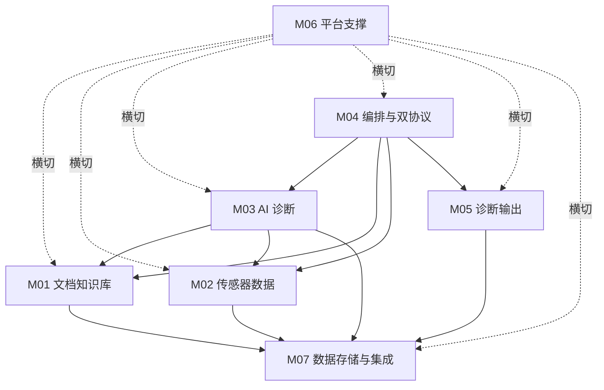
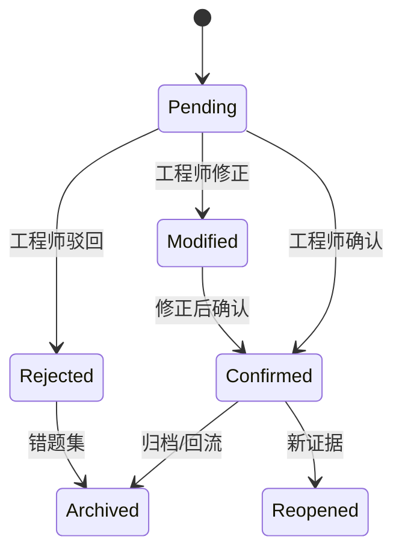

# 10 详细模块设计（Detailed Module Design）

> 文档编号：IIP-DDD-001  
> 版本：V1.0  
> 状态：评审稿  
> 读者：后端研发、算法工程师、前端研发、测试、运维

---

## 1. 模块总览

### 1.1 模块划分

| 模块编号 | 模块名称 | 主要职责 | 对应需求 | 主要智能体 |
| --- | --- | --- | --- | --- |
| M01 | 文档知识库模块 | 文档接入、解析、OCR、切块、向量化、混合检索、溯源、版本管理 | FR-01-* | A03 |
| M02 | 传感器数据处理模块 | 数据接入、清洗、对齐、特征提取、异常检测、数据服务 | FR-02-* | A04、A05 |
| M03 | AI 诊断模块 | 任务理解、澄清、假设生成、推理验证、置信度、维护建议 | FR-03-* | A02、A06、A07、A08 |
| M04 | 编排与双协议模块 | LangGraph 单图、A2A 协作、MCP 工具、可靠性策略 | FR-04-* | A01 + 全部 Agent |
| M05 | 诊断输出模块 | 报告生成、证据展示、多形态推送、人工复核、统计 | FR-05-* | A09 |
| M06 | 平台支撑模块 | 认证授权、审计、配置、可观测、成本、备份 | FR-06-*、NFR-* | 治理服务 |
| M07 | 数据存储与集成模块 | 关系库、向量库、时序库、对象存储、外部集成 | 数据需求 | - |

### 1.2 模块依赖关系



### 1.3 模块接口原则

- 同步接口使用 REST/JSON 或 A2A；异步事件使用消息队列。
- 所有工具能力通过 MCP 暴露，不直接暴露内部实现。
- 所有接口必须有版本号、Schema、错误码和超时定义。
- 模块间依赖通过接口和 DTO 隔离，禁止跨模块访问数据库表。
- 所有写操作必须记录操作人、任务 ID 和审计信息。

---

## 2. M01 文档知识库模块

### 2.1 模块职责

1. 文档上传、格式识别、解析、OCR 和清洗。
2. 章节、表格、图注、参数、步骤的结构化解析。
3. 语义切块、元数据标注、向量化和索引构建。
4. 混合检索、Rerank、去重、来源溯源。
5. 文档版本、增量更新、失效管理和检索评测。

### 2.2 子模块

| 子模块 | 职责 | 关键类/服务 |
| --- | --- | --- |
| Document Ingestor | 上传、格式识别、任务编排 | `DocumentIngestService` |
| Parser | PDF/Word/Excel/图片解析 | `DocumentParser`, `OCRParser` |
| Chunker | 语义/结构切块 | `SemanticChunker` |
| Chunk Enricher | 元数据、设备型号、页码标注 | `ChunkEnricher` |
| Embedding Service | 批量向量化 | `EmbeddingClient` |
| Index Manager | 向量/关键词索引构建与切换 | `IndexManager` |
| Retriever | 混合召回 + Rerank | `HybridRetriever` |
| Traceability Service | 原文片段和页码溯源 | `CitationService` |
| Version Manager | 文档版本与增量更新 | `DocumentVersionService` |

### 2.3 核心数据结构

```python
class DocumentMeta:
    doc_id: str
    doc_name: str
    doc_type: str
    device_models: list[str]
    version: str
    status: str            # active / deprecated / expired
    security_level: str
    effective_from: date | None
    effective_to: date | None
    source_uri: str
    checksum: str

class Chunk:
    chunk_id: str
    doc_id: str
    page: int
    section: str | None
    text: str
    token_count: int
    metadata: dict
    embedding_version: str

class RetrievedEvidence:
    evidence_id: str
    chunk_id: str
    doc_id: str
    doc_name: str
    page: int
    section: str | None
    text: str
    score: float
    rerank_score: float | None
    source_type: str = "document"
```

### 2.4 核心接口

| 接口 | 协议 | 输入 | 输出 | 说明 |
| --- | --- | --- | --- | --- |
| `POST /documents` | REST | 文件 + 元数据 | 文档 ID、处理任务 ID | 上传/导入 |
| `GET /documents/{id}/status` | REST | 文档 ID | 处理状态 | 解析进度 |
| `POST /documents/{id}/reprocess` | REST | 文档 ID | 任务 ID | 重新解析 |
| `POST /documents/{id}/deprecate` | REST | 文档 ID、原因 | 结果 | 失效管理 |
| `document.search` | MCP | query、filters、top_k | `RetrievedEvidence[]` | 混合检索 |
| `document.get_chunk` | MCP | doc_id、page、chunk_id | `Chunk` | 取证 |
| `POST /retrieval/evaluate` | REST | 评测集 | 指标 | 检索评测 |
| `POST /index/rebuild` | REST | 范围、版本 | 任务 ID | 索引重建 |

### 2.5 检索流程

```text
Query
  → 查询理解与改写
  → 元数据过滤（设备型号/文档类型/版本/权限）
  → 向量召回 ∥ 关键词召回
  → 合并去重
  → Rerank 精排
  → 来源有效性校验
  → Top-K 证据返回
```

### 2.6 异常处理

| 异常 | 处理策略 |
| --- | --- |
| 文件格式不支持 | 拒绝并返回支持格式列表 |
| 解析失败 | 重试、降级 OCR、记录失败原因、人工介入 |
| OCR 质量低 | 标记低质量，提示人工校正 |
| 向量化失败 | 重试、切换模型版本、任务告警 |
| 索引构建失败 | 保留旧索引，回滚别名，告警 |
| 检索无结果 | 返回知识缺口，不生成无依据答案 |
| 索引与文档不一致 | 暂停检索、重建、标记版本，审计告警 |

---

## 3. M02 传感器数据处理模块

### 3.1 模块职责

1. 接入 4 台设备、24 个传感器实时/历史数据。
2. 管理和校验设备、传感器元数据。
3. 数据清洗、时间对齐、重采样、质量评估。
4. 特征提取（时域、频域、趋势、质量）。
5. 异常检测、告警事件生成。
6. 提供统一数据服务和 MCP 工具。

### 3.2 子模块

| 子模块 | 职责 | 关键类/服务 |
| --- | --- | --- |
| Protocol Adapter | OPC UA/Modbus/MQTT 适配 | `ProtocolAdapter` |
| Ingestion Pipeline | 采集、缓冲、校验、入库 | `IngestionPipeline` |
| Metadata Service | 设备/传感器台账 | `DeviceMetadataService` |
| Data Quality | 缺失、异常、时间戳、量纲检查 | `DataQualityChecker` |
| Alignment Service | 多传感器时间对齐、重采样 | `TimeAligner` |
| Feature Service | 时域/频域/趋势特征 | `FeatureExtractor` |
| Anomaly Service | 阈值和模型异常检测 | `AnomalyDetector` |
| Query Service | 时序窗口查询 | `TimeSeriesQueryService` |

### 3.3 核心数据结构

```python
class SensorPoint:
    sensor_id: str
    device_id: str
    timestamp: datetime
    value: float
    unit: str
    quality: str

class DataQualityReport:
    sensor_id: str
    time_window: dict
    expected_points: int
    actual_points: int
    missing_rate: float
    duplicate_rate: float
    outlier_rate: float
    timestamp_anomalies: int
    score: float

class FeatureVector:
    sensor_id: str
    window: dict
    features: dict[str, float]
    unit: str
    quality: DataQualityReport

class AnomalyEvent:
    event_id: str
    device_id: str
    sensor_ids: list[str]
    time_window: dict
    anomaly_type: str
    severity: str
    score: float
    evidence: dict
    detected_at: datetime
```

### 3.4 核心接口

| 接口 | 协议 | 输入 | 输出 |
| --- | --- | --- | --- |
| `POST /ingestion/streams` | MQTT/HTTP | 传感器数据点 | 接收确认 |
| `POST /ingestion/history` | REST/文件 | 批量历史数据 | 导入任务 ID |
| `GET /devices/{id}` | REST/MCP | 设备 ID | 设备台账 |
| `GET /sensors/{id}` | REST/MCP | 传感器 ID | 传感器元数据 |
| `tsdb.query` | MCP | device_id、sensor_ids、time_window | 时序数据 |
| `tsdb.features` | MCP | series、feature_list | 特征向量 |
| `POST /anomaly/detect` | REST/MCP | 数据/时间窗 | 异常事件 |
| `GET /quality/report` | REST/MCP | 设备/传感器/时间窗 | 质量报告 |

### 3.5 特征计算说明

| 特征类型 | 公式/说明 | 用途 |
| --- | --- | --- |
| 均值/方差 | 统计基础 | 趋势和波动 |
| RMS | sqrt(mean(x²)) | 振动能量 |
| 峰峰值 | max - min | 冲击 |
| 峭度 | 四阶标准化矩 | 冲击敏感 |
| 频谱峰值 | FFT 峰值 | 旋转频率 |
| 包络谱 | Hilbert 包络 + FFT | 轴承故障 |
| 谐波/边带 | 基频倍数/边带能量 | 齿轮/轴承 |
| 趋势斜率 | 滑窗线性拟合 | 劣化趋势 |
| 突变点 | 变点检测 | 异常起始 |

### 3.6 异常处理

| 异常 | 处理策略 |
| --- | --- |
| 采集断线 | 本地缓存、断点续传、重连、告警 |
| 数据乱序 | 按事件时间排序，窗口迟到数据策略 |
| 缺失值 | 按规则插值/标记，不静默填充 |
| 量纲不一致 | 拒绝入库，提示修正台账 |
| 阈值缺失 | 不自动推断，标记待配置 |
| 检测模型不可用 | 降级为阈值/统计规则 |
| 查询超时 | 缩小窗口、缓存、异步查询 |

---

## 4. M03 AI 诊断模块

### 4.1 模块职责

1. 任务接入、意图识别、槽位抽取、信息澄清。
2. 多假设生成、证据需求规划、假设验证。
3. 知识证据与数据证据融合。
4. 置信度评估、拒答与转人工。
5. 维护决策与处置建议。
6. 多轮对话与反馈回流。

### 4.2 子模块

| 子模块 | 职责 | 关键类/服务 |
| --- | --- | --- |
| Intake Service | 意图识别、槽位、澄清 | `IntakeAgent` |
| Diagnosis Planner | 诊断计划和步骤编排 | `DiagnosisPlanner` |
| Hypothesis Engine | 候选故障生成 | `HypothesisGenerator` |
| Evidence Collector | 调用检索/数据/案例工具 | `EvidenceCollector` |
| Reasoning Engine | 假设—验证循环 | `DiagnosisReasoner` |
| Confidence Calibrator | 置信度计算与校准 | `ConfidenceCalibrator` |
| Guardrail | 拒答、安全、越权 | `DiagnosisGuardrail` |
| Maintenance Advisor | 处置建议和风险 | `MaintenanceAdvisor` |

### 4.3 诊断结果数据结构

```python
class Hypothesis:
    hypothesis_id: str
    fault_name: str
    component: str | None
    supporting_evidence: list[str]
    contradicting_evidence: list[str]
    confidence: float
    status: str  # open / supported / rejected / uncertain
    verification_steps: list[dict]

class DiagnosisResult:
    task_id: str
    device_id: str
    symptoms: list[str]
    time_window: dict
    candidate_faults: list[Hypothesis]
    root_cause: Hypothesis | None
    confidence: float
    evidence_chain: list[dict]
    data_quality: dict
    risk_level: str
    limitations: list[str]
    disclaimers: list[str]
    trace_id: str
```

### 4.4 核心接口

| 接口 | 协议 | 输入 | 输出 |
| --- | --- | --- | --- |
| `POST /diagnosis/tasks` | REST | 用户请求/告警 | 任务 ID |
| `GET /diagnosis/tasks/{id}` | REST | 任务 ID | 任务状态/结果 |
| `POST /diagnosis/tasks/{id}/feedback` | REST | 复核结果 | 反馈 ID |
| `knowledge.retrieve` | A2A/MCP | 查询条件 | 文档证据 |
| `sensor.analyze` | A2A/MCP | 设备/时间窗 | 数据与特征 |
| `diagnosis.reason` | A2A | 任务上下文 | 候选故障 |
| `evidence.verify` | A2A | 诊断结论+证据 | 校验结果 |
| `maintenance.advise` | A2A | 根因+风险 | 处置建议 |

### 4.5 置信度模型

置信度由多因素加权：

```text
confidence = w1 * evidence_sufficiency
           + w2 * evidence_consistency
           + w3 * source_reliability
           + w4 * data_quality
           + w5 * model_self_assessment
           - penalty_contradiction
           - penalty_out_of_scope
```

| 因子 | 说明 | 权重建议 |
| --- | --- | --- |
| evidence_sufficiency | 证据是否覆盖故障特征 | 0.25 |
| evidence_consistency | 支持/反驳证据一致性 | 0.25 |
| source_reliability | 文档版本、来源、数据质量 | 0.20 |
| data_quality | 数据完整性、时间对齐、量纲 | 0.15 |
| model_self_assessment | 模型自评（需校验） | 0.15 |
| contradiction_penalty | 矛盾证据惩罚 | 动态 |
| out_of_scope_penalty | 超出知识库覆盖惩罚 | 动态 |

> 最终置信度必须经过证据校验和规则约束，不允许仅依赖模型自评。

### 4.6 异常处理

| 异常 | 处理策略 |
| --- | --- |
| 信息不足 | 触发澄清，不进入诊断 |
| 检索无结果 | 记录知识缺口，降低置信度或转人工 |
| 数据质量差 | 降级置信度，提示补充数据 |
| 假设全部驳回 | 输出不确定结论和人工建议 |
| 证据冲突 | 展示冲突，降低置信度，转人工 |
| 模型超时 | 切换备用模型/模板降级 |
| 高风险故障 | 强制人工复核，不自动下发 |

---

## 5. M04 编排与双协议模块

### 5.1 模块职责

1. LangGraph 单图统一编排，管理诊断状态。
2. A2A Agent 注册、发现、任务下发与结果回传。
3. MCP 工具注册、调用、Schema 校验、鉴权与审计。
4. 超时、重试、幂等、熔断、降级、限流。
5. Checkpoint、断点恢复、HITL 中断。
6. 全链路 Trace 与成本控制。

### 5.2 子模块

| 子模块 | 职责 | 关键类/服务 |
| --- | --- | --- |
| Graph Builder | 图定义与路由 | `GraphBuilder` |
| State Manager | State Schema、合并、压缩 | `StateManager` |
| Checkpointer | 状态持久化与恢复 | `CheckpointStore` |
| Node Registry | 节点注册与发现 | `NodeRegistry` |
| A2A Registry | Agent 注册与能力目录 | `A2ARegistry` |
| A2A Gateway | 任务路由、鉴权、重试 | `A2AGateway` |
| MCP Registry | 工具注册与 Schema | `MCPRegistry` |
| MCP Client | 统一工具调用 | `MCPClient` |
| Policy Engine | 超时、重试、熔断、限流 | `PolicyEngine` |
| Trace Bridge | 链路追踪 | `TraceBridge` |

### 5.3 核心接口

| 接口 | 协议 | 说明 |
| --- | --- | --- |
| `POST /a2a/agents/register` | A2A | Agent 注册 |
| `GET /a2a/agents` | A2A | Agent 发现 |
| `POST /a2a/tasks` | A2A | 任务下发 |
| `GET /a2a/tasks/{id}` | A2A | 任务状态 |
| `POST /a2a/tasks/{id}/cancel` | A2A | 取消任务 |
| `POST /mcp/tools/register` | MCP | 工具注册 |
| `GET /mcp/tools` | MCP | 工具列表 |
| `POST /mcp/tools/{name}/invoke` | MCP | 工具调用 |
| `POST /orchestrator/tasks` | REST | 创建诊断任务 |
| `POST /orchestrator/tasks/{id}/resume` | REST | 恢复中断任务 |

### 5.4 可靠性策略

| 策略 | 配置建议 | 说明 |
| --- | --- | --- |
| 超时 | A2A 5s、MCP 3s、LLM 30s | 按工具配置 |
| 重试 | 最多 2～3 次，指数退避 | 仅幂等操作 |
| 幂等 | `task_id + capability + payload_hash` | 防止重复执行 |
| 熔断 | 错误率 > 50% 时熔断 30s | 保护下游 |
| 限流 | 按 Agent/工具/租户 | 防止过载 |
| 降级 | 备用模型、规则、缓存、人工 | 保持核心可用 |
| 最大步数 | 图中最大节点执行次数 | 防止死循环 |
| 预算 | 单任务最大 Token/耗时 | 成本控制 |
| Checkpoint | 每关键节点持久化 | 支持恢复 |

### 5.5 状态一致性

- State 只由编排器写入；节点返回增量更新，由 reducer 合并。
- 证据、假设、校验结果使用 `evidence_id`/`hypothesis_id` 关联。
- 异步 A2A 结果通过事件回写 State；必须校验任务 ID 和版本。
- Checkpoint 包含业务状态、节点位置、重试计数、Trace 上下文。
- 状态变更写审计，支持回放和复盘。

---

## 6. M05 诊断输出模块

### 6.1 模块职责

1. 报告模板管理和结构化报告生成。
2. 证据链、图表、风险提示渲染。
3. 多形态输出与推送。
4. 人工复核、意见记录和状态流转。
5. 统计与运营看板。
6. 报告导出和归档。

### 6.2 数据结构

```python
class DiagnosisReport:
    report_id: str
    task_id: str
    title: str
    device: dict
    summary: str
    root_cause: dict
    confidence: float
    candidate_faults: list[dict]
    evidence_chain: list[dict]
    maintenance_advice: list[dict]
    risk_notice: list[str]
    limitations: list[str]
    disclaimer: str
    generated_at: datetime
    version: str
```

### 6.3 核心接口

| 接口 | 协议 | 说明 |
| --- | --- | --- |
| `report.render` | MCP | 生成报告 |
| `notify.send` | MCP | 推送通知 |
| `GET /reports/{id}` | REST | 查询报告 |
| `GET /reports/{id}/export?format=pdf` | REST | 导出 |
| `POST /reports/{id}/review` | REST | 人工复核 |
| `GET /statistics/diagnosis` | REST | 诊断统计 |
| `POST /reports/{id}/archive` | REST | 归档 |

### 6.4 复核状态机



### 6.5 异常处理

| 异常 | 处理策略 |
| --- | --- |
| 模板缺失 | 使用默认模板，告警 |
| 渲染失败 | 降级 Markdown，保留原始结构化数据 |
| 推送失败 | 重试、降级站内信、记录失败 |
| 导出失败 | 异步任务 + 通知 |
| 复核冲突 | 保留版本历史，记录操作人 |
| 数据脱敏失败 | 拦截输出，安全告警 |

---

## 7. M06 平台支撑模块

### 7.1 子模块

| 子模块 | 职责 | 关键能力 |
| --- | --- | --- |
| IAM Service | 认证、RBAC、数据范围 | OIDC/LDAP、权限策略 |
| Audit Service | 审计日志 | 操作、工具、模型、输出 |
| Config Service | 配置管理 | 设备、模型、提示词、协议 |
| Observability Service | Trace/Metric/Log | OTel、Prometheus、Loki |
| Cost Service | 模型成本监控 | Token、调用次数、预算 |
| Notification Service | 告警通知 | 邮件、IM、短信 |
| Backup Service | 备份恢复 | 数据库、对象、配置 |
| Feature Flag Service | 灰度与开关 | 模型、提示词、工具版本 |

### 7.2 权限模型

```text
Subject（用户/服务/Agent）
  → Role（管理员/工程师/专家/审计员/系统）
  → Permission（read/write/review/configure/audit）
  → Resource Scope（设备组/文档密级/租户/项目）
  → Tool Scope（sensor:read、document:read、report:write）
```

**鉴权要求**：

- 用户请求和 Agent/MCP 调用均需鉴权。
- 数据查询自动注入权限过滤条件。
- 跨 Agent 调用传播用户身份和 scope，禁止权限提升。
- 高危操作需二次确认并写审计。

### 7.3 审计事件

```json
{
  "event_id": "AUD-20250101-0001",
  "timestamp": "2025-01-01T10:00:00+08:00",
  "actor": {"type": "user", "id": "U-1001", "role": "engineer"},
  "action": "diagnosis.create",
  "resource": {"type": "diagnosis_task", "id": "TASK-001"},
  "result": "success",
  "ip": "10.0.0.1",
  "trace_id": "trace-xxx",
  "detail": {"device_id": "EQ-003"}
}
```

---

## 8. M07 数据存储与集成模块

### 8.1 数据存储设计

| 存储 | 数据 | 选型建议 | 关键设计 |
| --- | --- | --- | --- |
| 关系库 | 设备、任务、案例、配置、权限 | PostgreSQL | 主备、分区、JSONB |
| 向量库 | 文档向量、案例向量 | pgvector/Milvus/Qdrant | 元数据过滤、别名切换 |
| 时序库 | 传感器数据、特征、异常 | TimescaleDB/IoTDB | 分区、压缩、保留策略 |
| 对象存储 | 原文、报告、附件、备份 | MinIO/S3 | 版本、生命周期、加密 |
| 缓存 | 会话、热点、限流 | Redis | TTL、集群、持久化 |
| 消息队列 | 告警、任务、事件、审计 | Kafka/RabbitMQ | 分区、幂等、死信 |
| 全文索引 | 文档关键词 | ES/OpenSearch | 中文分词、混合检索 |
| 审计库 | 审计事件 | PostgreSQL/WORM | 只追加、不可篡改 |

### 8.2 关键表设计（摘要）

**diagnosis_tasks**

| 字段 | 类型 | 说明 |
| --- | --- | --- |
| task_id | uuid PK | 任务 ID |
| source | varchar | web/alert/api |
| device_id | varchar | 设备 |
| symptom | jsonb | 现象 |
| time_window | jsonb | 时间窗 |
| status | varchar | pending/running/waiting_human/succeeded/failed |
| priority | varchar | 优先级 |
| result | jsonb | 诊断结果 |
| confidence | numeric | 置信度 |
| trace_id | varchar | Trace |
| created_at | timestamptz | 创建时间 |
| updated_at | timestamptz | 更新时间 |

**evidence**

| 字段 | 类型 | 说明 |
| --- | --- | --- |
| evidence_id | uuid PK | 证据 ID |
| task_id | uuid FK | 任务 |
| source_type | varchar | document/sensor/case |
| source_id | varchar | 来源 ID |
| content | jsonb | 内容摘要 |
| citation | jsonb | 引用信息 |
| weight | numeric | 权重 |
| created_at | timestamptz | 创建时间 |

**anomaly_events**

| 字段 | 类型 | 说明 |
| --- | --- | --- |
| event_id | uuid PK | 事件 ID |
| device_id | varchar | 设备 |
| sensor_ids | jsonb | 传感器 |
| start_time | timestamptz | 开始 |
| end_time | timestamptz | 结束 |
| anomaly_type | varchar | 类型 |
| severity | varchar | 严重度 |
| score | numeric | 分数 |
| status | varchar | open/confirmed/closed |

**cases**

| 字段 | 类型 | 说明 |
| --- | --- | --- |
| case_id | uuid PK | 案例 ID |
| title | varchar | 标题 |
| device_model | varchar | 型号 |
| symptoms | jsonb | 现象 |
| root_cause | jsonb | 根因 |
| solution | jsonb | 处置 |
| source_task_id | uuid | 来源任务 |
| review_status | varchar | 复核状态 |
| embedding_id | varchar | 向量 ID |
| created_at | timestamptz | 创建时间 |

### 8.3 外部集成

| 系统 | 集成方式 | 数据方向 | 说明 |
| --- | --- | --- | --- |
| 采集系统/网关 | MQTT/OPC UA/Modbus | 入 | 传感器数据 |
| 告警系统 | Webhook/MQ | 入 | 告警触发诊断 |
| 工单系统 | REST/Webhook | 双向 | 生成/回填工单 |
| 资产管理系统 | REST | 入/出 | 设备台账 |
| 企业 IM/邮件 | Webhook/SMTP | 出 | 报告通知 |
| 统一身份 | OIDC/LDAP | 入 | 认证 |
| 对象存储 | S3 API | 双向 | 文档/报告 |
| 可观测平台 | OTLP | 出 | Trace/Metric/Log |

### 8.4 数据一致性策略

- 文档原文与向量索引通过 `doc_version` 关联，索引切换使用别名。
- 时序数据与特征数据以 `sensor_id + window + feature_version` 关联。
- 任务、证据、报告、审计通过 `task_id`/`trace_id` 串联。
- 异步消息消费幂等，必须校验消息 ID。
- 定期对账：文档-索引、时序-特征、任务-报告。
- 备份恢复演练至少每季度一次。

---

## 9. 模块错误码规范（摘要）

| 错误码 | 含义 | HTTP | 处理 |
| --- | --- | --- | --- |
| IIP-400-001 | 参数校验失败 | 400 | 返回字段错误 |
| IIP-401-001 | 未认证 | 401 | 跳转登录 |
| IIP-403-001 | 无权限 | 403 | 记录审计 |
| IIP-404-001 | 资源不存在 | 404 | 提示 |
| IIP-409-001 | 状态冲突 | 409 | 提示重试 |
| IIP-429-001 | 限流 | 429 | 返回 Retry-After |
| IIP-500-001 | 内部错误 | 500 | 记录 Trace，通用提示 |
| IIP-503-001 | 依赖不可用 | 503 | 降级/重试 |
| IIP-504-001 | 超时 | 504 | 重试/转人工 |
| IIP-422-001 | 证据不足 | 422 | 返回知识缺口/转人工 |
| IIP-451-001 | 安全拦截 | 451 | 安全审计告警 |

---

## 10. 模块测试要点

| 模块 | 单元测试 | 集成测试 | 契约测试 | 端到端测试 |
| --- | --- | --- | --- | --- |
| M01 | 解析/切块/检索 | 文档入库到检索 | MCP 工具 Schema | 文档溯源 |
| M02 | 特征/质量/异常 | 采集到查询 | 时序工具契约 | 告警触发诊断 |
| M03 | 意图/假设/置信度 | 诊断推理链 | A2A 任务契约 | 问诊诊断 |
| M04 | 图路由/策略 | A2A+MCP 闭环 | 协议兼容 | 全链路 |
| M05 | 模板/状态机 | 报告生成推送 | 通知契约 | 复核回流 |
| M06 | 权限/审计/配置 | 横切集成 | 安全策略 | 越权/审计 |
| M07 | 存储访问/迁移 | 主备/备份恢复 | 数据 Schema | 数据一致性 |
