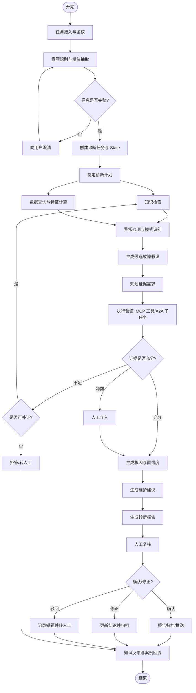
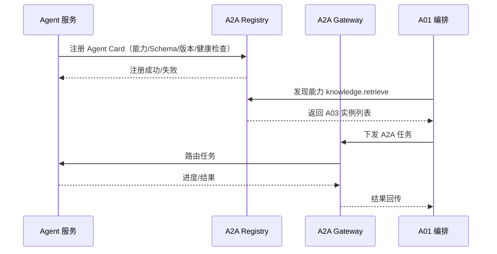
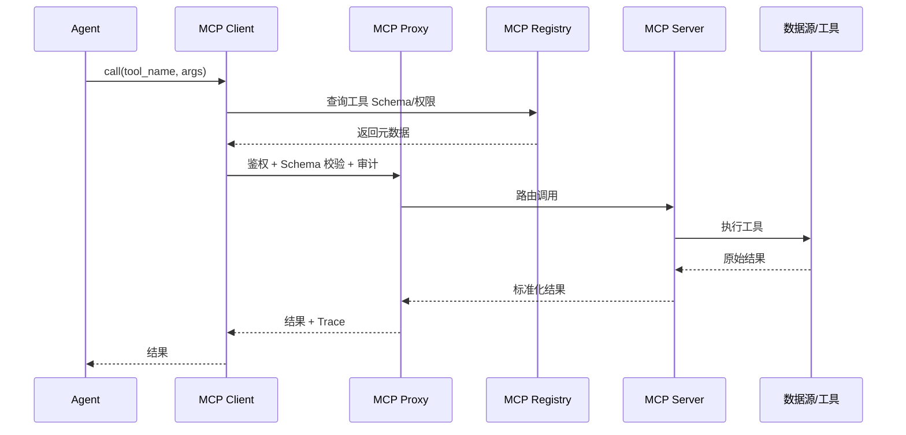
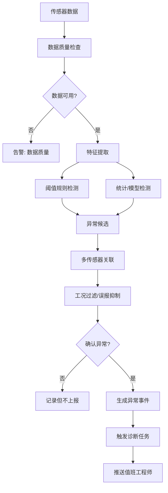
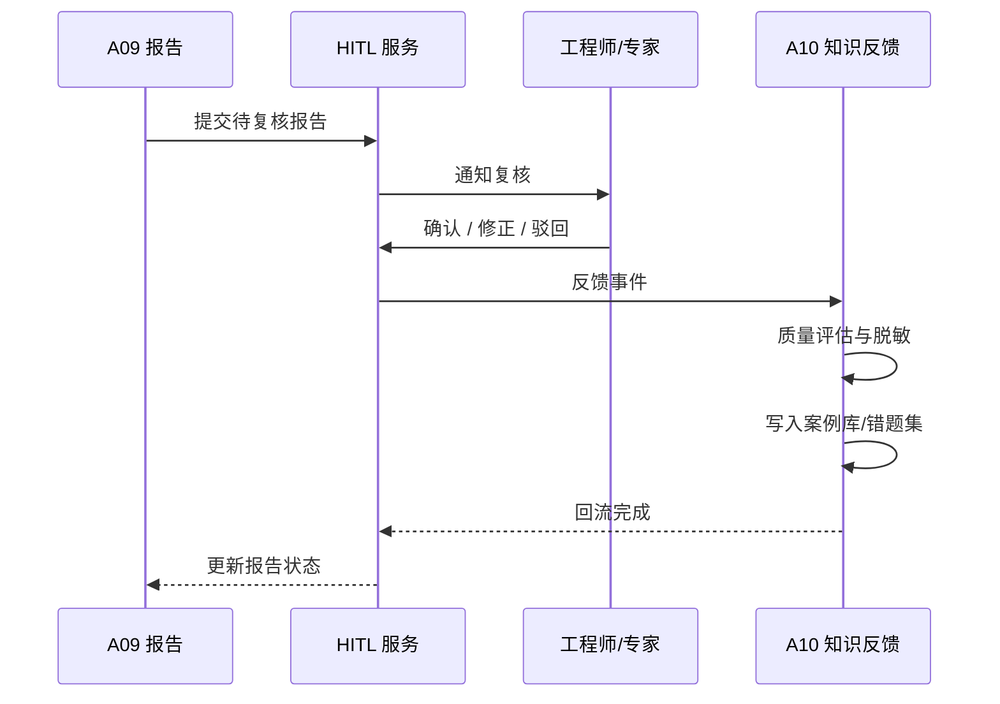

# 11 核心流程设计（Core Process Design）

> 文档编号：IIP-PROC-001  
> 版本：V1.0  
> 状态：评审稿  
> 读者：架构师、研发、算法、测试、运维

---

## 1. 流程设计原则

1. **单图入口**：所有诊断任务由 LangGraph 单图统一编排，禁止旁路调用。
2. **状态唯一**：`DiagnosisState` 是唯一上下文载体，跨 Agent 数据通过引用传递。
3. **证据驱动**：每个结论必须由证据链支撑，证据不足则补证、降级或转人工。
4. **人机协同**：关键/高风险结论必须人工复核，AI 不直接控制设备。
5. **可恢复**：关键节点设置 Checkpoint，失败可重试、续跑、补偿。
6. **可观测**：每个节点、A2A 调用、MCP 调用、模型调用都有 Trace 和审计。
7. **幂等可靠**：任务、工具、消息消费均支持幂等，避免重复报告/告警。

---

## 2. 端到端诊断主流程

### 2.1 主流程概览



### 2.2 阶段说明

| 阶段 | 节点 | 负责 Agent | 输入 | 输出 | 失败处理 |
| --- | --- | --- | --- | --- | --- |
| 1. 接入 | `api_gateway` | API 网关 | 请求/告警 | 认证上下文 | 401/403/429 |
| 2. 澄清 | `task_intake` | A02 | 原始请求 | 结构化任务 | 追问；超时挂起 |
| 3. 计划 | `plan_diagnosis` | A01 | 结构化任务 | 诊断计划 | 转人工 |
| 4. 检索 | `retrieve_knowledge` | A03 | 查询条件 | 文档证据 | 知识缺口 |
| 5. 数据 | `query_sensor_data` | A04 | 设备/时间窗 | 数据+特征 | 数据不足降级 |
| 6. 异常 | `detect_anomaly` | A05 | 时序/特征 | 异常事件 | 规则降级 |
| 7. 假设 | `generate_hypotheses` | A06 | 现象+证据 | 候选假设 | 无假设转人工 |
| 8. 验证 | `verify_evidence` | A07 | 假设+证据 | 校验结果 | 补证/转人工 |
| 9. 结论 | `diagnose` | A06/A07 | 校验后假设 | 根因+置信度 | 拒答 |
| 10. 建议 | `maintenance_decision` | A08 | 根因+风险 | 处置建议 | 通用建议 |
| 11. 报告 | `generate_report` | A09 | 结论+建议 | 报告 | Markdown 降级 |
| 12. 复核 | `human_approval` | HITL | 报告 | 确认/修正 | 超时挂起 |
| 13. 回流 | `knowledge_feedback` | A10 | 反馈 | 案例/错题 | 人工评审 |

---

## 3. LangGraph 单图详细设计

### 3.1 节点清单

| 节点名 | 类型 | 对应能力 | 是否可中断 | Checkpoint |
| --- | --- | --- | --- | --- |
| `api_entry` | 入口 | 鉴权、限流、创建任务 | 否 | 是 |
| `task_intake` | Agent 节点 | A02 意图/澄清 | 是（等待用户） | 是 |
| `plan_diagnosis` | Agent 节点 | A01 计划 | 否 | 是 |
| `retrieve_knowledge` | A2A 节点 | A03 | 否 | 是 |
| `query_sensor_data` | A2A 节点 | A04 | 否 | 是 |
| `detect_anomaly` | A2A 节点 | A05 | 否 | 是 |
| `generate_hypotheses` | LLM 节点 | A06 | 否 | 是 |
| `plan_evidence` | LLM 节点 | A06 | 否 | 是 |
| `execute_verification` | 工具/A2A 节点 | A06/A07 | 否 | 是 |
| `verify_evidence` | Agent 节点 | A07 | 否 | 是 |
| `diagnose` | Agent 节点 | A06 | 否 | 是 |
| `maintenance_decision` | Agent 节点 | A08 | 否 | 是 |
| `generate_report` | Agent 节点 | A09 | 否 | 是 |
| `human_approval` | HITL 节点 | 人工 | 是 | 是 |
| `knowledge_feedback` | 异步节点 | A10 | 否 | 是 |
| `error_handler` | 异常节点 | 编排 | 否 | 是 |
| `human_escalation` | HITL 节点 | 人工 | 是 | 是 |

### 3.2 状态字段生命周期

| State 字段 | 写入节点 | 读取节点 | 说明 |
| --- | --- | --- | --- |
| `task_id` | `api_entry` | 全部 | 全局唯一 |
| `device` | `task_intake` | 全部 | 设备上下文 |
| `symptom` | `task_intake` | 诊断/检索 | 现象 |
| `time_window` | `task_intake` | 数据/异常 | 时间窗 |
| `plan` | `plan_diagnosis` | 编排 | 诊断计划 |
| `evidence` | 检索/数据/工具 | 诊断/校验/报告 | 证据池 |
| `sensor_features` | `query_sensor_data` | 异常/诊断 | 特征 |
| `anomalies` | `detect_anomaly` | 诊断 | 异常事件 |
| `hypotheses` | `generate_hypotheses` | 验证/诊断 | 候选故障 |
| `verification` | `execute_verification` | 校验 | 验证结果 |
| `diagnosis_result` | `diagnose` | 建议/报告 | 根因与置信度 |
| `maintenance_advice` | `maintenance_decision` | 报告 | 处置建议 |
| `report` | `generate_report` | HITL | 报告 |
| `human_feedback` | `human_approval` | 回流 | 复核结果 |
| `errors` | `error_handler` | 全部 | 错误与重试 |

### 3.3 条件路由

```python
def route_after_intake(state):
    if state.get("clarification_needed"):
        return "wait_for_user"
    return "plan_diagnosis"

def route_after_verification(state):
    if state["evidence_sufficiency"] == "sufficient":
        return "diagnose"
    if state["evidence_sufficiency"] == "insufficient":
        if state["retry_count"] < 2 and state["can_retry"]:
            return "retrieve_knowledge"
        return "human_escalation"
    if state["evidence_sufficiency"] == "conflict":
        return "human_escalation"
    return "human_escalation"

def route_after_human(state):
    if state["human_feedback"]["decision"] == "reject":
        return "human_escalation"
    return "knowledge_feedback"
```

### 3.4 Checkpoint 与恢复

- **Checkpoint 时机**：每个节点执行后、HITL 中断前、A2A 异步任务提交后。
- **存储内容**：State 快照、当前节点、待执行节点、重试计数、Trace 上下文、版本号。
- **恢复流程**：任务查询 → 加载 Checkpoint → 校验状态版本 → 从断点继续 → 记录恢复事件。
- **幂等校验**：恢复执行前检查节点是否已成功，避免重复调用工具或重复报告。
- **保留策略**：诊断任务 Checkpoint 建议保留 ≥ 90 天，审计相关按合规要求延长。

---

## 4. A2A 协作流程

### 4.1 Agent 注册与发现



### 4.2 A2A 任务生命周期

```text
CREATED → DISPATCHED → RUNNING → SUCCEEDED
                    ↘ FAILED → RETRYING → RUNNING
                    ↘ CANCELED
                    ↘ TIMEOUT → FAILED
```

| 状态 | 说明 | 编排动作 |
| --- | --- | --- |
| CREATED | 任务已创建 | 持久化任务 |
| DISPATCHED | 已下发 | 等待确认 |
| RUNNING | 执行中 | 更新进度 |
| SUCCEEDED | 成功 | 合并结果到 State |
| FAILED | 失败 | 判断是否重试/降级 |
| RETRYING | 重试中 | 退避后重新下发 |
| TIMEOUT | 超时 | 熔断/降级 |
| CANCELED | 已取消 | 停止后续依赖 |

### 4.3 典型 A2A 调用

| 调用方 | 被调用方 | 能力 | 超时 | 失败降级 |
| --- | --- | --- | --- | --- |
| A01 | A03 | `knowledge.retrieve` | 5s | 知识缺口，继续诊断 |
| A01 | A04 | `sensor.analyze` | 8s | 数据不足，降低置信度 |
| A01 | A05 | `anomaly.detect` | 5s | 规则检测 |
| A01 | A06 | `diagnosis.reason` | 30s | 模板/规则降级 |
| A01 | A07 | `evidence.verify` | 10s | 转人工 |
| A01 | A08 | `maintenance.advise` | 8s | 通用建议 |
| A01 | A09 | `report.generate` | 10s | Markdown 降级 |
| A06 | A07 | `evidence.verify` | 10s | 内部规则校验 |

---

## 5. MCP 工具调用流程

### 5.1 调用链



### 5.2 工具调用策略

| 策略 | 说明 |
| --- | --- |
| Schema 校验 | 入参/出参严格校验，不合法直接拒绝 |
| 权限校验 | 校验调用者、用户、设备/文档范围、工具 scope |
| 超时 | 每个工具独立超时，默认 3s，长任务异步化 |
| 重试 | 仅幂等查询类工具重试，写操作不自动重试 |
| 缓存 | 热点检索/台账查询可缓存，带 TTL 和版本 |
| 熔断 | 下游错误率高时熔断，返回降级结果 |
| 审计 | 记录调用方、参数摘要、结果摘要、耗时、Trace |
| 脱敏 | 返回前按权限脱敏敏感字段 |
| 安全 | 禁止控制类工具、越权访问、敏感命令执行 |

### 5.3 工具结果标准化

```json
{
  "tool_name": "tsdb.query",
  "status": "success",
  "data": {"series": []},
  "metadata": {
    "source": "TSDB-01",
    "latency_ms": 120,
    "cached": false,
    "quality": {"score": 0.98, "missing_rate": 0.01}
  },
  "error": null,
  "trace_id": "trace-xxx"
}
```

---

## 6. 异常检测与告警流程



**关键设计**：

- 阈值以设备文档和现场配置为准，平台不自动修改设备参数。
- 工况标签用于抑制工况切换导致的误报。
- 多传感器关联提高诊断可信度，例如振动 + 温度同时异常。
- 异常事件与诊断任务通过 `event_id` 关联，可追溯。

---

## 7. 人工复核与知识回流流程

### 7.1 人工复核



### 7.2 知识回流规则

| 复核结果 | 回流目标 | 处理要求 |
| --- | --- | --- |
| 确认 | 案例库 | 专家评审后入库，生成案例向量 |
| 修正 | 案例库 + 错题集 | 记录修正原因，更新根因/建议 |
| 驳回 | 错题集 | 记录错误类型，触发评测和优化 |
| 无法判断 | 待定区 | 专家二次评审 |
| 高风险 | 安全审计 | 安全团队复核 |

**质量门槛**：

- 人工确认是入库的必要条件，AI 原始结论不得自动作为标准答案。
- 案例去重、脱敏、版本化，保留来源任务和证据。
- 低质量反馈进入待审核区，不直接污染知识库。
- 定期统计错误模式，驱动提示词、检索和规则优化。

---

## 8. 降级与补偿流程

### 8.1 依赖故障矩阵

| 依赖 | 故障表现 | 降级策略 | 用户提示 |
| --- | --- | --- | --- |
| LLM | 超时/限流/不可用 | 切换备用模型；规则模板；转人工 | “AI 推理暂时不可用，已提供规则建议” |
| Embedding | 向量化失败 | 关键词检索降级；缓存结果 | “检索精度可能下降” |
| Rerank | 重排失败 | 使用召回原始排序 | “结果未精排” |
| 向量库 | 查询失败 | 关键词检索；缓存 | “知识检索降级” |
| 时序库 | 查询失败 | 最近缓存数据；缩小窗口；提示补充 | “数据暂不可用” |
| 模型网关 | 失败 | 多模型路由；本地备用 | “正在使用备用模型” |
| A2A Agent | 超时/失败 | 重试、熔断、跳过非关键 Agent | “部分能力降级” |
| MCP 工具 | 失败 | 备用工具、缓存、规则替代 | “某工具不可用” |
| 消息队列 | 积压 | 限流、扩容、异步重试 | “报告推送延迟” |
| 数据库 | 主库故障 | 切换备库；只读降级 | “系统维护中” |

### 8.2 补偿事务

- **文档处理失败**：保留原文件、记录失败节点、支持重跑，不生成不完整索引。
- **诊断任务失败**：从最近 Checkpoint 恢复；已完成的副作用通过幂等键去重。
- **报告推送失败**：异步重试，超过阈值降级站内信并告警。
- **案例回流失败**：重试写入；失败进入死信队列，人工处理。
- **审计写入失败**：本地缓冲 + 重试；审计不可用时拒绝高风险操作。

---

## 9. 核心流程 SLA

| 流程 | 指标 | 目标 |
| --- | --- | --- |
| 文档入库 | 单文档解析+索引 | 按文档大小，≤ `[TIME]` |
| 知识检索 | P95 | ≤ 1.5s |
| 时序查询 | P95（近 7 天） | ≤ 2s |
| 异常检测 | 端到端延迟 | ≤ 5s |
| 诊断主流程 | P95（常规单设备） | ≤ 60s |
| 报告生成 | P95 | ≤ 5s |
| 推送 | 成功率 | ≥ 99% |
| 复核回流 | 异步 | ≤ 1min |
| 任务恢复 | RTO | ≤ 30min |
| 数据完整率 | 月度 | ≥ 99% |

---

## 10. 流程验收用例

| 编号 | 场景 | 预期 |
| --- | --- | --- |
| PC-01 | 完整信息问诊 | 成功生成含证据链报告 |
| PC-02 | 缺少设备信息 | 触发澄清，用户补充后继续 |
| PC-03 | 知识库无相关文档 | 明确知识缺口，不编造 |
| PC-04 | 传感器数据缺失 | 降低置信度并提示补充 |
| PC-05 | 证据冲突 | 展示冲突，转人工复核 |
| PC-06 | LLM 超时 | 备用模型或规则降级，任务不中断 |
| PC-07 | A2A 子任务失败 | 重试/熔断/降级，记录 Trace |
| PC-08 | MCP 工具失败 | 备用工具/缓存/提示 |
| PC-09 | 人工驳回 | 进入错题集，触发优化 |
| PC-10 | 进程重启 | Checkpoint 恢复，任务续跑 |
| PC-11 | 重复告警 | 幂等去重，不重复报告 |
| PC-12 | 高风险诊断 | 强制人工复核，不自动下发控制指令 |
