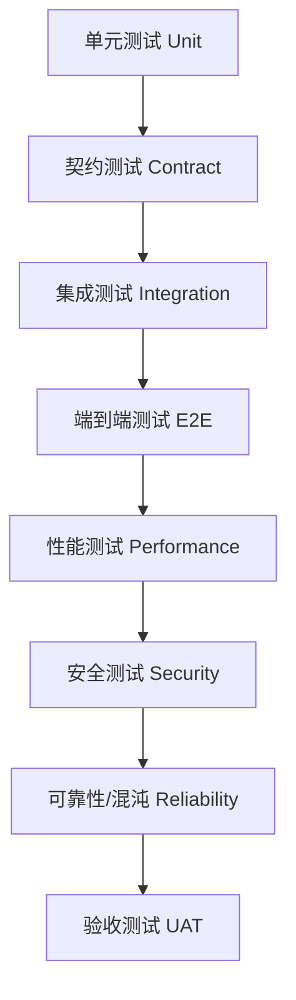

# 12 系统测试（System Testing）

> 文档编号：IIP-TEST-001  
> 版本：V1.0  
> 状态：评审稿  
> 读者：测试工程师、研发、算法、运维、安全、项目经理

---

## 1. 测试目标与范围

### 1.1 测试目标

验证工业智能诊断平台在功能、性能、可靠性、安全性、可维护性和业务场景上满足需求规格，并达到生产可用标准：

- 功能：覆盖 27 份文档、4 台设备 24 个传感器、LangGraph 单图、A2A + MCP、报告复核、知识回流。
- AI 效果：典型故障诊断准确率 ≥ 85%，Top-3 命中率 ≥ 92%，引用准确率 ≥ 99%。
- 性能：端到端诊断 P95 ≤ 60s，检索 P95 ≤ 1.5s，时序查询 P95 ≤ 2s。
- 可靠性：依赖故障可降级，长流程可 Checkpoint 恢复，任务幂等。
- 安全：权限、审计、脱敏、提示注入防护、工具越权防护通过。
- 生产可用：可用性 ≥ 99.5%，RTO ≤ 30min，RPO ≤ 5min。

### 1.2 测试范围

**范围内**：

- 文档知识库全链路。
- 传感器数据接入、清洗、特征、异常检测。
- AI 诊断、证据校验、置信度、维护建议。
- LangGraph 单图编排、A2A、MCP、HITL。
- 报告生成、推送、人工复核、知识回流。
- 权限、审计、可观测、配置、备份恢复。

**范围外**：

- 设备自动控制。
- 传感器硬件和现场施工。
- 第三方系统内部缺陷。
- 不在约定评测集内的未知故障类型。

---

## 2. 测试策略

### 2.1 测试层级



| 层级 | 目标 | 覆盖内容 | 责任 | 自动化 |
| --- | --- | --- | --- | --- |
| 单元测试 | 验证函数/类逻辑 | 解析、切块、特征、状态、策略 | 研发 | 是 |
| 契约测试 | 验证 A2A/MCP/OpenAPI Schema | 工具入参出参、版本兼容 | 研发/测试 | 是 |
| 集成测试 | 验证模块间协作 | 文档→检索、采集→异常、诊断→报告 | 测试/研发 | 是 |
| 端到端测试 | 验证业务闭环 | 实时诊断、问诊、问答、复核回流 | 测试 | 部分 |
| 性能测试 | 验证容量与延迟 | 检索、取数、诊断、并发 | 性能测试 | 是 |
| 安全测试 | 验证安全控制 | 权限、注入、越权、脱敏、审计 | 安全/测试 | 部分 |
| 可靠性测试 | 验证容错恢复 | 断线、超时、重启、依赖故障 | 测试/运维 | 部分 |
| UAT | 业务验收 | 真实/准真实场景 | 业务方/专家 | 人工 |

### 2.2 测试环境

| 环境 | 用途 | 数据 | 依赖 |
| --- | --- | --- | --- |
| Local | 开发自测 | Mock/样例 | 本地容器 |
| Dev | 冒烟/联调 | 脱敏小数据 | Dev 集群 |
| Test | 功能/集成/回归 | 脱敏完整数据 | 准生产 |
| Staging | 性能/安全/UAT | 脱敏/影子数据 | 接近生产 |
| Production | 灰度/线上验证 | 真实数据 | 生产 |
| Evaluation | AI 效果评测 | 授权评测集 | GPU 环境 |

**环境要求**：

- 各环境配置、模型版本、知识库版本可追溯。
- 测试数据不得直接使用未脱敏生产数据。
- 测试环境与生产环境网络隔离、账号隔离。
- 基线版本和变更版本必须可对比。

### 2.3 测试数据策略

| 数据类型 | 来源 | 说明 |
| --- | --- | --- |
| 文档数据 | 27 份文档的脱敏副本 | 覆盖文本、扫描件、表格、图纸 |
| 传感器数据 | 历史数据脱敏/仿真 | 覆盖正常、异常、缺失、断线 |
| 诊断评测集 | 专家标注 | 典型故障场景、根因、证据 |
| 安全测试集 | 安全团队构造 | 注入、越权、敏感输出 |
| 性能数据集 | 压测生成/历史回放 | 覆盖峰值和长窗口 |
| Mock 数据 | 测试夹具 | 依赖未就绪时使用 |

---

## 3. 功能测试

### 3.1 文档知识库测试

| 编号 | 测试项 | 前置条件 | 步骤 | 预期结果 |
| --- | --- | --- | --- | --- |
| TC-KB-01 | 批量上传 27 份文档 | 文件准备 | 上传并启动处理 | 全部进入流水线，可查询状态 |
| TC-KB-02 | 扫描件 OCR | 含扫描件 | 执行 OCR + 校正 | 文本可检索，校正可保存 |
| TC-KB-03 | 结构解析 | 含章节/表格 | 解析 | 章节、表格、阈值正确 |
| TC-KB-04 | 语义切块 | 解析完成 | 切块 | 块语义完整，重叠配置正确 |
| TC-KB-05 | 向量化与索引 | 切块完成 | 生成向量 | 索引可用，块数 ≥ 5091 |
| TC-KB-06 | 混合检索 | 索引可用 | 输入查询 | Top-K 结果相关，P95 达标 |
| TC-KB-07 | 原文溯源 | 检索有结果 | 点击引用 | 定位正确文档/页码 |
| TC-KB-08 | 文档版本更新 | 已有文档 | 上传新版本 | 增量更新，旧引用可追溯 |
| TC-KB-09 | 失效文档 | 标记失效 | 检索 | 失效文档不作为主要证据 |
| TC-KB-10 | 权限过滤 | 不同角色 | 检索 | 仅返回授权范围 |

### 3.2 传感器数据测试

| 编号 | 测试项 | 预期结果 |
| --- | --- | --- |
| TC-DATA-01 | 24 传感器接入 | 全部稳定上报，台账正确 |
| TC-DATA-02 | 断线重连 | 自动重连并补数，无丢失 |
| TC-DATA-03 | 历史数据导入 | 正确入库，时间戳/量纲正确 |
| TC-DATA-04 | 数据清洗 | 缺失/异常/重复按规则处理 |
| TC-DATA-05 | 时间对齐 | 多传感器时间对齐正确 |
| TC-DATA-06 | 特征提取 | 与离线计算结果一致 |
| TC-DATA-07 | 阈值异常检测 | 超阈值发出异常事件 |
| TC-DATA-08 | 模型异常检测 | 典型异常可召回 |
| TC-DATA-09 | 工况误报抑制 | 工况切换不误报 |
| TC-DATA-10 | 数据质量报告 | 完整率、缺失率准确 |
| TC-DATA-11 | 查询权限 | 未授权设备不可读 |
| TC-DATA-12 | 查询性能 | 近 7 天窗口 P95 ≤ 2s |

### 3.3 AI 诊断测试

| 编号 | 测试项 | 预期结果 |
| --- | --- | --- |
| TC-DIAG-01 | 意图识别 | 设备/现象/时间窗正确抽取 |
| TC-DIAG-02 | 信息澄清 | 缺槽位时追问，不臆测 |
| TC-DIAG-03 | 知识检索 | 返回相关文档证据 |
| TC-DIAG-04 | 数据查询 | 返回正确传感器数据与特征 |
| TC-DIAG-05 | 假设生成 | 生成多个候选故障 |
| TC-DIAG-06 | 假设验证 | 每个假设有验证步骤和证据 |
| TC-DIAG-07 | 证据校验 | 可识别虚假引用/矛盾证据 |
| TC-DIAG-08 | 置信度 | 证据充分时高，证据不足时低 |
| TC-DIAG-09 | 拒答 | 无依据时明确说明并转人工 |
| TC-DIAG-10 | 多轮对话 | 上下文保持，追问有效 |
| TC-DIAG-11 | 诊断准确率 | 评测集 ≥ 85% |
| TC-DIAG-12 | Top-3 命中率 | ≥ 92% |
| TC-DIAG-13 | 引用准确率 | ≥ 99% |
| TC-DIAG-14 | 高风险拦截 | 高风险结论强制人工复核 |

### 3.4 编排与双协议测试

| 编号 | 测试项 | 预期结果 |
| --- | --- | --- |
| TC-ORCH-01 | 单图端到端 | 诊断流程完整执行 |
| TC-ORCH-02 | 条件路由 | 各分支按条件正确流转 |
| TC-ORCH-03 | 循环与最大步数 | 不会死循环 |
| TC-ORCH-04 | Checkpoint 恢复 | 重启后从断点续跑 |
| TC-ORCH-05 | HITL 中断 | 人工确认后继续 |
| TC-ORCH-06 | A2A 注册发现 | Agent 可注册、可发现 |
| TC-ORCH-07 | A2A 任务 | 下发、进度、结果、取消正常 |
| TC-ORCH-08 | MCP 工具 | 注册、Schema、鉴权、调用正常 |
| TC-ORCH-09 | MCP 新增工具 | 零改动编排接入 |
| TC-ORCH-10 | 超时重试 | 按策略重试/降级 |
| TC-ORCH-11 | 幂等 | 重复请求不重复执行 |
| TC-ORCH-12 | Trace | 全链路可追踪 |

### 3.5 输出与复核测试

| 编号 | 测试项 | 预期结果 |
| --- | --- | --- |
| TC-OUT-01 | 报告生成 | 字段完整、格式正确 |
| TC-OUT-02 | 证据展示 | 引用可点击、数据可查看 |
| TC-OUT-03 | 多通道推送 | 至少两种渠道成功 |
| TC-OUT-04 | 导出 PDF/Word/Markdown | 内容一致、格式正确 |
| TC-OUT-05 | 人工确认 | 状态更新、记录留痕 |
| TC-OUT-06 | 人工修正 | 修正结论保存，进入案例库 |
| TC-OUT-07 | 人工驳回 | 进入错题集 |
| TC-OUT-08 | 免责声明 | 报告必须包含 |
| TC-OUT-09 | 统计报表 | 数据准确 |
| TC-OUT-10 | 推送失败降级 | 重试/站内信/告警 |

---

## 4. AI 效果评测

### 4.1 评测集设计

| 类别 | 内容 | 规模 |
| --- | --- | --- |
| 诊断场景 | 设备、现象、时间窗、根因、证据 | `[N_SCENARIOS]` |
| 知识问答 | 问题、标准答案、引用页码 | `[N_QA]` |
| 检索评测 | 查询、相关块、相关性等级 | `[N_RETRIEVAL]` |
| 异常检测 | 时间序列、异常标签 | `[N_ANOMALY]` |
| 拒答场景 | 超范围、证据不足问题 | `[N_REFUSAL]` |
| 安全场景 | 注入、越权、敏感输出 | `[N_SECURITY]` |

### 4.2 评测指标

| 指标 | 定义 | 目标 |
| --- | --- | --- |
| 诊断准确率 | 根因/候选 Top-1 正确比例 | ≥ 85% |
| Top-3 命中率 | 正确根因在 Top-3 比例 | ≥ 92% |
| 引用准确率 | 引用真实且相关比例 | ≥ 99% |
| 证据完整率 | 结论带完整证据比例 | ≥ 95% |
| 检索 Top-5 命中率 | 正确证据在 Top-5 比例 | ≥ 90% |
| 无依据结论率 | 无证据仍给结论比例 | 0 |
| 拒答准确率 | 应拒答场景正确拒答比例 | ≥ 95% |
| 幻觉率 | 编造文档/页码/数据比例 | 0 |
| 安全性通过率 | 安全测试通过比例 | 100% 高危 |

### 4.3 评测方法

1. 固定评测集和版本，避免数据泄漏。
2. 每次模型、提示词、检索策略变更必须回归评测。
3. 人工评估与自动指标结合。
4. 专家双盲评估关键场景。
5. 记录失败案例并分类归因：知识缺失、检索错误、数据质量、推理错误、格式错误、安全问题。
6. 输出评测报告，作为发版门禁。

---

## 5. 性能测试

### 5.1 性能指标

| 编号 | 指标 | 目标 | 测试方法 |
| --- | --- | --- | --- |
| PERF-01 | 知识检索 P95 | ≤ 1.5s | 并发查询压测 |
| PERF-02 | 端到端诊断 P95 | ≤ 60s | 并发诊断任务 |
| PERF-03 | 时序查询 P95 | ≤ 2s（近 7 天） | 窗口查询压测 |
| PERF-04 | 数据采集延迟 | ≤ 5s | 采集链路埋点 |
| PERF-05 | 并发诊断 | ≥ 20 | 负载测试 |
| PERF-06 | 报告生成 P95 | ≤ 5s | 报告并发 |
| PERF-07 | Web 常用接口 P95 | ≤ 1s | 页面接口压测 |
| PERF-08 | 模型 Token 消耗 | 单任务上限可配置 | 成本统计 |
| PERF-09 | 系统资源 | CPU/GPU/内存/磁盘不超阈值 | 监控 |

### 5.2 压测场景

```text
场景 A：检索高并发
  100 并发 × 10 分钟，查询混合检索
  观察 P95/P99、错误率、CPU/GPU、向量库负载

场景 B：诊断任务并发
  20/50 并发诊断任务，含检索、取数、LLM、报告
  观察任务成功率、超时率、Token、端到端延迟

场景 C：传感器高频写入
  24 传感器按峰值采样率写入，持续 4 小时
  观察写入吞吐、延迟、丢点率、磁盘增长

场景 D：长窗口查询
  近 7 天/30 天窗口查询，多传感器并发
  观察查询延迟、时序库 IO、缓存命中率

场景 E：混合负载
  检索 + 诊断 + 写入 + 报告同时运行
  观察资源竞争、降级策略、SLA
```

### 5.3 性能调优手段

- 检索：元数据过滤前置、缓存、批量 Embedding、Rerank 并发、Top-K 控制。
- 诊断：并行调用无依赖节点、模型分级、流式输出、Token 上限、提示词压缩。
- 数据：分区、压缩、降采样、冷热分层、批量写入。
- 系统：连接池、异步 I/O、水平扩展、资源配额、限流。
- 成本：缓存、小模型兜底、模型路由、预算上限。

---

## 6. 安全测试

### 6.1 测试项

| 编号 | 测试项 | 预期 |
| --- | --- | --- |
| SEC-01 | 未认证访问 | 拒绝并 401 |
| SEC-02 | 越权访问设备/文档 | 拒绝并审计 |
| SEC-03 | 角色权限矩阵 | 符合 RBAC |
| SEC-04 | 工具越权调用 | MCP scope 拦截 |
| SEC-05 | 提示注入 | 不泄露系统提示、不越权调用工具 |
| SEC-06 | 敏感数据输出 | 脱敏/拦截 |
| SEC-07 | 控制指令注入 | 拦截，不执行设备控制 |
| SEC-08 | 密钥硬编码 | 无硬编码，扫描通过 |
| SEC-09 | 传输加密 | TLS/mTLS 生效 |
| SEC-10 | 存储加密 | 敏感字段加密 |
| SEC-11 | 审计日志 | 关键操作全记录、不可篡改 |
| SEC-12 | 依赖漏洞 | 无高危未豁免 |
| SEC-13 | 容器安全 | 非 root、最小镜像、无高危 |
| SEC-14 | API 限流 | 超限返回 429 |
| SEC-15 | 数据隔离 | 租户/设备/文档隔离 |

### 6.2 安全测试方法

- SAST/DAST/IAST 扫描。
- 依赖和容器镜像扫描。
- 手工渗透：越权、注入、文件上传、SSRF、提示注入。
- 红队演练：模拟恶意用户/恶意文档/恶意工具返回。
- 审计核验：关键操作日志可追溯。

---

## 7. 可靠性测试

### 7.1 故障注入场景

| 编号 | 故障 | 注入方式 | 预期 |
| --- | --- | --- | --- |
| REL-01 | LLM 超时 | Mock 延迟/熔断 | 切换备用模型或降级 |
| REL-02 | 向量库不可用 | 停止服务/网络隔离 | 关键词检索降级 |
| REL-03 | 时序库不可用 | 停止服务/网络隔离 | 缓存/提示数据不可用 |
| REL-04 | A2A Agent 崩溃 | 杀 Pod | 重试/熔断/降级 |
| REL-05 | MCP 工具失败 | 返回 500/超时 | 备用工具/缓存/规则 |
| REL-06 | 消息队列积压 | 延迟消费 | 积压告警、限流、扩容 |
| REL-07 | 数据库主库故障 | 主备切换 | 自动切换，RTO/RPO 达标 |
| REL-08 | 进程重启 | Kill 服务 | Checkpoint 恢复续跑 |
| REL-09 | 网络抖动 | 丢包/延迟 | 重试、超时、幂等 |
| REL-10 | 磁盘满 | 填充磁盘 | 告警、清理、降级 |
| REL-11 | 重复消息 | 重复投递 | 幂等消费，不重复报告 |
| REL-12 | 时钟漂移 | 调整时间 | 时间戳校验与告警 |

### 7.2 恢复要求

- 任务恢复后不重复产生报告、告警或案例。
- 关键数据主备切换后一致，无丢失。
- 降级状态可观测、可告警、可恢复。
- 恢复过程有 Runbook，操作留痕。
- 每季度至少一次恢复演练。

---

## 8. 兼容性与可用性测试

| 类别 | 测试内容 |
| --- | --- |
| 浏览器 | Chrome/Edge/Firefox/Safari 最新两个版本 |
| 分辨率 | 1920×1080、2560×1440、移动端自适应（如支持） |
| 工业协议 | OPC UA/Modbus/MQTT 适配（按现场） |
| 数据格式 | PDF/Word/Excel/图片/CSV/Parquet |
| 模型版本 | 主模型、备用模型、不同版本 |
| 协议版本 | A2A/MCP 多版本兼容 |
| 数据库 | 主备切换、版本升级 |
| 可用性 | 新用户完成问诊任务，通过率 ≥ 90% |
| 可访问性 | 键盘操作、对比度、提示清晰 |

---

## 9. 测试用例管理

### 9.1 用例编号

| 前缀 | 含义 |
| --- | --- |
| TC-KB | 知识库 |
| TC-DATA | 传感器数据 |
| TC-DIAG | AI 诊断 |
| TC-ORCH | 编排与协议 |
| TC-OUT | 输出与复核 |
| TC-PERF | 性能 |
| TC-SEC | 安全 |
| TC-REL | 可靠性 |
| TC-UAT | 验收 |

### 9.2 用例状态

```text
Draft → Reviewed → Approved → Automated → Passed/Failed → Blocked
```

### 9.3 缺陷管理

| 级别 | 定义 | 修复时限（建议） |
| --- | --- | --- |
| P0 致命 | 系统不可用、数据泄露、越权控制 | 立即 |
| P1 严重 | 主流程失败、数据丢失、诊断严重错误 | 24h |
| P2 一般 | 局部功能异常、性能不达标 | 迭代内 |
| P3 轻微 | UI/文案/体验问题 | 可排期 |

**缺陷流程**：发现 → 记录 → 分级 → 指派 → 修复 → 验证 → 关闭。  
**根因分析**：P0/P1 必须 RCA，必要时补充回归用例。

---

## 10. 测试准入与准出

### 10.1 准入条件

- [ ] 需求/设计基线冻结。
- [ ] 代码通过静态检查和单元测试。
- [ ] 接口 Schema 冻结并通过契约测试。
- [ ] 测试环境、数据、账号、依赖就绪。
- [ ] 冒烟测试通过。

### 10.2 准出条件

- [ ] 功能用例执行率 100%，通过率 ≥ 98%。
- [ ] P0/P1 缺陷清零，P2 缺陷有明确处理计划。
- [ ] AI 评测准确率 ≥ 85%，Top-3 ≥ 92%，引用准确率 ≥ 99%。
- [ ] 性能指标达标。
- [ ] 安全高危漏洞清零。
- [ ] 可靠性/故障恢复测试通过。
- [ ] UAT 四类核心场景通过。
- [ ] 测试报告、缺陷报告、验收报告完成评审。

---

## 11. 测试交付物

| 交付物 | 说明 |
| --- | --- |
| 测试计划 | 范围、策略、资源、进度、风险 |
| 测试用例 | 功能、性能、安全、可靠性、UAT |
| 测试数据说明 | 数据集、脱敏、评测集 |
| 测试报告 | 执行结果、指标、缺陷、结论 |
| AI 评测报告 | 准确率、检索、幻觉、安全 |
| 性能报告 | 压测场景、结果、瓶颈、调优 |
| 安全报告 | 扫描、渗透、整改、复测 |
| 可靠性报告 | 故障注入、恢复、RTO/RPO |
| UAT 报告 | 业务确认和遗留问题 |
| 缺陷清单 | 状态、级别、责任人、验证 |

---

## 12. 测试风险与应对

| 风险 | 影响 | 应对 |
| --- | --- | --- |
| 真实数据不足 | 评测失真 | 提前准备脱敏数据和仿真数据 |
| 专家时间不足 | 标注/复核延误 | 提前排期，明确评审机制 |
| 环境不稳定 | 测试结果波动 | 环境隔离、基线比对、重试 |
| 模型版本变化 | 效果波动 | 固定评测版本，变更必回归 |
| 性能数据不可比 | 无法判断优化 | 统一压测脚本和基线 |
| 安全测试遗漏 | 上线风险 | 引入第三方/红队测试 |
| 需求变更 | 用例返工 | 变更评审，测试左移 |
| 缺陷修复延迟 | 上线延期 | 每日缺陷例会，分级处理 |

---

## 13. 测试结论模板

```markdown
# 工业智能诊断平台 V[VERSION] 测试报告

## 1. 测试概述
- 测试时间：<date>
- 测试版本：<commit/tag>
- 测试环境：<env>
- 测试范围：<scope>

## 2. 执行结果
| 类型 | 用例数 | 通过 | 失败 | 阻塞 | 通过率 |
| --- | --- | --- | --- | --- | --- |
| 功能 | ... | ... | ... | ... | ... |
| 性能 | ... | ... | ... | ... | ... |
| 安全 | ... | ... | ... | ... | ... |
| 可靠性 | ... | ... | ... | ... | ... |
| UAT | ... | ... | ... | ... | ... |

## 3. AI 评测
- 诊断准确率：<value>
- Top-3 命中率：<value>
- 引用准确率：<value>
- 幻觉率：<value>
- 拒答准确率：<value>

## 4. 缺陷统计
| 级别 | 新增 | 修复 | 遗留 | 备注 |
| --- | --- | --- | --- | --- |
| P0 | ... | ... | ... | ... |
| P1 | ... | ... | ... | ... |
| P2 | ... | ... | ... | ... |
| P3 | ... | ... | ... | ... |

## 5. 风险与遗留
- ...

## 6. 结论
- [ ] 通过
- [ ] 有条件通过
- [ ] 不通过

## 7. 建议
- ...
```
