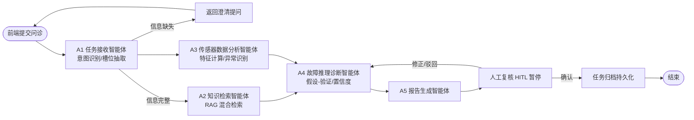

# 工业智能诊断平台 · 项目总设计文档

| 项目名称 | 工业智能诊断平台（Industrial Intelligent Diagnosis Platform） |
| --- | --- |
| 文档版本 | v1.0（MVP 基线） |
| 编制日期 | 2026-09-11 |
| 编制人 | 成员A / 成员B |
| 文档状态 | 评审中 |
| 适用范围 | 2 人开发团队 MVP 版本；企业级扩展方案作为演进参考 |
| 关联文档 | [02_模块与核心流程设计.md](./MVP_02_模块与核心流程设计.md)、[03_开发计划测试与交付.md](./MVP_03_开发计划、测试与交付.md) |

> 说明：本文档由原始企业级评审文档（01 业务背景、02 业务功能、03 智能体目录、04 系统架构、07 需求分析、08 技术选型）合并精简而成，面向 2 人团队统一对项目的理解。所有章节均区分 **MVP 实现** 与 **企业级扩展** 两档，避免小团队被生产级复杂度拖垮。

---

## 修订记录

| 版本 | 日期 | 修订人 | 说明 |
| --- | --- | --- | --- |
| v1.0 | 2026-09-11 | 成员A/B | 合并 01/02/03/04/07/08 形成 MVP 基线文档 |

---

## 1. 项目业务背景与痛点

### 1.1 业务背景

面向工业场景提供 **AI 驱动的设备故障诊断**能力。以一家中小型制造工厂为例：车间内 4 台离心风机（4 台设备），每台部署 6 路传感器，合计 **24 个传感器**，实时采集振动、温度、电流、转速、油压、噪声等时序数据。

平台构建了覆盖 **27 份工业文档** 的设备知识库，采用 **LangGraph 单图统一编排**，引入 A2A + MCP 双协议分层架构思想，将 AI 诊断能力推进至生产可用级别（MVP 阶段为简化实现）。

### 1.2 核心痛点

| 编号 | 痛点 | 业务影响 | 平台对策 |
| --- | --- | --- | --- |
| P1 | 设备故障人工排查耗时久 | 故障停机后工程师需数小时翻阅手册 | RAG 秒级检索文档知识库 |
| P2 | 诊断高度依赖老工程师经验 | 经验断层时诊断质量下降 | 知识库沉淀经验 + LLM 推理 |
| P3 | 知识传承困难 | 手册、工单、报告分散各处 | 统一知识库 + 诊断案例回流 |
| P4 | 数据分散 | 文档、时序数据、报告各自孤立 | 统一数据层（PG + pgvector） |
| P5 | 故障发现滞后 | 事后维修损失大 | 传感器数据实时特征分析 + 异常检测 |

---

## 2. 项目目标与范围

### 2.1 项目目标

- **核心目标**：运维人员输入故障现象（或上传传感器数据），平台自动完成「知识检索 → 数据分析 → 故障推理 → 报告生成 → 人工复核」，输出带证据链的诊断报告与维修建议。
- **学习目标**：完整落地课程所学——FastAPI、LangChain、LangGraph、RAG 检索增强、OpenAI 兼容接口调用 LLM、Function Calling、MCP 工具调用思想。

### 2.2 MVP 范围 vs 企业扩展范围

| 能力项 | ✅ MVP 范围（2 人开发，本期交付） | 📌 企业扩展范围（未来演进，不本期实现） |
| --- | --- | --- |
| Agent 形态 | LangGraph 图内进程节点，进程内函数调用 | A2A 协议分布式独立 Agent 服务 |
| 工具调用 | Function-Calling + Pydantic Schema（MCP 思想） | 独立 MCP Server / Registry 集群，MCP over HTTP |
| 部署形态 | Docker Compose 单体单实例 | Kubernetes + Helm 多副本、可观测全家桶 |
| 鉴权安全 | API-Key + 基础 RBAC 角色 | Keycloak OIDC + 细粒度 ABAC + Vault 密钥管理 |
| 数据存储 | PostgreSQL + pgvector、Redis、本地文件系统 | 独立时序库（TimescaleDB/IoTDB）+ MinIO + Milvus/Qdrant |
| 前端 | 最小 Web 控制台（问诊、报告、文档上传） | 完整管理台（权限、监控、多租户） |
| 数据源 | 开源数据 + AI 仿真数据 | 真实工业网关实时数据 |
| 可观测性 | 结构化日志 + TraceID | OpenTelemetry 全链路 + Grafana/Loki/Tempo |
| 测试 | 单元 + 集成 + 简单 E2E | 混沌注入、完整安全渗透、大规模自动化 |

> **原则**：保留课程核心技术点（FastAPI / RAG / LangGraph / Function-Calling / OpenAI 兼容），砍掉分布式与重型运维组件；代码层面预留接口，后期可平滑演进到企业方案。

---

## 3. 用户角色、业务场景

### 3.1 用户角色

| 角色 | 说明 | 主要操作 |
| --- | --- | --- |
| 运维工程师 | 主要使用者 | 发起问诊、查看报告、确认/修正结论 |
| 设备/工艺工程师 | 复核专家 | 人工复核 AI 结论，补充专家意见 |
| 系统管理员 | 平台维护 | 用户管理、知识库文档管理、参数配置 |

### 3.2 核心业务场景

- **场景 1：问诊式故障诊断（主场景）**。运维人员输入「3 号风机振动异常、温度升高」，系统自动检索知识库 + 分析传感器时序数据，输出根因假设、置信度、证据链、维修建议。
- **场景 2：传感器数据异常诊断**。上传/指定时间窗的传感器数据，系统做特征提取与异常检测，判断异常模式并关联知识库给出诊断。
- **场景 3：人工复核（Human-in-the-loop）**。AI 报告生成后流程暂停，由工程师确认/修正/驳回；复核结论回写状态并沉淀案例。
- **场景 4：知识库管理**。上传工业文档，自动解析、切块、向量化入库，支撑 RAG 检索与溯源。

---

## 4. 功能需求与非功能需求

### 4.1 功能需求（FR），MoSCoW 优先级

| 编号 | 需求描述 | 优先级 |
| --- | --- | --- |
| FR-01 | 用户提交故障问诊请求（设备 + 现象 + 时间窗） | Must |
| FR-02 | 系统基于 RAG 检索 27 份文档知识库并返回证据块 | Must |
| FR-03 | 系统查询并分析 24 路传感器时序数据，输出特征与异常事件 | Must |
| FR-04 | 系统基于「知识证据 + 数据证据」执行假设-验证推理，输出候选故障与置信度 | Must |
| FR-05 | 系统生成结构化诊断报告（根因、置信度、证据链、维修建议） | Must |
| FR-06 | 人工复核：确认/修正/驳回，支持流程断点恢复 | Must |
| FR-07 | 诊断任务、证据、报告全链路持久化，可历史查询 | Must |
| FR-08 | 文档上传、解析、切块、向量化入库 | Must |
| FR-09 | 简单 Web 控制台：问诊输入、报告展示、文档上传 | Must |
| FR-10 | 基础 API-Key 鉴权与用户登录 | Should |
| FR-11 | 知识缺口/数据质量不足时的降级提示与置信度下调 | Should |
| FR-12 | 复核通过案例回流知识库（案例沉淀） | Could |
| FR-13 | 多设备/多租户数据隔离 | Won't（企业扩展） |
| FR-14 | 复杂权限（ABAC、数据范围细粒度） | Won't（企业扩展） |
| FR-15 | 实时告警推送 | Won't（企业扩展） |

### 4.2 非功能需求（NFR）

| 编号 | 类别 | 要求（MVP 基线） |
| --- | --- | --- |
| NFR-01 | 性能 | 单次诊断端到端 ≤ 60s（含 LLM 推理）；RAG 检索 ≤ 3s |
| NFR-02 | 可用性 | 开发/演示环境单实例；支持故障恢复（Checkpoint 断点续跑） |
| NFR-03 | 安全 | API-Key 鉴权；密钥走 .env 环境变量；关键操作审计留痕 |
| NFR-04 | 可维护性 | 模块化 Monorepo 结构；统一错误码；结构化日志 + TraceID |
| NFR-05 | 可扩展性 | Agent 节点、工具定义预留独立服务化接口（A2A / MCP 迁移点） |
| NFR-06 | 数据质量 | 仿真数据可复现（固定随机种子）；文档切块可溯源（页码） |

---

## 5. 智能体（Agent）职责说明

### 5.1 企业方案 Agent 目录（A01-A10，职责基准）

> 原始企业方案定义 10 个智能体，作为职责的**完整基准**。MVP 阶段不拆分为 10 个独立服务，而是按职责合并到 LangGraph 图内节点。

| 编号 | 名称 | 职责（解决的业务问题） | 是否 LLM |
| --- | --- | --- | --- |
| A01 | 用户交互/意图理解 | 对话接入、意图识别、澄清追问 | ✅ |
| A02 | 任务接入 | 诊断任务创建、参数校验、槽位抽取 | ✅ |
| A03 | 知识检索 | RAG 检索知识库，返回带页码证据 | ✅ |
| A04 | 传感器数据分析 | 时序数据查询、清洗、特征计算 | ❌ |
| A05 | 异常检测 | 阈值/统计方法识别异常事件与模式 | ❌ |
| A06 | 故障推理（假设生成） | 基于证据生成候选故障假设 | ✅ |
| A07 | 证据验证 | 逐条校验支持/矛盾证据，置信度评估 | ✅ |
| A08 | 维护决策 | 输出维修处置建议、备件/停机建议 | ✅ |
| A09 | 报告生成 | 组装结构化诊断报告（含溯源） | ✅ |
| A10 | 知识反馈 | 复核后案例回流知识库、沉淀经验 | ✅ |

### 5.2 MVP 节点映射（A1-A5）与实现方式

| MVP 节点 | 对应企业 Agent | 职责（MVP 落点） | 实现方式 |
| --- | --- | --- | --- |
| A1 任务接收智能体 | A01 + A02 | 意图识别、槽位抽取、参数校验、澄清 | LangGraph 节点，调用 LLM |
| A2 知识检索智能体（RAG） | A03 | 查询改写 → 混合检索 → 证据过滤 | LangGraph 节点，调用 LLM + RAG 工具 |
| A3 传感器数据分析智能体 | A04 + A05 | 时序查询 → 清洗 → 特征计算 → 异常识别 | LangGraph 节点，纯计算不调 LLM |
| A4 故障推理诊断智能体 | A06 + A07 + A08 | 假设-验证推理、置信度、维护建议 | LangGraph 节点，调用 LLM |
| A5 报告生成智能体 | A09 | 结构化报告组装、证据链、免责声明 | LangGraph 节点，调用 LLM |
| （可选扩展）反馈回流 | A10 | 复核通过案例回流知识库 | 后续迭代实现，本期可选 |

**MVP 实现方式（重点）**：全部节点运行在 **LangGraph 单图、同一进程内**，节点间通过共享状态对象 `DiagnosisState` 传递数据，**进程内直接函数调用，无网络 RPC**。工具同样为进程内 Python 函数。

**企业扩展方式**：将各节点拆分为独立 HTTP 服务，节点间通过 **A2A 协议**（任务下发/结果回传）通信；LangGraph 编排层只负责流程与状态，不再直接执行业务逻辑。

### 5.3 简化 RACI 矩阵（MVP 节点 × 活动）

| 活动 | A1 任务接收 | A2 知识检索 | A3 数据分析 | A4 故障推理 | A5 报告生成 | 人工（工程师） |
| --- | --- | --- | --- | --- | --- | --- |
| 问诊输入与意图解析 | R/A | I | I | C | I | C |
| 知识库检索 | I | R/A | I | C | C | - |
| 传感器特征/异常分析 | I | I | R/A | C | C | - |
| 故障推理与置信度 | C | C | C | R/A | I | - |
| 报告生成 | I | C | C | C | R/A | I |
| 结论复核确认 | C | I | I | C | C | R/A |

（R=负责执行，A=最终负责，C=被咨询，I=被告知）

---

## 6. 技术选型

### 6.1 MVP 技术选型（2 人开发，本期使用）

| 模块 | 选型 | 理由 |
| --- | --- | --- |
| 后端 API | FastAPI | 课程核心；异步、自动 OpenAPI 文档、类型校验 |
| Agent 编排 | LangGraph | 课程核心；单图编排、状态管理、条件分支、HITL |
| LLM 调用 | OpenAI 兼容接口（DeepSeek） | 课程核心；Function-Calling 做工具调用，成本低 |
| RAG | LangChain（文档加载、切块、混合检索、Rerank） | 课程核心；生态完善 |
| 向量库 | ChromaDB | RAG 开发最主流向量库 |
| 关系数据 | MySQL | 任务、报告、审计、用户 |
| 缓存/会话 | Redis（单实例） | LangGraph Checkpoint、会话缓存 |
| 文件存储 | 本地文件系统 | MVP 阶段替代 MinIO；后期切 S3 |
| 前端 | React 18 + JavaScript + Ant Design + Vite | 最小控制台 |
| 运行环境 | Docker Compose（单实例） | 一键启动，无需 K8s |
| 代码仓库 | Github | 课程演示与托管 |

### 6.2 企业扩展选型对照表

| 模块 | MVP 选型 | 企业扩展选型 |
| --- | --- | --- |
| Agent 通信 | 进程内函数调用 | A2A 协议（Agent-to-Agent 网络通信） |
| 工具协议 | Function-Calling + Pydantic | 独立 MCP Server / Registry，MCP over HTTP |
| 编排 | LangGraph 单图 | 同上 + Agent 服务化 + 消息队列 |
| 时序存储 | PostgreSQL 普通表 | TimescaleDB / IoTDB |
| 对象存储 | 本地文件系统 | MinIO / S3 |
| 向量库 | pgvector | Milvus / Qdrant（数据量大时独立） |
| 鉴权 | API-Key + 基础 RBAC | Keycloak OIDC + ABAC + Vault |
| 可观测 | 结构化日志 + TraceID | OpenTelemetry + Prometheus + Grafana + Loki |
| 部署 | Docker Compose | Kubernetes + Helm + Istio |

---

## 7. 系统架构

### 7.1 MVP 简化系统架构（单体 LangGraph）

```
┌────────────────────────────────────────────────────────────────┐
│                    Web 前端(React + TS 最小控制台)              │
│              问诊输入 / 报告展示 / 文档上传                      │
└──────────────────────────┬─────────────────────────────────────┘
                           │ HTTPS / REST
┌──────────────────────────▼─────────────────────────────────────┐
│                    FastAPI 后端服务(单体进程)                   │
│  ┌──────────────────────────────────────────────────────────┐  │
│  │        LangGraph 编排引擎(单图, DiagnosisState 流转)      │  │
│  │   A1任务接收 → A2知识检索 → A3数据分析                     │  │
│  │        → A4故障推理 → A5报告生成 → [HITL人工复核]          │  │
│  └──────────────────────────────────────────────────────────┘  │
│  ┌──────────────────────────────────────────────────────────┐  │
│  │   工具层(Function-Calling + Pydantic Schema, MCP 思想)    │  │
│  │   ① 知识库检索工具   ② 传感器时序查询工具   ③ 复核反馈工具   │  │
│  └──────────────────────────────────────────────────────────┘  │
│  ┌──────────────────────────────────────────────────────────┐  │
│  │   LangChain RAG 模块：加载 / 切块 / Embedding / 混合检索   │  │
│  └──────────────────────────────────────────────────────────┘  │
│  鉴权(API-Key) │ 日志+TraceID │ 审计记录                        │
└──────┬───────────────────────┬──────────────────┬─────────────┘
       │                       │                  │
┌──────▼──────┐   ┌────────────▼──────────┐   ┌───▼────────────┐
│ PostgreSQL  │   │ Redis                 │   │ 本地文件系统    │
│ + pgvector  │   │ (Checkpoint/缓存)     │   │ (文档/报告)     │
│ 业务+向量    │   └───────────────────────┘   └────────────────┘
│ +仿真时序    │
└─────────────┘
```

### 7.2 企业级扩展架构（A2A + MCP）参考

```
┌─────────┐   ┌─────────┐   ┌─────────┐       独立 Agent 服务
│ A1 服务  │  │ A2 服务  │   │ A3 服务 │  ...  (各自独立部署)
└────┬────┘   └────┬────┘   └────┬────┘
     │   A2A 协议（任务下发 / 结果回传，跨网络）   │
┌────▼──────────────────────────────▼─────────┐
│        A2A 注册中心 / 网关                   │
└────────────────┬────────────────────────────┘
                 │
┌────────────────▼─────────────────────────────┐
│     MCP Registry / Proxy(工具标准化注册)      │
└───┬─────────────────┬───────────────────┬────┘
┌───▼────┐   ┌────────▼────┐   ┌──────────▼──┐
│ MCP    │   │ MCP         │   │ MCP         │
│ 知识库  │   │ 传感器时序  │   │ 复核/案例    │
│ Server │   │ Server      │   │ Server      │
└────────┘   └─────────────┘   └─────────────┘
```

### 7.3 架构演进路线

1. **MVP（本期，2 人开发）**：单体 LangGraph，进程内 Agent + 工具 → 快速交付端到端能力。
2. **演进一（Agent 服务化）**：按 A1-A5 边界拆独立 HTTP 服务，接入 A2A 协议。
3. **演进二（MCP 独立化）**：工具拆为独立 MCP Server，走 MCP over HTTP。
4. **演进三（生产加固）**：K8s 部署、可观测、完整鉴权、独立时序/向量库，复用本文企业扩展选型。

---

## 8. LangGraph 单图编排设计

### 8.1 编排总览



### 8.2 节点与状态流转

| 顺序 | 节点 | 输入（State 字段） | 输出（写入 State） | 是否调用 LLM |
| --- | --- | --- | --- | --- |
| 1 | 入口 | 原始请求 | task_id、device_id、symptom、time_window | ❌ |
| 2 | A1 | 原始请求 | structured_task、missing_slots | ✅ |
| 3a | A2 | device_id、symptom | evidence[]（带页码证据） | ✅ |
| 3b | A3 | device_id、time_window | sensor_features、anomalies、data_quality | ❌ |
| 4 | A4 | evidence + anomalies + features | hypotheses[]、diagnosis_result、confidence | ✅ |
| 5 | A5 | 全部中间结果 | report | ✅ |
| 6 | HITL | report | status=waiting_review、断点 | ❌ |
| 7 | 复核恢复 | review_decision、comment | 人工反馈写入 State | ❌（可选 LLM） |
| 8 | 归档 | 完整 State | 持久化 + 完成状态 | ❌ |

### 8.3 DiagnosisState 状态定义（Pydantic）

```python
from typing import Optional
from pydantic import BaseModel, Field

class EvidenceItem(BaseModel):
    doc_id: str
    doc_name: str
    page: int
    snippet: str
    score: float

class AnomalyEvent(BaseModel):
    sensor_id: str
    ts_start: str
    ts_end: str
    anomaly_type: str
    severity: str

class Hypothesis(BaseModel):
    fault: str
    confidence: float
    supporting_evidence: list[str]
    contradicting_evidence: list[str]

class DiagnosisState(BaseModel):
    # 请求层
    task_id: str = ""
    device_id: str = ""
    symptom: str = ""
    time_window: str = ""
    user_info: str = ""
    # 结构化任务层
    structured_task: Optional[dict] = None
    missing_slots: list[str] = []
    # 证据层
    evidence: list[EvidenceItem] = []
    sensor_features: Optional[dict] = None
    anomalies: list[AnomalyEvent] = []
    data_quality: Optional[dict] = None
    # 推理层
    hypotheses: list[Hypothesis] = []
    diagnosis_result: Optional[dict] = None
    confidence: float = 0.0
    knowledge_gap: bool = False
    # 报告与复核层
    report: Optional[dict] = None
    review_decision: str = ""      # confirm / amend / reject
    review_comment: str = ""
    status: str = "init"           # init/running/waiting_review/done
```

### 8.4 条件分支与循环

- **信息缺失分支**：`missing_slots` 非空 → 返回澄清提问，流程暂停等待用户补充。
- **证据不足分支**：`evidence` 为空或 `data_quality` 高缺失 → 置 `knowledge_gap=True`，A4 自动降置信度并提示人工介入。
- **复核修正循环**：`review_decision=amend/reject` → 回跳 A4 重新推理（携带人工意见）。

### 8.5 人工复核（HITL）与断点恢复

- 使用 LangGraph `interrupt` / Checkpoint 机制，报告生成后在「人工复核」节点暂停；
- 通过 Redis/数据库保存 Checkpoint，进程重启后可按 `task_id` 恢复状态续跑；
- 人工意见（确认/修正/驳回 + 专家意见）写回 State，作为案例回流与评测依据。

---

## 9. 工具调用设计

### 9.1 MVP：Function-Calling + Pydantic Schema（MCP 思想）

> 保留 MCP 的「工具标准化 Schema」思想：每个工具具备名称、描述、入参 Schema、出参结构、审计字段。MVP 不部署独立 MCP 网络服务，工具即进程内 Python 函数，由 LangChain/LangGraph 的 Function-Calling 机制调用。

```python
# tools/knowledge_search_tool.py
from pydantic import BaseModel, Field

class KnowledgeSearchInput(BaseModel):
    query: str = Field(description="改写后的检索问题")
    device_id: str = Field(description="设备型号过滤条件")
    top_k: int = Field(default=5, ge=1, le=10)

def knowledge_search(args: KnowledgeSearchInput) -> list[dict]:
    """知识库混合检索工具：向量检索 + 关键词检索 + Rerank"""
    # 调用 pgvector 相似度查询 + 全文检索，返回带页码证据
    ...

class SensorQueryInput(BaseModel):
    device_id: str
    time_window: str
    sensor_ids: list[str]

def sensor_query(args: SensorQueryInput) -> list[dict]:
    """传感器时序查询工具：读取原始时序测点数据"""
    ...
```

### 9.2 工具注册与调用流程

1. 每个工具用 Pydantic 定义入参/出参 Schema（对标 MCP 工具定义）；
2. 将工具声明注入 LLM 调用（Function-Calling），模型根据任务自主选择工具；
3. LLM 输出工具调用请求 → LangChain 工具执行器在**进程内**执行 → 结果回填上下文；
4. 工具执行记录（调用参数、耗时、结果摘要）写入审计日志。

### 9.3 企业扩展：独立 MCP Server

- 将 `knowledge_search`、`sensor_query` 等工具封装为独立 MCP Server（FastMCP）；
- 通过 MCP Registry/Proxy 做工具注册与路由，Agent 经 MCP over HTTP 调用；
- 工具 Schema 保持不变，仅将「进程内调用」替换为「网络调用」，代码迁移成本低。

---

## 10. 存储设计

### 10.1 MVP 存储方案

| 数据类别 | 存储 | 说明 |
| --- | --- | --- |
| 业务数据（任务/报告/用户/审计） | MySQL | 关系表 |
| 向量数据（文档切块 Embedding） | chromaDB | RAG 开发最主流入门向量库 |
| 传感器时序数据 | MySQL(普通表 + 索引) | MVP 数据量小，无需独立时序库 |
| 会话/Checkpoint | Redis | LangGraph Checkpoint、缓存 |
| 文档原文/报告附件 | 本地文件系统 | 目录按设备/任务组织；后期切 S3 |

### 10.2 企业扩展存储方案

| 数据类别 | 企业扩展 |
| --- | --- |
| 时序数据 | TimescaleDB / IoTDB（高并发写入、压缩、保留策略） |
| 对象存储 | MinIO / S3（多副本、生命周期管理） |
| 向量库 | Milvus / Qdrant（数据量 > 千万级时独立集群） |
| 缓存 | Redis Cluster + 哨兵 |
| 审计 | 独立审计库 + WORM 防篡改 |

---

## 11. 风险清单

| 编号 | 风险 | 影响 | 概率 | 应对措施 |
| --- | --- | --- | --- | --- |
| R1 | LLM 推理幻觉，输出无证据结论 | 诊断质量 | 中 | 强制「基于证据推理」提示词 + 证据链附注 + 知识缺口降置信度 |
| R2 | 2 人人力不足，范围蔓延 | 延期 | 高 | MoSCoW 砍范围，Won't 项一律不做；里程碑冻结 |
| R3 | 文档知识库数据不足/切块质量差 | 检索效果差 | 中 | 开源数据 + AI 补充；检索评测指标把关（命中率@k） |
| R4 | 仿真数据与真实场景偏差 | 演示说服力弱 | 中 | 基于 CMAPSS 分布生成；固定随机种子可复现；文档中声明仿真口径 |
| R5 | 单点故障（单体部署） | 可用性 | 低 | Checkpoint 断点续跑；Docker Compose 一键重建 |
| R6 | API-Key 泄露 | 安全 | 低 | 密钥仅存 .env；关键操作审计；本地演示环境 |
| R7 | 工具调用失败（数据库不可用等） | 流程中断 | 低 | 降级策略：跳过对应证据源、降低置信度、提示人工介入 |

---