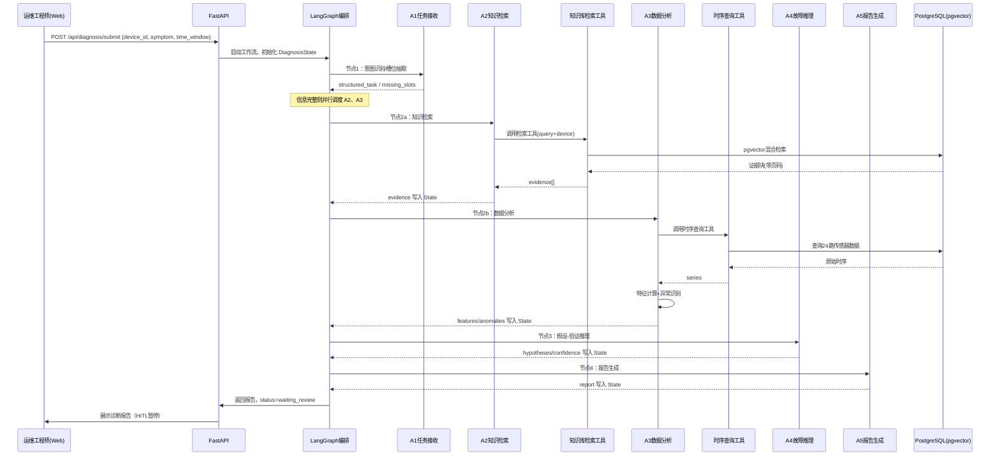
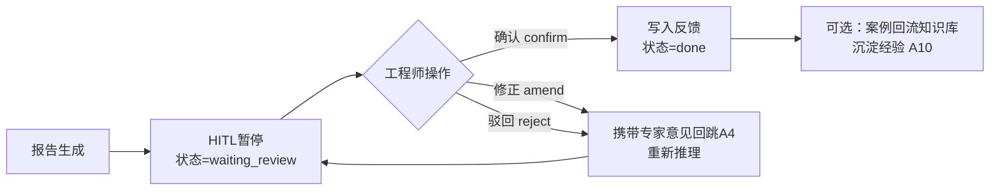

# 工业智能诊断平台 · 模块与核心流程设计

| 项目名称 | 工业智能诊断平台 |
| --- | --- |
| 文档版本 | v1.0（MVP 基线） |
| 编制日期 | 2026-09-11 |
| 编制人 | 成员A / 成员B（占位，待填写） |
| 文档状态 | 评审中 |
| 关联文档 | [01_项目总设计文档.md](./MVP_01_项目总设计文档.md)、[03_开发计划测试与交付.md](./MVP_03_开发计划、测试与交付.md) |

> 说明：本文档由原始评审文档（09 数据集与硬件资源、10 详细模块设计、11 核心流程设计、05 工程目录结构）合并精简而成，面向开发实现。所有模块均区分 **MVP 实现** 与 **企业扩展点**。

---

## 修订记录

| 版本 | 日期 | 修订人 | 说明 |
| --- | --- | --- | --- |
| v1.0 | 2026-09-11 | 成员A/B | 合并 09/10/11/05 形成 MVP 技术设计基线 |

---

## 1. 数据集与硬件资源

### 1.1 数据集说明

| 数据类别 | 规模 | 来源 | 用途 |
| --- | --- | --- | --- |
| 工业文档知识库 | 27 份文档、1109 页、5091 个向量块 | 开源（设备公开手册、工业白皮书、CMAPSS 配套文档）+ AI 生成（历史维修工单、故障案例、处置预案） | RAG 检索证据 |
| 传感器时序数据 | 4 台设备 × 6 路 = 24 传感器 | 开源基础（NASA CMAPSS 涡轮机故障时序）+ AI 仿真生成 | 特征计算、异常检测 |
| 诊断案例（可选回流） | 人工复核通过案例 | 平台运行沉淀 | 知识反馈、评测 |

- **传感器测点**：每台设备 6 路：振动、温度、电流、转速、油压、噪声。
- **仿真口径**：基于 CMAPSS 数据分布，用 Python 生成正常/异常运行片段，覆盖多种故障模式（轴承磨损、转子不平衡、油温异常等）；**固定随机种子，数据可复现**；所有仿真数据在文档与报告中明确标注「仿真」。
- **向量化**：文档经 LangChain 加载 → 文本切块（约 500 token/块，重叠 10%）→ Embedding → 存入 chromaDB

### 1.2 硬件资源：MVP 开发 vs 企业生产

| 资源项 | ✅ MVP 开发资源 | 📌 企业生产资源 |
| --- | --- | --- |
| 开发机 | 单台笔记本/PC（16G 内存，CPU 即可） | 多台服务器 + GPU 推理集群 |
| 数据库 | Docker 内 MySQL + chromaDB + Redis 单实例 | 独立数据库集群 + 高可用 |
| Embedding/LLM | 云端 OpenAI 兼容 API（DeepSeek） | 私有化部署 LLM / 专线 API |
| 存储 | 本地磁盘（数十 GB 级） | 对象存储 + 时序库集群（TB 级） |
| 运行环境 | Docker Compose 单机 | Kubernetes 多节点 |

---

## 2. 七大模块详细设计（M01-M07）

> 每个模块包含：**职责、核心数据结构、核心接口、MVP 实现、企业扩展点**。

### M01 知识库模块

| 项 | 内容 |
| --- | --- |
| **职责** | 工业文档全生命周期管理：上传、解析、切块、向量化、混合检索（向量 + 关键词 + Rerank）、溯源 |
| **核心数据结构** | `Document`、`DocChunk`（见第 5 章数据模型） |
| **核心接口** | `upload_document(file) -> doc_id`；`parse_and_chunk(doc_id)`；`embed_and_store(doc_id)`；`search(query, filters, top_k) -> list[EvidenceItem]` |
| **MVP 实现** | LangChain 加载器 + RecursiveCharacterTextSplitter + 云端 Embedding API + pgvector 相似度查询；混合检索：pgvector 向量检索 + PostgreSQL 全文检索 + 简单 Rerank |
| **企业扩展点** | 独立向量库（Milvus/Qdrant）、多路召回 + 重排模型、OCR 服务化、增量文档同步 |

### M02 传感器数据模块

| 项 | 内容 |
| --- | --- |
| **职责** | 传感器时序数据管理：数据接入（仿真数据导入）、查询、清洗、时域/频域特征计算、异常事件识别 |
| **核心数据结构** | `SensorSeries`、`SensorFeature`、`AnomalyEvent` |
| **核心接口** | `ingest_sensor_data(device_id, df)`；`query_series(device_id, time_window, sensor_ids)`；`compute_features(series)`；`detect_anomalies(features) -> list[AnomalyEvent]` |
| **MVP 实现** | 仿真数据脚本生成 CSV → 批量导入 MySQL；pandas/numpy 计算 RMS、峰峰值、峭度、频谱特征；阈值 + 统计方法识别异常；**不调用 LLM** |
| **企业扩展点** | 独立时序库（TimescaleDB/IoTDB）、实时流接入（Kafka + 网关）、更复杂异常检测模型（隔离森林/时序模型） |

### M03 AI 诊断模块

| 项 | 内容 |
| --- | --- |
| **职责** | 核心诊断能力：LangGraph 单图编排、假设-验证推理、置信度评估、报告生成 |
| **核心数据结构** | `DiagnosisState`（见文档一 8.3 节）、`Hypothesis`、`Report` |
| **核心接口** | `start_diagnosis(state)`；`run_reasoning(state)`；`generate_report(state)`；`review_confirm(state, decision, comment)` |
| **MVP 实现** | LangGraph 图（A1-A5 + HITL 节点）；LLM 通过 OpenAI 兼容接口调用（DeepSeek），Function-Calling 调工具；提示词强制「基于证据推理、禁止幻觉」；复核修正支持回跳 |
| **企业扩展点** | Agent 服务化 + A2A 通信、多模型路由、推理可解释性面板、模型评测闭环 |

### M04 编排协议模块

| 项 | 内容 |
| --- | --- |
| **职责** | Agent 编排与工具调用协议抽象：节点路由、状态流转、工具注册/调用、协议适配（MCP/A2A 预留） |
| **核心数据结构** | 工具注册表 `ToolSpec`（name、description、input_schema、output_schema）、`DiagnosisState` |
| **核心接口** | `register_tool(spec, handler)`；`build_workflow() -> CompiledGraph`；`invoke_tool(name, args)` |
| **MVP 实现** | LangGraph 图定义 + LangChain 工具封装（Pydantic Schema）；工具进程内调用；**保留 MCP 思想：标准化 Schema + 审计字段** |
| **企业扩展点** | 独立 MCP Server/Registry（MCP over HTTP）；A2A 协议适配层；工具调用限流与熔断 |

### M05 输出模块

| 项 | 内容 |
| --- | --- |
| **职责** | 对外输出：REST API、Web 控制台、诊断报告展示、文档上传界面 |
| **核心数据结构** | `APIResponse`（统一响应结构）、`Report` |
| **核心接口** | `POST /api/diagnosis/submit`；`GET /api/diagnosis/{task_id}`；`POST /api/diagnosis/{task_id}/review`；`POST /api/documents`；`GET /api/diagnosis/history` |
| **MVP 实现** | FastAPI 路由 + Pydantic 响应模型；React 最小控制台（问诊表单、报告卡片、文档上传）；不实现复杂管理台 |
| **企业扩展点** | 完整管理台、多租户、告警推送、移动端、OpenAPI 全量导出对接第三方 |

### M06 平台支撑模块

| 项 | 内容 |
| --- | --- |
| **职责** | 用户与鉴权、审计留痕、日志与 TraceID、配置管理 |
| **核心数据结构** | `User`、`AuditLog`、配置项 |
| **核心接口** | `authenticate(api_key)`；`check_rbac(user, role)`；`write_audit(action, params)`；`init_config()` |
| **MVP 实现** | API-Key + 基础 RBAC（admin/engineer）；关键操作（诊断提交、复核、文档上传）写审计表；结构化日志 + TraceID 贯穿全链路；配置走 .env |
| **企业扩展点** | Keycloak OIDC、细粒度 ABAC、Vault 密钥管理、OpenTelemetry 全链路、审计 WORM |

### M07 存储集成模块

| 项 | 内容 |
| --- | --- |
| **职责** | 数据库/缓存/文件存储的统一访问封装：连接管理、迁移、事务、Checkpoint 持久化 |
| **核心数据结构** | 数据模型（见第 5 章）；`Checkpoint` |
| **核心接口** | `init_db()`；`save_checkpoint(task_id, state)`；`load_checkpoint(task_id)`；`save_report(task_id, report)` |
| **MVP 实现** | SQLAlchemy + Alembic 迁移；pgvector 扩展；Redis 存 LangGraph Checkpoint；本地文件存文档原文与报告附件 |
| **企业扩展点** | 多库拆分（独立时序库/对象存储/向量库）、读写分离、备份恢复策略 |

---

## 3. 核心业务流程图

### 3.1 端到端诊断主流程



### 3.2 异常检测子流程

1. 按 device_id + time_window 读取原始时序（24 路）；
2. 数据清洗：剔除明显坏值、标记缺失段，输出 `data_quality`（缺失率/完整率）；
3. 特征计算：RMS、峰峰值、峭度、均值/方差、频谱主频等；
4. 阈值判定：对照设备健康基线阈值识别超限事件 → 生成 `AnomalyEvent`（类型、时段、严重度）；
5. 结果与 `data_quality` 一并写入 State，供 A4 推理使用；数据质量差时整体置信度下调。

### 3.3 人工复核回流流程



### 3.4 降级策略

| 触发条件 | 降级动作 | 对用户提示 |
| --- | --- | --- |
| RAG 检索无证据（knowledge_gap） | 跳过文档证据，A4 强制降置信度 | 「知识库无相关资料，建议人工介入」 |
| 传感器数据大量缺失 | 仅用可用测点，置信度下调 | 「数据质量差，结果仅供参考」 |
| 工具调用失败（DB 不可用） | 跳过对应证据源继续流程 | 报告标注缺失证据源 |
| LLM 调用超时 | 重试 1 次，仍失败则返回部分结果 | 提示服务繁忙，可稍后重试 |
| 信息缺失（槽位不全） | 流程暂停，返回澄清提问 | 向用户索要必填参数 |

---

## 4. 工程目录结构（Monorepo，适配单体）

```text
industrial_diagnosis/
├── README.md                     # 项目说明、环境启动、演示操作
├── docker-compose.yml            # PG+pgvector、Redis 一键启动
├── .env.example                  # 环境变量模板（LLM key、DB 配置）
├── requirements.txt              # Python 依赖
├── docs/                         # 项目文档（本三份 md）
├── data/
│   ├── raw_docs/                 # 27 份工业原始文档（pdf/docx）
│   ├── sensor_sim/               # AI 生成+开源传感器仿真数据（csv）
│   └── scripts/                  # 数据生成/导入脚本
├── apps/
│   └── api/                      # FastAPI 后端服务
│       ├── main.py               # 应用入口
│       ├── routers/              # REST 路由（diagnosis/documents/users）
│       ├── schemas/              # Pydantic 请求/响应模型
│       └── middleware/           # 鉴权、日志 TraceID、审计
├── packages/
│   ├── core/                     # 可复用核心包
│   │   ├── state.py              # DiagnosisState 定义
│   │   ├── errors.py             # 统一错误码与异常
│   │   └── config.py             # 配置加载
│   ├── agents/                   # LangGraph 节点（智能体）
│   │   ├── a1_intake.py          # A1 任务接收
│   │   ├── a2_rag.py             # A2 知识检索
│   │   ├── a3_sensor_analysis.py # A3 数据分析
│   │   ├── a4_reasoning.py       # A4 故障推理
│   │   └── a5_report.py          # A5 报告生成
│   ├── workflow/                 # LangGraph 图构建
│   │   └── graph.py              # 节点连线、条件分支、HITL
│   ├── rag/                      # RAG 模块
│   │   ├── loader.py             # 文档加载/切块
│   │   ├── embedding.py          # Embedding 封装
│   │   └── retriever.py          # 混合检索 + Rerank
│   ├── tools/                    # 工具层（MCP 思想，Function-Calling）
│   │   ├── knowledge_search_tool.py
│   │   ├── sensor_query_tool.py
│   │   └── registry.py           # 工具注册表
│   ├── sensor/                   # 时序数据处理
│   │   ├── features.py           # 特征计算
│   │   └── anomaly.py            # 异常检测
│   ├── db/                       # 数据访问层
│   │   ├── models.py             # ORM 模型
│   │   └── migrations/           # Alembic 迁移脚本
│   └── llm/                      # LLM 封装（OpenAI 兼容）
│       └── client.py             # DeepSeek 客户端 + Function-Calling
├── frontend/                     # React + TS 最小控制台
│   ├── src/pages/                # 问诊页/报告页/文档上传页
│   └── src/api/                  # API 客户端
├── ml/                           # 算法实验（特征/阈值/评测）
│   ├── eval_metrics.py           # AI 评测指标
│   └── notebooks/                # 数据探索 notebook
└── tests/                        # 单元/集成测试
    ├── unit/
    ├── integration/
    └── e2e/
```

> 说明：Monorepo 采用 `apps/`（可运行服务）+ `packages/`（可复用包）+ `ml/`（算法）+ `frontend/`（前端）结构；砍掉企业方案中的 K8s/infra/多环境 overlays 目录。

---

## 5. 数据模型（数据库关键表定义）

### 5.1 表清单

| 表名 | 说明 | 归属模块 |
| --- | --- | --- |
| `users` | 用户与角色 | M06 |
| `documents` | 知识库文档元信息 | M01 |
| `doc_chunks` | 文档切块 + 向量（pgvector） | M01 |
| `diagnosis_tasks` | 诊断任务主表 | M03/M05 |
| `evidence` | 任务-证据关联（溯源） | M03 |
| `sensor_series` | 传感器原始时序 | M02 |
| `sensor_features` | 计算特征快照 | M02 |
| `anomalies` | 异常事件 | M02 |
| `reports` | 诊断报告 | M03 |
| `review_records` | 人工复核记录 | M03 |
| `audit_logs` | 审计日志 | M06 |

### 5.2 关键表结构（DDL 示意）

```sql
-- 文档与向量（M01）
CREATE TABLE documents (
    id          BIGSERIAL PRIMARY KEY,
    filename    TEXT NOT NULL,
    doc_type    TEXT,                -- pdf/docx/txt
    page_count  INT,
    status      TEXT DEFAULT 'pending',  -- pending/parsed/embedded/failed
    created_at  TIMESTAMPTZ DEFAULT now()
);

CREATE TABLE doc_chunks (
    id          BIGSERIAL PRIMARY KEY,
    doc_id      BIGINT REFERENCES documents(id),
    chunk_index INT,
    content     TEXT,
    page        INT,                 -- 溯源页码
    embedding   VECTOR(1024)         -- pgvector 向量列（维度按 Embedding 模型）
);
CREATE INDEX idx_chunks_doc ON doc_chunks(doc_id);

-- 诊断任务（M03）
CREATE TABLE diagnosis_tasks (
    id            BIGSERIAL PRIMARY KEY,
    task_id       UUID UNIQUE NOT NULL,
    device_id     TEXT NOT NULL,
    symptom       TEXT,
    time_window   TEXT,
    status        TEXT NOT NULL,          -- init/running/waiting_review/done
    confidence    FLOAT,
    diagnosis     JSONB,                  -- 根因假设快照
    created_by    TEXT,
    created_at    TIMESTAMPTZ DEFAULT now(),
    updated_at    TIMESTAMPTZ DEFAULT now()
);

-- 证据溯源（M03）
CREATE TABLE evidence (
    id          BIGSERIAL PRIMARY KEY,
    task_id     UUID REFERENCES diagnosis_tasks(task_id),
    chunk_id    BIGINT REFERENCES doc_chunks(id),
    doc_id      BIGINT,
    page        INT,
    snippet     TEXT,
    score       FLOAT
);

-- 传感器时序（M02，MVP 用普通表）
CREATE TABLE sensor_series (
    id          BIGSERIAL PRIMARY KEY,
    device_id   TEXT NOT NULL,
    sensor_id   TEXT NOT NULL,            -- vibration/temperature/...
    ts          TIMESTAMPTZ NOT NULL,
    value       DOUBLE PRECISION,
    quality     TEXT DEFAULT 'ok'         -- ok/missing/outlier
);
CREATE INDEX idx_series_dev_ts ON sensor_series(device_id, sensor_id, ts);

-- 异常事件（M02）
CREATE TABLE anomalies (
    id           BIGSERIAL PRIMARY KEY,
    task_id      UUID REFERENCES diagnosis_tasks(task_id),
    device_id    TEXT,
    sensor_id    TEXT,
    anomaly_type TEXT,
    severity     TEXT,
    ts_start     TIMESTAMPTZ,
    ts_end       TIMESTAMPTZ
);

-- 报告与复核（M03/M05）
CREATE TABLE reports (
    id          BIGSERIAL PRIMARY KEY,
    task_id     UUID REFERENCES diagnosis_tasks(task_id),
    content     JSONB,                     -- 结构化报告
    version     INT DEFAULT 1,
    created_at  TIMESTAMPTZ DEFAULT now()
);

CREATE TABLE review_records (
    id          BIGSERIAL PRIMARY KEY,
    task_id     UUID REFERENCES diagnosis_tasks(task_id),
    decision    TEXT NOT NULL,             -- confirm/amend/reject
    comment     TEXT,
    reviewer    TEXT,
    created_at  TIMESTAMPTZ DEFAULT now()
);

-- 审计（M06）
CREATE TABLE audit_logs (
    id          BIGSERIAL PRIMARY KEY,
    action      TEXT NOT NULL,             -- diagnosis_submit/review/doc_upload/...
    user_id     TEXT,
    task_id     UUID,
    params      JSONB,
    created_at  TIMESTAMPTZ DEFAULT now()
);
```

---

## 6. 错误码规范

### 6.1 错误码分段

| 分段 | 范围 | 含义 |
| --- | --- | --- |
| 通用 | 10000-10099 | 参数/请求错误 |
| 鉴权 | 10100-10199 | 认证授权错误 |
| 任务 | 10200-10299 | 诊断任务错误 |
| 知识库 | 10300-10399 | 文档/RAG 错误 |
| 数据 | 10400-10499 | 传感器/数据错误 |
| 编排 | 10500-10599 | LangGraph/工具调用错误 |
| 存储 | 10600-10699 | 数据库/缓存错误 |

### 6.2 错误码表（示例）

| 错误码 | HTTP 状态 | 含义 | 处理建议 |
| --- | --- | --- | --- |
| 10001 | 400 | 请求参数缺失或格式错误 | 校验入参后重试 |
| 10002 | 400 | device_id 不存在 | 检查设备编号 |
| 10101 | 401 | API-Key 无效 | 检查请求头 Authorization |
| 10102 | 403 | 权限不足（RBAC） | 联系管理员授权 |
| 10201 | 404 | 任务不存在 | 核对 task_id |
| 10202 | 409 | 任务状态不允许该操作 | 按状态机流转 |
| 10301 | 500 | 文档解析失败 | 检查文档格式 |
| 10302 | 404 | 知识库无相关文档 | 走知识缺口降级 |
| 10401 | 500 | 时序查询失败 | 检查数据接入 |
| 10402 | 200（降级） | 传感器数据缺失率高 | 报告标注数据质量差 |
| 10501 | 500 | LangGraph 工作流执行失败 | 查看 TraceID 日志 |
| 10502 | 500 | 工具调用异常 | 查看工具日志 |
| 10601 | 500 | 数据库连接失败 | 检查 PG/Redis 服务 |
| 10602 | 500 | Checkpoint 保存/恢复失败 | 检查 Redis |

### 6.3 统一响应结构

```json
{
  "code": 0,
  "message": "success",
  "trace_id": "8f3a2c...",
  "data": {}
}
```

（`code=0` 表示成功；非 0 见错误码表；全链路日志携带同一 `trace_id` 便于排障。）

---